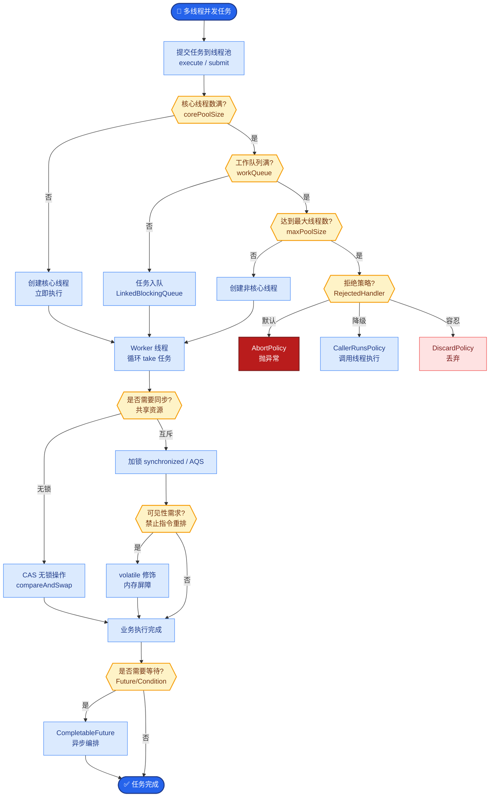
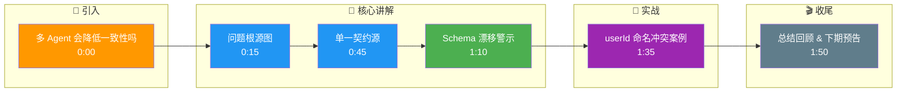

# 多 Agent 会不会降低「一致性」(同一产品前后端接口对不上)

多 Agent 系统确实会增加系统复杂度，**会**降低「一致性」。因为不同 Agent（如前端设计 Agent、后端开发 Agent）拥有独立的上下文和 Prompt，容易产生类似「接口对不上」、「字段命名不一致」的问题。

**解决方案**：
1. **单一契约源**：引入 OpenAPI (Swagger) 或 JSON Schema 作为唯一的 Truth Source，所有 Agent 必须引用该契约，而不是自己臆造。
2. **契约测试 Agent**：专门设置一个 QA Agent，负责比对前后端的实现是否符合契约。
3. **静态检查/门禁**：在 Agent 生成代码后，插入编译或 Lint 步骤，强制校验。
4. **状态机门禁**：使用 LangGraph 等状态机工具，确保关键状态变更符合预定义流程。

**一致性保障流程图**：
```text
         [ Shared Context ]
         (Schema / API Spec)
              │      │
        ┌─────┘      └─────┐
        ▼                    ▼
 [ Frontend Agent ]   [ Backend Agent ]
 (Generate UI)        (Generate API)
        │                    │
        └───────┬────────────┘
                ▼
      [ Integration / QA Agent ]
      (Compare Spec vs Code)
                │
        Mismatch │      Match
          ┌──────┴──────┐
          ▼             ▼
    [ Return Fix ]  [ Accept ]
```

**实战案例**：
在电商系统重构中，后端 Agent 将 `userId` 改为 `user_id`（蛇形），但前端 Agent 坚持用驼峰 `userId`。通过引入 Schema 强制校验，QA Agent 自动拦截了联调失败，并要求后端 Agent保持与 OpenAPI 定义一致，避免了上线后大量 400 报错。

**代码示例**：
```python
# Schema First Approach (Pydantic v2)
from pydantic import BaseModel

# Shared Truth Source
class UserSchema(BaseModel):
    user_id: int  # Force snake_case definition
    email: str

# Backend Agent Generation
mock_api_resp = {"user_id": 123, "email": "test@example.com"}
assert UserSchema(**mock_api_resp) # Runtime validation

# Frontend Agent Conversion
frontend_data = UserSchema(**mock_api_resp).model_dump(by_alias=False) # Standardized
```

**一致性方案对比**：

| 方案 | 优点 | 缺点 | 适用场景 |
| :--- | :--- | :--- | :--- |
| **Post-Hoc QA** | 实现简单，不干扰生成 | 反馈周期长，Token 浪费 | 初期验证，非关键路径 |
| **Schema Injection** | 强一致，生成即准确 | Prompt 容量受限 | 接口字段较少的业务 |
| **Reflexion Loop** | 自我修复能力强 | 成本高，耗时久 | 复杂逻辑，对准确性要求高 |

**关键细节补充**：
- **全局 Memory**：确保所有 Agent 共享一部分长期记忆，专门存放变量定义、接口文档等元数据。
- **Reflexion 模式**：当 QA Agent 发现不一致时，反馈具体错误信息给对应的 Agent，要求其自我修正（Self-Reflexion），而不是直接重置。
- **版本控制**：接口 Schema 必须版本化（如 v1, v2），防止 Agent 在迭代过程中引用旧定义导致的不一致。

## 易错点
1. **Schema 漂移**：认为 Schema 生成一次就永久有效，忽略了业务变更。必须引入「架构师 Agent」负责维护 Schema 的生命周期，处理变更通知。
2. **Prompt 截断**：将巨大的 OpenAPI 文档直接塞进 Prompt 容易导致截断。应采用 RAG（检索增强生成），只将与当前任务相关的接口定义注入给 Agent。

## 面试追问
1. 如果业务需求变更导致 Schema 必须修改，如何协调所有正在运行的 Agent 平滑切换到新版本，而不破坏现有任务？
2. 在极端情况下，两个 Agent 各执一词（前端认为 A 对，后端认为 B 对），仲裁机制如何设计？是引入“架构师 Agent”还是基于规则？
3. 对于复杂的嵌套对象，JSON Schema 可能会非常长，如何优化 Token 消耗？

## 核心流程图



## 记忆要点

- 多 Agent 独立上下文易导致接口不一致，需单一契约源。
- 引入 OpenAPI/Schema 作为唯一真理，QA Agent 强校验。
- 采用 Schema First 或 Reflexion 模式自我修正。

## 结构化回答

**30 秒电梯演讲：** 多 Agent 会降低一致性，因为不同 Agent 独立上下文和 Prompt 容易产生接口对不上、字段命名不一致。解法是单一契约源——引入 OpenAPI 或 JSON Schema 作为唯一 Truth Source，所有 Agent 必须引用而非臆造。配合契约测试 Agent（QA Agent 比对前后端实现）和 Schema First 或 Reflexion 模式自我修正。坑是 Schema 漂移需架构师 Agent 维护生命周期，巨大 OpenAPI 塞 Prompt 要用 RAG 只注入相关接口。

**展开框架：**
1. **问题根源** — 多 Agent 独立上下文和 Prompt 导致接口对不上、字段命名不一致（userId vs user_id 驼峰蛇形冲突）。
2. **单一契约源** — OpenAPI 或 JSON Schema 作为唯一 Truth Source；QA Agent 比对前后端实现是否符合契约；Schema First 生成即准确。
3. **Reflexion 与避坑** — QA Agent 发现不一致反馈具体错误让 Agent 自我修正；Schema 漂移需架构师 Agent 维护变更通知；巨大 OpenAPI 用 RAG 只注入相关接口。

**收尾：** 做电商重构时踩过坑——后端 Agent 改 userId 为 user_id 但前端坚持驼峰，引入 Schema 强制校验 QA Agent 自动拦截联调失败避免 400 报错。您想聊哪块，Schema 版本控制还是 Reflexion 反馈设计？

## 视频脚本

> 预计时长：2 分钟 | 由浅入深

| 时间 | 画面/字幕 | 口播台词 | 讲解要点 |
|------|----------|----------|----------|
| 0:00 | 标题卡：多 Agent 会降低一致性吗 | "多人协作装修必须按同一张图纸施工。" | 类比开场 |
| 0:15 | 问题根源图 | "不同 Agent 独立上下文导致接口对不上、字段命名不一致。" | 问题根源 |
| 0:45 | 单一契约源 | "OpenAPI 或 JSON Schema 作为唯一 Truth Source，强制引用。" | 核心解法 |
| 1:10 | Schema 漂移警示 | "坑：Schema 生成一次不永久有效，要架构师 Agent 维护。" | 关键坑 |
| 1:35 | userId 命名冲突案例 | "实战：后端蛇形前端驼峰，Schema 强校验拦截联调失败。" | 实战教训 |
| 1:50 | 总结卡 | "记住：单一契约源 + QA Agent + Reflexion。下期讲评估。" | 收尾 |

### 视频流程图




