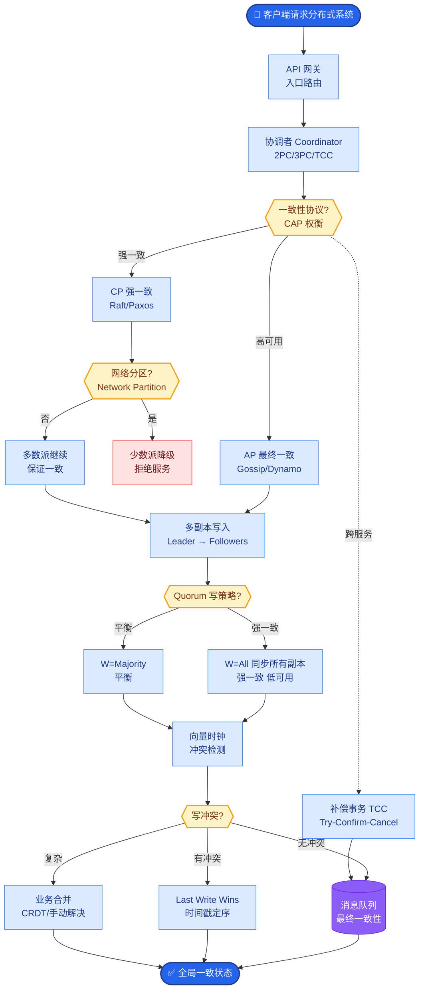

# 为什么需要「人机在环」

高风险决策（如医疗诊断、金融交易）、未知法规限制、或模型置信度低时，人类作为最终审核者是关键的安全防线，可防止幻觉或逻辑错误导致严重后果；同时，人类干预产生的真实反馈数据（RLHF 核心来源）是迭代优化提示词与工具调用的关键。

**架构示意**：
```text
┌──────────────────┐
│     用户请求      │
└────────┬─────────┘
         │
         ▼
┌──────────────────┐       ┌──────────────────┐
│   Agent/模型      │───────│   信任度评估器    │
│   (生成初步结果)  │       │  (置信度/风险)   │
└────────┬─────────┘       └────────┬─────────┘
         │                         │
         │        (置信度高)        │ (置信度低/高风)
         ▼                         ▼
┌──────────────────┐       ┌──────────────────┐
│    自动响应       │       │   转交人工审核    │
└──────────────────┘       └────────┬─────────┘
                                   │
                                   ▼
                          ┌──────────────────┐
                          │   人类修正/确认   │◄─────┐
                          └────────┬─────────┘      │
                                   │               │
                                   ▼               │
                          ┌──────────────────┐      │
                          │   最终用户响应    │      │
                          └────────┬─────────┘      │
                                   │               │
                                   ▼               │
                          ┌──────────────────┐      │
                          │  标注数据积累     │──────┘ (用于模型微调/对齐)
                          └──────────────────┘
```

**实战案例**：
在金融投研助手开发中，Agent 曾编造不存在的财报数据。我们引入了置信度门槛（<0.8 触发人工审核），并强制人工审核结果写回数据库。两周内积累了 500+ 条修正数据，微调后幻觉率降低了 40%。

**代码示例**：
```python

def human_in_the_loop_agent(agent_result, confidence_threshold=0.8):
    if agent_result.confidence >= confidence_threshold:
        return agent_result.content
    else:
        # 低置信度，接入人工审核 API (如 Triage)
        review_id = create_review_ticket(agent_result)
        
        # 模拟人工审核返回结果
        human_feedback = wait_for_review(review_id, timeout=300) # 5min超时
        
        if human_feedback.approved:
            log_to_dataset(agent_result, human_feedback.corrected_content) # 写入数据集
            return human_feedback.corrected_content
        else:
            return "Content rejected due to policy violation."
```

**关键细节补充**：
- **置信度校准**：模型的 Logits 往往不是真实的置信度，需通过温度缩放或 Platt Scaling 进行校准，否则容易频繁误报或漏报风险。
- **Fallback 机制**：若人工审核超时（如无人值守），系统必须具备安全的降级策略（如拒绝执行或回复兜底话术），而不是无限挂起。
- **审核界面优化**：人工审核 UI 应高亮显示 Agent 的不确定来源（如引用的文档片段），加速人类判断。

## 易错点
1. **置信度幻觉**：模型可能对错误的回答给出极高的自信度。单纯依赖分数是不够的，必须结合“自我一致性检查”（多次采样看结果是否一致）来辅助判断。
2. **反馈循环偏差**：人类修正后的数据如果直接用于微调，可能会引入人类的偏好偏差，导致模型过度拟合特定审核人员的风格。需进行数据清洗和去偏。

## 面试追问
1. 如果人工审核积压严重，导致大量任务排队，你会如何设计优先级调度算法来平衡效率和风险？
2. 如何量化“人机在环”带来的收益？即如何证明增加人工步骤比纯自动化更好？
3. 在用户端体验上，如何优雅地处理“转人工”的过渡，不让用户感到系统正在“卡顿”或“由于错误而中断”？

## 核心流程图



## 记忆要点

- 人机在环是高风险决策的安全防线，也是 RLHF 数据来源。
- 低置信度或高风险触发人工审核，修正数据用于微调。
- 需校准置信度，防止模型对错误回答过度自信。

## 结构化回答

**30 秒电梯演讲：** 人机在环是高风险决策的安全防线，也是 RLHF 数据来源。触发场景：高风险决策（医疗、金融）、未知法规限制、模型置信度低。人类作为最终审核者防止幻觉或逻辑错误导致严重后果，同时产生的真实反馈数据用于微调迭代。需校准置信度（温度缩放或 Platt Scaling）防模型对错误回答过度自信，人工审核超时要有安全降级策略而非无限挂起。

**展开框架：**
1. **触发场景** — 高风险决策（医疗诊断、金融交易）、未知法规限制、模型置信度低（低于阈值如 0.8）；人类作为最后防线防止灾难。
2. **数据闭环** — 人类修正数据写回数据集用于 RLHF 微调；反馈循环迭代优化提示词和工具调用；标注数据积累提升模型对齐。
3. **置信度校准与避坑** — 模型 Logits 非真实置信度需温度缩放校准；置信度幻觉要结合自我一致性检查（多次采样看结果一致）；反馈数据要清洗去偏防过度拟合审核员风格。

**收尾：** 做金融投研助手时踩过坑——Agent 编造不存在的财报数据，引入置信度门槛（<0.8 触发人工审核）强制结果写回数据库，两周积累 500+ 修正数据微调后幻觉率降 40%。您想聊哪块，置信度校准方法还是审核积压优先级调度？

## 视频脚本

> 预计时长：2 分钟 | 由浅入深

| 时间 | 画面/字幕 | 口播台词 | 讲解要点 |
|------|----------|----------|----------|
| 0:00 | 标题卡：为什么需要人机在环 | "自动驾驶遇到特殊情况得让司机接管。" | 类比开场 |
| 0:15 | 触发场景 | "高风险决策、未知法规、低置信度，三类场景触发人工。" | 触发条件 |
| 0:45 | 数据闭环图 | "人工修正数据写回数据集，用于 RLHF 微调迭代。" | 数据闭环 |
| 1:10 | 置信度幻觉警示 | "坑：模型对错误回答过度自信，要温度缩放校准。" | 关键坑 |
| 1:35 | 财报幻觉案例 | "实战：编造财报数据，置信度门槛+数据积累幻觉降 40%。" | 实战教训 |
| 1:50 | 总结卡 | "记住：高风险触发 + 数据闭环 + 置信度校准。下期讲架构取舍。" | 收尾 |

### 视频流程图


