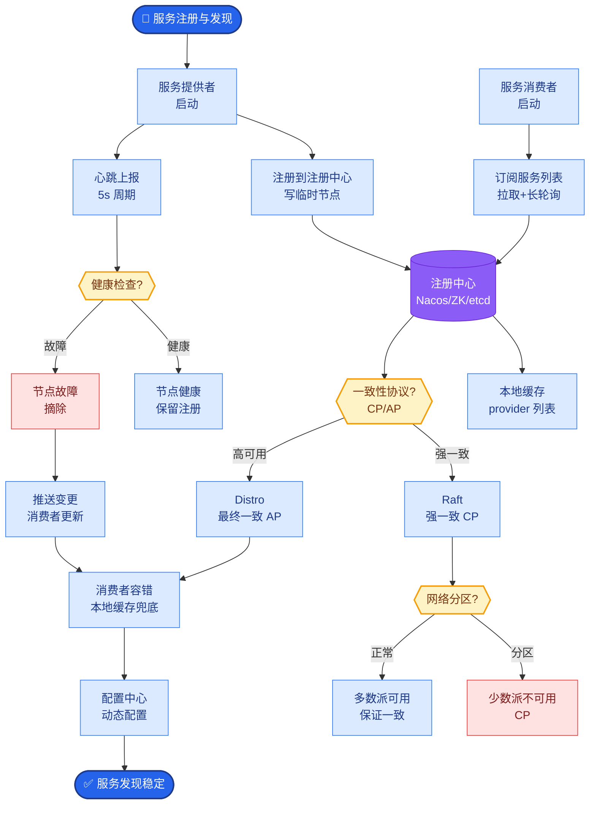
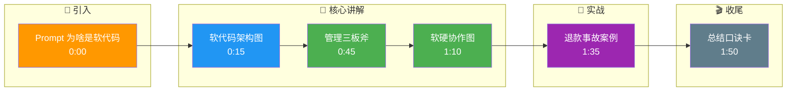

# 为什么说 Prompt 是 Agent 的「软代码」

因为 Agent 的行为策略（何时触发推理、何时调用工具、输出什么格式）大量编码在 System/User Prompt 与模板里。修改 Prompt 就像修改业务逻辑代码，直接影响系统输出，因此必须进行版本管理、Code Review（同行评审）以及 A/B 测试，以确保行为的稳定性和可复现性。

**实战案例**：某客服机器人在更新了“退货政策”的 Prompt 后，未对旧版本进行灰度测试，导致用户询问退款时 Agent 误读了新的折扣逻辑，在短短 2 小时内造成了数千笔错误的退款计算，最终不得不紧急回滚 Prompt 版本。

**软代码与硬代码协作流程：**
```text
┌──────────────────────────────────────┐
│         Agent 运行时系统              │
├──────────────────────────────────────┤
│                                      │
│  ┌──────────────┐     ┌─────────────┐│
│  │  Prompt 模板  │────▶│   LLM 模型   ││
│  │  (软代码)     │     │  (解释器)    ││
│  └──────┬───────┘     └──────┬──────┘│
│         │                     │      │
│         │ 生成指令             │      │
│         ▼                     │      │
│  ┌─────────────────────────────┐│     │
│  │      Python/JS 程序         │◄─────┘
│  │      (硬代码: 解析JSON/     │
│  │       调用API/ 异常处理)   │
│  └─────────────────────────────┘│
└──────────────────────────────────────┘
```

**代码示例**：
```python
# 使用 PromptLayer 或 LangChain 进行版本化管理（伪代码）
prompt_template = PromptTemplate.from_version("customer_service_v2")

# 注入上下文（变量部分）
filled_prompt = prompt_template.format(
    user_role="VIP",
    context=get_relevant_docs(query),
    current_date="2023-10-27" # 防止时间幻觉
)

response = llm.predict(filled_prompt)
# 硬代码部分：强制执行业务规则兜底
if not is_valid_response_format(response):
    raise ValueError("Prompt 解析失败，请检查软代码逻辑")
```

## 边界情况
1. **输入长度超限**：当注入的上下文过长导致 Prompt 超出模型上下文窗口时，需设计截断策略（如保留最新的摘要，或滑动窗口机制），防止系统指令被截断导致行为失控。
2. **特殊字符注入**：当用户输入包含类似 Prompt 的分隔符（如 `###` 或 XML 标签）时，可能破坏“软代码”结构，需对输入变量进行转义或包裹在不可见字符中。
3. **多语言/多模态混合**：在处理包含非文本输入（如图片 Base64）或多语言混合查询时，需确保 Prompt 模板对不同模态 token 占位的边界处理兼容，避免语义偏移。

## 面试追问
1. **Prompt 注入防护**：既然 Prompt 是代码，如何防止用户输入恶意 Prompt 篡改系统指令？（使用分隔符、护栏模型或指令转义）。
2. **版本控制与回滚**：在生产环境中，如何实现 Prompt 的热更新与毫秒级回滚？（配合配置中心如 Apollo/Nacos，或专门的 Prompt 管理平台如 LangSmith/PromptLayer）。
3. **调试与可观测性**：由于 LLM 的非确定性，当线上出现由“软代码”引发的 Bug 时，你如何复现和排查？（记录完整的 Prompt 模板、变量快照、随机种子及中间推理过程）。

## 易错点
1. **将 Prompt 视为静态文本**：错误地认为写好 Prompt 就一劳永逸，实际上 Prompt 是“动态代码”，需随 LLM 模型升级（如 GPT-3.5 到 GPT-4）而重新校准。
2. **硬代码缺失**：过度依赖 LLM 理解软代码逻辑，而未在程序侧（硬代码）做兜底校验（如 JSON 解析失败处理），导致系统脆弱。

## 核心流程图



## 记忆要点

- Prompt 控制行为策略，修改即改逻辑，故称“软代码”
- 需像代码一样管理：版本控制、Code Review、A/B 测试
- 软代码（LLM）与硬代码（程序兜底）协作，缺一不可
- 风险：未灰度测试直接上线，可能导致业务逻辑大面积错误

## 结构化回答

**30 秒电梯演讲：** Prompt 是 Agent 的"软代码"——因为行为策略（何时推理、何时调工具、输出啥格式）大量编码在 System/User Prompt 里，改 Prompt 就像改业务逻辑代码，直接影响系统输出。所以必须像代码一样管理：版本控制、Code Review、A/B 测试、灰度发布。软代码（LLM 推理）和硬代码（程序兜底校验）缺一不可。

**展开框架：**
1. **为何叫软代码** — 行为逻辑编码在 Prompt 模板里，LLM 当解释器，修改 Prompt 等于改逻辑，属动态配置而非静态代码。
2. **管理三板斧** — 版本控制（PromptLayer/LangSmith）、Code Review、A/B 测试加灰度，配合配置中心（Apollo/Nacos）热更新和毫秒级回滚。
3. **软硬协作** — LLM 生成指令（软代码），Python/JS 程序解析 JSON、调 API、异常处理（硬代码兜底），过度依赖 LLM 不做兜底校验会导致系统脆弱。

**收尾：** 我踩过坑——客服机器人更新退货政策 Prompt 没灰度测试，2 小时内造成数千笔错误退款计算，紧急回滚才止损。您想深入聊 Prompt 注入防护，还是软代码 Bug 的复现排查？

## 视频脚本

> 预计时长：2 分钟 | 由浅入深

| 时间 | 画面/字幕 | 口播台词 | 讲解要点 |
|------|----------|----------|----------|
| 0:00 | 标题卡：Prompt 为啥是软代码 | "改 Prompt 等于改程序逻辑，所以叫软代码。" | 开场钩子 |
| 0:15 | 软代码架构图 | "行为策略编码在 Prompt 模板里，LLM 当解释器，修改即改逻辑。" | 核心概念 |
| 0:45 | 管理三板斧 | "像代码一样管：版本控制、Code Review、A/B 测试加灰度发布。" | 管理方法 |
| 1:10 | 软硬协作图 | "LLM 生成指令软代码，程序解析 JSON 调 API 硬代码兜底，缺一不可。" | 软硬协作 |
| 1:35 | 退款事故案例 | "实战：退货 Prompt 没灰度，2 小时数千笔错误退款，紧急回滚止损。" | 实战教训 |
| 1:50 | 总结口诀卡 | "记住：Prompt 是软代码，版本管理加灰度，硬代码必兜底。下期讲 Prompt 工程进阶。" | 收尾 |

### 视频流程图




