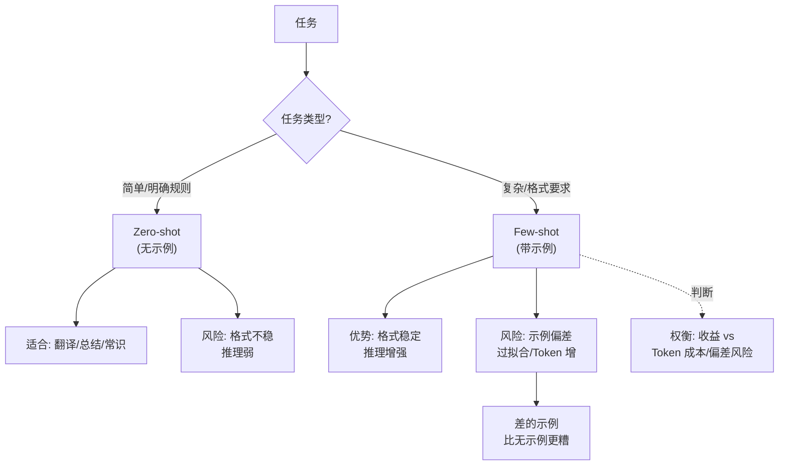
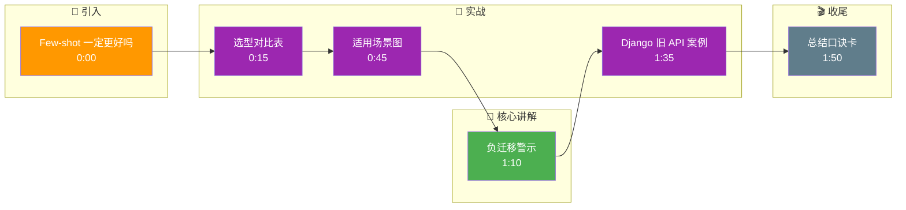

# Few-shot 一定比 Zero-shot 好吗

不一定。**Zero-shot 的优势**在于任务简单且指令清晰时，能大幅节省 Token 成本和延迟；**Few-shot 的优势**在于处理复杂输出格式或逻辑边界情况时，通过上下文学习提供更稳定的模式模仿。但如果 Few-shot 示例质量差、存在噪声，或者示例分布与测试数据分布不一致，反而会引入偏见，误导模型，效果不如 Zero-shot。

**实战案例**：在开发代码生成工具时，起初使用了 Zero-shot 性能尚可。为了处理特定框架（如 Django），加入了 Few-shot 示例。然而，由于示例中包含了过时的 API 写法，模型开始疯狂模仿旧代码，导致生成的代码无法运行。清洗示例并更新为最新 API 版本后，效果才超越 Zero-shot。

**Zero-shot vs Few-shot 选型对比：**

| 维度 | Zero-shot | Few-shot |
| :--- | :--- | :--- |
| **Token 成本** | 极低（仅指令） | 较高（指令 + N个示例） |
| **响应延迟** | 低 | 高（上下文越长，首字生成越慢） |
| **复杂格式支持** | 弱（容易漏字段） | 强（能严格模仿 JSON Schema/XML） |
| **泛化能力** | 强（不受示例噪声影响） | 弱（易受示例分布偏差干扰） |
| **适用场景** | 通用问答、简单分类、意图识别 | 复杂抽取、特定风格迁移、罕见逻辑推理 |

## 边界情况
1. **上下文窗口耗尽**：对于超长文档的摘要任务，使用 Few-shot 可能会挤占文档内容的 Token 空间，此时 Zero-shot 往往效果更好。
2. **示例与任务冲突**：如果 Few-shot 示例中隐含了某种错误的逻辑（虽然格式对），模型可能不仅学会了格式，还学会了错误的逻辑，导致“负迁移”。
3. **长尾/罕见场景**：对于极其罕见的逻辑（如特定的加密算法处理），若 Few-shot 示例不足以覆盖所有分支，Zero-shot 配合强指令（如“按步骤思考”）可能反而更通用。

## 面试追问
1. **样本选择策略**：如何挑选高质量的 Few-shot 示例？（聚类选择代表性样本，或者使用模型生成的“完美”样本，避免选择模棱两可的样本）。
2. **边际效应**：示例数量增加到多少时效果趋于饱和？（通常 3-8 个，再增加带来的边际收益递减，且不仅费钱还可能引入噪声）。
3. **Token 限制**：当上下文窗口有限时，如何压缩示例？（移除无关背景，仅保留核心输入输出对，或使用 Embedding 检索最相关的示例而非固定示例）。

## 易错点
1. **过度拟合示例**：精心挑选了几个“完美”的 Few-shot 示例，结果导致模型对真实世界中不完美的输入处理能力下降，泛化性变差。
2. **忽略示例间的独立性**：在 Few-shot 示例中存在数据泄露（如示例 B 的答案依赖示例 A 的上下文），导致模型在单次推理时产生幻觉。

## 技术原理

Few-shot 起作用的核心是 **上下文学习（In-Context Learning, ICL）**：模型在前向推理时，通过 Attention 机制从示例的输入-输出对中隐式归纳出映射规则，并将该规则应用于新 query。这与微调（更新权重）不同，ICL 不改变参数，仅在激活层面完成"临时学习"。

- **示例选择决定上限**：ICL 的效果高度依赖示例与测试分布的对齐度。研究表明，示例的"覆盖度"（覆盖目标输出的主要模式）比"数量"更重要——3 个覆盖不同模式的高质量示例，往往优于 10 个同质化的示例。
- **边际效应曲线**：示例数从 0→1 提升最显著（从纯指令到有模式），1→4 仍有明显增益，4→8 趋于饱和，8 个以上边际收益低于引入的噪声成本。这就是"3-8 个最佳"的经验来源。
- **负迁移的成因**：当示例中隐含的规则与任务真实规则不一致（如示例用旧 API、示例的推理路径有逻辑漏洞），模型会忠实地复现错误规则，导致比 Zero-shot 更差的结果。

## 代码示例

动态示例选择（基于 Embedding 检索最相关示例，而非固定示例）：

```python
from openai import OpenAI
import numpy as np

client = OpenAI()

def select_few_shot_examples(query: str, example_pool: list, k: int = 4) -> list:
    """从示例池中检索与 query 最相关的 k 个示例，避免固定示例的分布偏差"""
    def embed(text):
        r = client.embeddings.create(model="text-embedding-3-small", input=text)
        return r.data[0].embedding

    q_emb = np.array(embed(query))
    scored = []
    for ex in example_pool:
        e_emb = np.array(embed(ex["input"]))
        score = np.dot(q_emb, e_emb) / (np.linalg.norm(q_emb) * np.linalg.norm(e_emb))
        scored.append((score, ex))
    scored.sort(reverse=True, key=lambda x: x[0])
    return [ex for _, ex in scored[:k]]

def build_prompt(query, examples):
    messages = [{"role": "system", "content": "按示例的格式输出 JSON。"}]
    for ex in examples:
        messages.append({"role": "user", "content": ex["input"]})
        messages.append({"role": "assistant", "content": ex["output"]})
    messages.append({"role": "user", "content": query})
    return messages

# 简单任务直接 Zero-shot；复杂格式任务用动态 Few-shot
is_complex = True
if is_complex:
    shots = select_few_shot_examples(query, example_pool, k=4)
    prompt = build_prompt(query, shots)
else:
    prompt = [{"role": "user", "content": query}]
```

## 注意事项

- **示例顺序影响结果**：研究表明 LLM 对示例顺序敏感（recency bias），靠后的示例影响更大。建议把最典型的示例放最后，或做顺序消融实验确定稳定排列。
- **示例格式必须与目标严格一致**：示例输出的 JSON 缩进、字段顺序、是否带尾逗号都会被模型模仿。示例里多一个空格，输出就可能全错。
- **不要混用示例风格**：若 3 个示例中 2 个用中文回答、1 个用英文，模型输出语言会不稳定。保持示例风格统一。
- **动态检索优于固定示例**：线上场景下，用 Embedding 从示例池里检索与当前 query 最相关的示例（动态 Few-shot），比固定塞同一组示例泛化性更强。

## 核心流程图



## 记忆要点

- 并非绝对：Zero-shot 省钱快，Few-shot 稳定但易受噪声影响
- 选型：简单任务用 Zero-shot，复杂格式或逻辑用 Few-shot
- 边际效应：示例通常 3-8 个最佳，过多易引入偏差
- 风险：示例质量差或分布不一致会导致“负迁移”

## 结构化回答

**30 秒电梯演讲：** Few-shot 不一定比 Zero-shot 好。Zero-shot 省钱快、泛化强，适合简单任务和通用问答；Few-shot 稳定但易受噪声影响，适合复杂格式或罕见逻辑。关键是示例质量差或分布不一致会导致"负迁移"，效果反而不如 Zero-shot。示例通常 3-8 个最佳，过多边际收益递减还引入偏差。

**展开框架：**
1. **各有优势** — Zero-shot Token 成本低、延迟低、泛化强（不受示例噪声影响）；Few-shot 复杂格式支持强、模式模仿稳定。
2. **选型规则** — 简单分类和意图识别用 Zero-shot；复杂抽取、特定风格迁移、罕见推理用 Few-shot；超长文档摘要用 Zero-shot 避免挤占 Token。
3. **风险避坑** — 示例质量差或分布不一致导致负迁移；过度拟合"完美"示例泛化变差；示例间数据泄露导致幻觉。

**收尾：** 我做代码生成踩过坑——加 Django Few-shot 但示例含过时 API，模型疯狂模仿旧代码无法运行，清洗示例更新最新 API 后才超越 Zero-shot。您想深入聊样本选择策略，还是上下文窗口有限时的示例压缩？

## 视频脚本

> 预计时长：2 分钟 | 由浅入深

| 时间 | 画面/字幕 | 口播台词 | 讲解要点 |
|------|----------|----------|----------|
| 0:00 | 标题卡：Few-shot 一定更好吗 | "简单的题不用举例，复杂的题给对例子才管用。" | 类比开场 |
| 0:15 | 选型对比表 | "Zero-shot 省钱快泛化强，Few-shot 稳定但易受噪声影响。" | 选型对比 |
| 0:45 | 适用场景图 | "简单任务用 Zero-shot，复杂格式或罕见逻辑用 Few-shot。" | 适用场景 |
| 1:10 | 负迁移警示 | "坑：示例质量差或分布不一致导致负迁移，效果反不如 Zero-shot。" | 风险避坑 |
| 1:35 | Django 旧 API 案例 | "实战：Few-shot 含过时 API 模型模仿旧代码，清洗示例后才超越。" | 实战案例 |
| 1:50 | 总结口诀卡 | "记住：简单 Zero-shot，复杂 Few-shot，3-8 个最佳。下期讲示例顺序。" | 收尾 |

### 视频流程图




