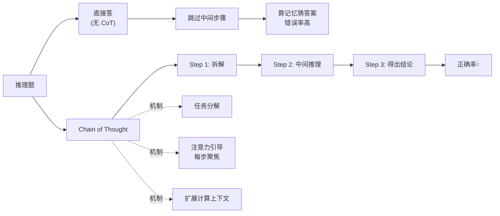
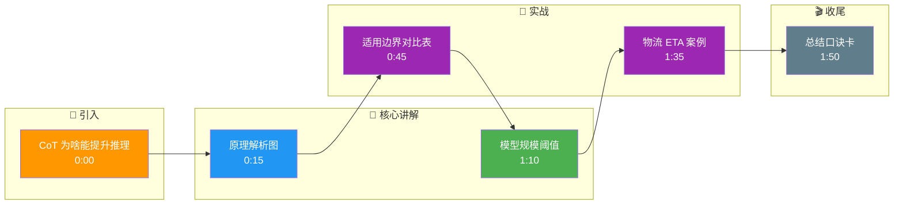

# CoT 为什么能提升推理题正确率

原理上，CoT（Chain of Thought）将复杂的推理任务分解为一系列显式的中间步骤，降低了模型“一步到位”生成正确结果的计算难度。对于 Transformer 架构，生成更多相关的中间 Token 有助于增强后续 Token 预测的条件概率（提供更多计算路径）。但 CoT 并非万能：在纯事实性回忆任务上可能反而降低准确率；同时 CoT 存在“错误累积”风险，如果中间推理步骤出错，极易误导最终答案。

**## 边界情况**
1. **反直觉场景（事实性任务）**：对于类似“中国的首都是哪里”这类事实回忆（Fact Retrieval）任务，强制使用 CoT 反而会降低准确率。因为模型在生成推理过程时容易产生幻觉，导致最终答案被错误推理带偏。
2. **模型规模阈值**：CoT 的有效性高度依赖于模型参数规模。通常研究表明，只有当模型参数超过约 100B（百亿）级别时，CoT 带来的收益才会显著显现；小模型使用 CoT 往往只增加了计算成本却无法提升推理质量。
3. **多语言迁移性**：CoT 推理步骤在某些低资源语言上可能不如在英语/中文上稳定，因为模型在这些语言上的逻辑推理 token 训练数据较少。

### 实战案例
在做电商物流 ETA（预计到达时间）计算时，直接让模型预测结果经常偏差很大，引入 CoT 让模型先分步解析“仓库出库+干线运输+末端配送”各环节耗时后，准确率提升了 30%，但偶尔会出现中间某环节时间计算错误导致最终谬误的情况。

### 代码示例
```python
# Few-shot CoT Prompting 示例
prompt = """
Q: Roger 有 5 个网球，他又买了 2 罐网球，每罐 3 个。现在他总共有多少个网球？
A: 罗杰开始有 5 个球。2 罐每罐 3 个就是另外 6 个球。5 + 6 = 11。答案是 11。

Q: 食堂有 23 个苹果，如果他们用掉 20 个做午餐，又买了 6 个，现在有多少个？
A: 让我们一步步思考。
"""
response = llm.generate(prompt)  # 模型会模仿中间推理步骤
```

### 对比表格

| 维度 | 标准 Prompting | Chain of Thought (CoT) |
| :--- | :--- | :--- |
| **核心机制** | 端到端直接预测答案 | 分解推理步骤，逐步推导 |
| **适用任务** | 简单分类、事实问答、翻译 | 数学运算、逻辑推理、复杂任务规划 |
| **Token 消耗** | 低（仅输出答案） | 高（输出推理过程 + 答案） |
| **鲁棒性** | 较差，容易一步错步步错 | 较高，配合 Self-Consistency 可显著提升 |
| **失败风险** | 幻觉或乱猜 | 中间步骤错误累积（错误传导） |

## 常见考点
1. **触发方式**：如何有效触发 CoT？（直接提示“Let's think step by step”或提供 Few-shot 推理示例）。
2. **Self-Consistency**：什么是自洽性？（对同一个问题多次采样生成不同的 CoT，取投票最多的结果，提高鲁棒性）。
3. **适用场景**：哪些任务不适合用 CoT？（简单的分类任务、算术运算中的符号计算、OCR 提取等不需要逻辑分解的任务）。

## 面试追问
1. 如果 CoT 的中间推理步骤本身出现了幻觉（即逻辑自洽但事实错误），有什么机制可以检测或修正？（考察对验证机制如Self-Verification、Reflexion的理解）
2. 为什么小模型使用 CoT 效果反而变差？（考察对模型涌现能力Emergent Abilities的认知）
3. 相比于标准的 Zero-shot CoT，你是如何选择 Few-shot 示例的？如果示例选错了会怎样？（考察示例选择策略如APE或Few-Shot Selection的重要性）

## 易错点
1. **认为 CoT 能解决所有推理题**：CoT 主要提升算术和符号推理能力，但在需要世界知识或常识的推理任务中，效果提升有限，甚至可能因为引入额外错误步骤而降低准确率。
2. **忽略 Token 成本**：在长上下文或高并发场景下，CoT 带来的 Token 消耗和延迟增加是线性的，容易导致生产环境成本失控或延迟 SLA 达标困难。

## 核心流程图



## 记忆要点

- 原理：分解复杂推理步骤，降低计算难度，增强条件概率
- 适用：算术、逻辑推理；不适用：简单事实回忆（易幻觉）
- 阈值：通常百亿参数以上模型才显著涌现 CoT 能力
- 风险：中间步骤错误会累积传导，需配合 Self-Consistency

## 结构化回答

**30 秒电梯演讲：** CoT 能提升推理题正确率，原理是把复杂推理分解成显式中间步骤，降低"一步到位"的计算难度，生成更多中间 Token 增强后续预测的条件概率。但 CoT 不是万能的：简单事实回忆任务反而降准确率（易幻觉），通常要百亿参数以上模型才显著涌现 CoT 能力。风险是中间步骤错误会累积传导，要配合 Self-Consistency 多次采样投票。

**展开框架：**
1. **原理解析** — 分解复杂推理为中间步骤，降低计算难度；Transformer 生成中间 Token 增强条件概率，提供更多计算路径。
2. **适用边界** — 算术和逻辑推理显著提升；事实回忆任务反而降准确率（"中国首都"类问题强制 CoT 易幻觉）；百亿参数以下模型收益不显著。
3. **风险与缓解** — 中间步骤错误累积传导；配合 Self-Consistency 多次采样投票提高鲁棒性；Token 成本和延迟线性增加。

**收尾：** 我做电商物流 ETA 计算时——直接预测偏差大，引入 CoT 分步解析"出库+干线+末端"各环节耗时后准确率升 30%，但偶尔中间环节算错导致谬误。您想深入聊 Self-Consistency 的实现，还是 CoT 推理链出错的定位？

## 视频脚本

> 预计时长：2 分钟 | 由浅入深

| 时间 | 画面/字幕 | 口播台词 | 讲解要点 |
|------|----------|----------|----------|
| 0:00 | 标题卡：CoT 为啥能提升推理 | "像做数学题写过程，一步步算比心算更准。" | 类比开场 |
| 0:15 | 原理解析图 | "分解复杂推理为中间步骤，生成中间 Token 增强条件概率。" | 核心原理 |
| 0:45 | 适用边界对比表 | "算术逻辑推理显著提升，事实回忆反而降准确率易幻觉。" | 适用边界 |
| 1:10 | 模型规模阈值 | "百亿参数以上模型才显著涌现 CoT 能力，小模型只增成本。" | 规模阈值 |
| 1:35 | 物流 ETA 案例 | "实战：分步解析出库干线末端耗时，准确率升 30%。" | 实战案例 |
| 1:50 | 总结口诀卡 | "记住：分解步骤降难度，简单任务别用，配 Self-Consistency。下期讲 Self-Reflection。" | 收尾 |

### 视频流程图




