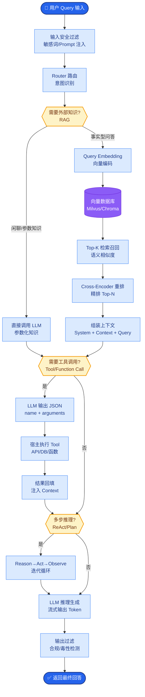

# 如何保证模型一定输出合法 JSON

**多层保障：** (1)Prompt 明确要求「仅 JSON、禁止 Markdown」；(2)用 JSON Schema 在服务端校验；(3)失败则 repair：用第二次调用让模型根据错误信息修正；或(4)用开源/库做 JSON repair；(5)关键路径用 Function Calling + 强校验。

**关键细节与原理：**
1. **Prompt 技巧**：在 Prompt 中提供 Few-Shot 示例（JSON 格式的正例），并明确要求“不要输出任何解释性文本，只返回 JSON 对象”。使用 XML 标签（如 `<json_output>`）包裹输出指令可增强分隔效果。
2. **Function Calling 机制**：利用模型原生的 Function Calling 能力（定义 `tools` 或 `functions`），模型会强制输出结构化的参数对象，通常比纯文本 Prompt 生成 JSON 的格式稳定性高得多。
3. **Grammar Constrained Sampling**：对于极致要求的场景，可使用支持语法约束采样（如 llama.cpp 的 -grammar 参数或 Outlines 库），在解码阶段通过有限状态机（FSM）限制模型只能输出符合 JSON 语法的 token，从数学上保证格式正确。

**## 边界情况**
1. **特殊字符转义**：模型在生成 JSON 字符串内容时，常会忘记转义内部的双引号或换行符。虽然外部大括号可能闭合，但会导致 `json.loads` 失败，需在 Repair 环节重点处理字符串内容的清洗。
2. **截断导致的格式不完整**：当生成的内容超过 max_tokens 时，模型可能在 JSON 的中间或末尾括号处截断。这种情况下无法通过简单的正则修复，通常需要补全请求或调整 max_tokens 预留。
3. **枚举值偏移**：即使 JSON 格式合法，模型生成的 Enum 值可能不在预定义的 Schema 范围内（例如要求输出 `"low"` 却输出了 `"small"`）。这属于逻辑错误而非语法错误，单纯的格式校验无法拦截。

### 实战案例
在提取复杂发票字段时，常规 Prompt 经常漏掉闭合括号 `}`。引入 `json_repair` 库作为兜底后，解析成功率从 92% 提升至 99.9%，彻底解决了流程中断问题。

### 代码示例
```python
import json
from json_repair import repair_json

raw_response = llm.generate(prompt) # 可能包含 ```json ...
try:
    data = json.loads(raw_response)
except json.JSONDecodeError:
    # 尝试自动修复常见错误（如尾随逗号、注释等）
    repaired_str = repair_json(raw_response)
    data = json.loads(repaired_str)
```

### 对比表格

| 方案 | 可靠性 | 实现难度 | 适用场景 | 成本 |
| :--- | :--- | :--- | :--- | :--- |
| **纯 Prompt** | 低 (60-80%) | 低 | 简单提取，可容忍失败 | 1x |
| **Function Calling** | 高 (95%+) | 低 | 结构化数据提取，工具调用 | 1x (专用API) |
| **后处理 Repair** | 极高 (99%+) | 低 | 容错要求高的生产环境 | 微小计算开销 |
| **Grammar Constrained** | 100% (数学保证) | 高 (需特定推理引擎) | 本地部署，严格格式控制 | 推理速度稍慢 |

**流程图：**
```text
┌─────────────┐
│  User Input │
└──────┬──────┘
       │
       ▼
┌─────────────────────┐
│ LLM Generate Output │
└──────┬──────────────┘
       │
       ▼
┌─────────────────┐    No     ┌──────────────────┐
│ JSON Parse Check│──────────►│ JSON Repair Lib  │──┐
└──────┬───────────┘           └──────────────────┘  │
       │ Yes                                         │
       ▼                                             │
┌─────────────────┐                                 │
│ Schema Validate │──No──► Refine Prompt ──────────┘
└──────┬───────────┘        (Retry LLM)
       │ Yes
       ▼
┌─────────────────┐
│   Success       │
└─────────────────┘
```

## 面试追问
1. 如果模型生成的 JSON 包含了 Markdown 代码块标记（如 ```json），在解析失败进入 Repair 流程时，应该如何处理以确保效率？（考察正则匹配与容错逻辑）
2. Grammar Constrained Sampling 虽然能保证格式正确，但会对模型的生成性能（Latency 或 Perplexity）产生什么影响？（考察对解码原理的理解）
3. 在 Function Calling 模式下，如果模型频繁调用了不存在的函数（幻觉函数），除了通过 Prompt 约束，还有什么系统层面的办法？（考察 RAG 检索工具定义或动态 Tool 列表加载）

## 易错点
1. **认为 Prompt 越严厉 JSON 越稳**：过于严厉的 Prompt（如“必须输出纯JSON，否则...”）有时会吓住模型，导致其在遇到不确定内容时反而产生格式崩溃或拒答。
2. **忽略 Schema 的业务校验**：只校验 JSON 格式合法，而不校验字段类型（如把数字输成字符串）或枚举值，导致下游业务逻辑报错。

## 核心流程图



## 记忆要点

- 多层保障：Prompt 约束 -> JSON Schema 校验 -> Repair 修复
- 高可靠方案：Function Calling 或 Grammar Constrained Sampling
- 兜底：解析失败时用修复库或二次调用让模型修正
- 风险：截断导致格式不完整，需预留 max_tokens

## 结构化回答

**30 秒电梯演讲：** 保证模型输出合法 JSON 要多层保障：Prompt 明确要求"仅 JSON 禁 Markdown"、服务端 JSON Schema 校验、失败用 repair 库或二次调用让模型修正。高可靠方案优先用 Function Calling（模型原生结构化输出）或 Grammar Constrained Sampling（FSM 数学保证格式）。兜底是解析失败用 json_repair 库，风险是截断导致格式不完整需预留 max_tokens。

**展开框架：**
1. **多层保障** — Prompt 约束（Few-shot 正例 + XML 标签分隔）→ JSON Schema 服务端校验 → Repair 修复（json_repair 库或二次调用）。
2. **高可靠方案** — Function Calling 模型原生结构化输出稳定性 95%+；Grammar Constrained Sampling 用 FSM 数学保证 100% 格式正确。
3. **风险避坑** — 截断导致括号不闭合需预留 max_tokens；特殊字符忘转义；枚举值偏移（"low"输出成"small"）是逻辑错非语法错。

**收尾：** 我做发票字段提取时——常规 Prompt 经常漏闭合括号，引入 json_repair 库兜底后解析成功率从 92% 升到 99.9%。您想深入聊 Grammar Constrained Sampling 的解码原理，还是 Function Calling 幻觉函数的防范？

## 视频脚本

> 预计时长：2 分钟 | 由浅入深

| 时间 | 画面/字幕 | 口播台词 | 讲解要点 |
|------|----------|----------|----------|
| 0:00 | 标题卡：怎么保证输出合法 JSON | "既要教孩子守规矩，也要准备橡皮擦帮他擦改写错的字。" | 类比开场 |
| 0:15 | 多层保障流程图 | "Prompt 约束、JSON Schema 校验、Repair 修复，三层保障。" | 多层保障 |
| 0:45 | 高可靠方案对比 | "Function Calling 稳定性 95%+，Grammar Constrained 数学保证 100%。" | 高可靠方案 |
| 1:10 | 截断风险警示 | "风险：截断导致括号不闭合需预留 max_tokens，枚举值偏移是逻辑错。" | 风险避坑 |
| 1:35 | 发票提取案例 | "实战：常规 Prompt 漏闭合括号，json_repair 兜底成功率 92% 升 99.9%。" | 实战案例 |
| 1:50 | 总结口诀卡 | "记住：多层保障，优先 Function Calling，repair 库兜底。下期讲 System Prompt 长度。" | 收尾 |

### 视频流程图


