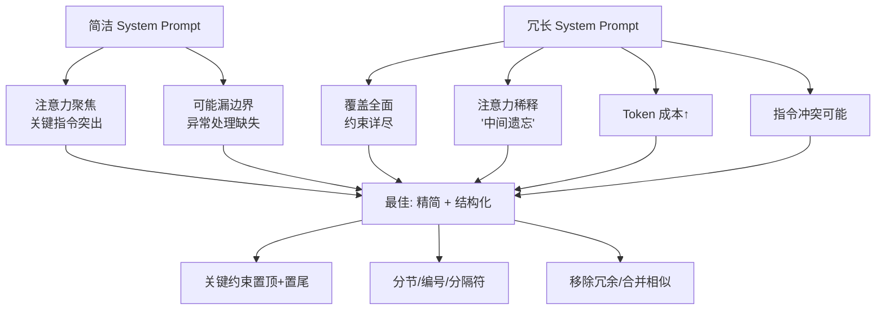

# System Prompt 越长越好吗

不是。过长会稀释重点、占用上下文，且增加被用户间接注入利用的表面积。应分层：核心规则短而硬，细节放文档检索或工具说明。

**关键细节与原理：**
1. **注意力机制弱点**：LLM 的注意力机制在处理超长 Prompt 时，对首尾内容的关注度较高，中间部分容易被“淹没”。冗长的 System Prompt 可能导致关键指令（如“拒绝回答敏感问题”）被模型忽略。
2. **上下文窗口竞争**：System Prompt 占用过多 Token 会挤压用户提问和 RAG 检索内容的可用空间，导致回答时信息量不足。
3. **注入风险**：过长的 Prompt 包含越多的自然语言指令，就越容易包含可以被用户通过“越狱”技巧利用或绕过的逻辑模式。
4. **优化策略**：采用“CoT（思维链）隐藏”技术，将复杂的推理逻辑隐藏在 System Prompt 中作为静默思考步骤，而对用户只展示简洁的输出要求。

**## 边界情况**
1. **指令冲突与优先级**：当 System Prompt 中存在多条且可能冲突的指令（如“保持友善”与“拒绝骚扰”）时，过长的 Prompt 会让模型难以权衡优先级，导致行为摇摆不定。
2. **多轮对话的状态污染**：在长对话中，过长的 System Prompt 会被不断重复输入，如果其中包含时间敏感信息（如“今天是...”），容易造成混淆，且极大地浪费 Token。
3. **模型遗忘效应**：某些模型在处理极长上下文（如 128k+）时，如果 System Prompt 位于最开头且没有在尾部重复，模型可能会“忘记” System Prompt 中的核心约束。

### 实战案例
某客服机器人的 System Prompt 初始写了 2000 行业务规范，导致模型经常在用户“没听清”时无法正确复读上文。我们将 80% 的细则移至 RAG 知识库，System Prompt 仅保留“必须先查库”的核心指令，响应效果显著提升。

### 代码示例
```python
# 优化前：所有规则硬编码
system_prompt = """
你是客服。规则1：...规则500：...
用户：你好
"""

# 优化后：分层设计
system_prompt = """
你是一个专业客服助手。
1. 必须先查询 knowledge_base 获取最新政策。
2. 回答要简洁礼貌。
3. 禁止回答政治问题。
"""
user_query = "..."
retrieved_docs = search_knowledge_base(user_query) # 动态加载细节
final_input = f"Context: {retrieved_docs}\nUser: {user_query}"
```

### 对比表格

| 特性 | 长 System Prompt | 短 System Prompt + RAG |
| :--- | :--- | :--- |
| **指令遵循度** | 容易衰减（注意力分散） | 高（指令紧凑） |
| **知识更新** | 需重新部署 Prompt | 实时更新知识库 |
| **上下文占用** | 高（固定占用） | 动态（按需加载） |
| **注入风险** | 高（攻击面大） | 低（核心逻辑少） |
| **维护成本** | 低（逻辑集中） | 中（需维护检索质量） |

**常见考点：**
1. 什么是“长上下文迷失”现象，System Prompt 放哪里最好？（通常开头或结尾效果较好，视模型而定）
2. 如何测试 System Prompt 的有效性？（使用 adversarial examples 对抗测试）
3. 是否需要每次请求都发送完整的 System Prompt？（取决于模型 API 是否支持 Session 级别的 System 注入）

## 面试追问
1. 如果必须把非常复杂的逻辑（如几百页的法律法规）放入 System Prompt，你会如何组织结构来最大化模型的遵循率？（考察结构化提示、分块或模块化提示的设计能力）
2. 在多轮对话中，System Prompt 的内容是否应该根据对话状态动态调整？（考察动态 Prompt 编排与对话管理的结合）
3. 现在的很多模型支持 System Message 和 User Message 分离，从技术实现上讲，这种分离是否完全避免了 System Prompt 被 User Prompt 覆盖的风险？（考察对 Attention 机制和实际模型训练数据分布的深度理解，实际上并非绝对隔离）

## 易错点
1. **将知识库内容硬编码到 System Prompt**：很多新手为了简化架构，直接把公司知识库的问答塞进 System Prompt，导致 Token 消耗爆炸且检索能力丧失。
2. **忽视不同模型的 System Prompt 训练差异**：有些模型在训练时对 System Message 的加权更高，而有些模型则对 User Message 最后的内容更敏感，通用的 Prompt 模板在不同模型上可能效果迥异。


## 核心流程图



## 核心知识点图


## 记忆要点

- 不是越长越好：过长稀释重点、占用窗口、增加注入面
- 优化策略：核心规则短而硬，细节放 RAG 检索动态加载
- 注意力机制：中间内容易被淹没，关键指令放首尾
- 易错：将知识库硬编码进 System Prompt 导致 Token 爆炸

## 结构化回答

**30 秒电梯演讲：** System Prompt 不是越长越好。过长会稀释重点（注意力机制对首尾关注高，中间被淹没）、占用上下文窗口挤压用户提问和 RAG 空间、增加被注入利用的表面积。优化策略是分层：核心规则短而硬放 System Prompt，细节放 RAG 知识库动态检索加载。易错是把知识库硬编码进 System Prompt 导致 Token 爆炸。

**展开框架：**
1. **三大问题** — 注意力稀释（中间内容被淹没）、上下文窗口竞争（挤压用户提问和 RAG）、注入风险增加（攻击面大）。
2. **分层优化** — 核心规则短而硬（"必须先查库""禁止政治"）放 System Prompt；80% 细则移至 RAG 知识库动态加载。
3. **注意力利用** — 关键指令放首尾位置；多轮对话中过长的 System Prompt 重复输入浪费 Token，时间敏感信息易混淆。

**收尾：** 我做客服机器人时——System Prompt 写了 2000 行业务规范导致模型经常无法正确复读，把 80% 细则移到 RAG 知识库只保留核心指令后效果显著提升。您想深入聊长上下文迷失现象，还是动态 Prompt 编排？

## 视频脚本

> 预计时长：2 分钟 | 由浅入深

| 时间 | 画面/字幕 | 口播台词 | 讲解要点 |
|------|----------|----------|----------|
| 0:00 | 标题卡：System Prompt 越长越好吗 | "法律条文越短越有力，太长没人看还容易找漏洞。" | 类比开场 |
| 0:15 | 三大问题图 | "过长稀释重点、占用上下文窗口、增加注入风险表面积。" | 三大问题 |
| 0:45 | 分层优化策略 | "核心规则短而硬放 System Prompt，细节放 RAG 知识库动态加载。" | 分层优化 |
| 1:10 | 注意力机制示意 | "注意力对首尾关注高，关键指令放首尾，中间内容易被淹没。" | 注意力利用 |
| 1:35 | 客服规范案例 | "实战：2000 行规范导致无法复读，80% 移 RAG 后效果显著提升。" | 实战案例 |
| 1:50 | 总结口诀卡 | "记住：核心短硬，细节 RAG，关键指令放首尾。下期讲 Prompt 注入防护。" | 收尾 |

