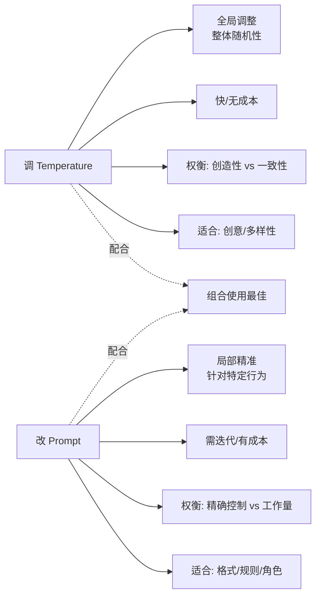

# 调 Temperature 和改 Prompt 有什么分工

Prompt 解决「做什么、格式与安全」；Temperature 主要调「多样性 vs 确定性」。格式总错应先改 Prompt 与校验，而不是盲目调参。

**关键细节与原理**：
1. **Temperature 原理**：Temperature 控制 Softmax 输出的概率分布平滑度。T=0 时退化为 Argmax，选择概率最高的 Token（确定性最强）；T 越高，低概率 Token 被选中的机会越大，输出越随机、富有创造力。
2. **Top-P (Nucleus Sampling)**：通常与 Temperature 配合使用。只选择累积概率达到 P 的 Token 集合进行采样。这能防止模型在长尾极端低概率词上“乱来”。
3. **边界条件**：对于代码生成、SQL 生成等需要语法严格正确的场景，建议 Temperature=0；对于创意写作、头脑风暴，建议 0.7-1.0。
4. **Prompt 的决定性作用**：Temperature 改变的是“怎么说”，Prompt 决定的是“能不能做对”。如果 Prompt 逻辑混乱，无论 Temperature 多低都无法得到正确答案。

**实战案例**：
在做 SQL 生成工具时，若 Temperature > 0，模型偶尔会把 `JOIN` 写成 `LEFT INNER JOIN` 这种不存在的语法；即使通过 Prompt 强化了格式要求，偶发的随机性仍会导致执行报错，最终我们将 Temperature 锁死为 0 保证了 100% 的语法可用性。

**代码示例**：
```python
# Python: OpenAI API 控制确定性与多样性的典型用法
import openai

# 场景1：代码生成/逻辑推理，追求绝对准确
code_resp = openai.ChatCompletion.create(
    model="gpt-4",
    temperature=0,  # 0 确保输出最确定的 Token
    messages=[...]
)

# 场景2：头脑风暴，追求发散性
ideas = openai.ChatCompletion.create(
    model="gpt-4",
    temperature=0.9, # 高温鼓励探索低概率 Token
    top_p=0.9,       # 配合 Nucleus Sampling 防止离谱词
    messages=[...]
)
```

**常见考点**：
1. Temperature 设为 0 是否意味着完全没有随机性？（取决于具体实现，有些 API 即使 T=0 也会有微小的随机性或并行采样差异）
2. 为什么在 Function Calling 场景下通常建议将 Temperature 设低？（防止模型调用错误的工具或生成参数结构错误）
3. Top-K 和 Top-P 的区别是什么？（Top-K 限制候选数量，Top-P 限制概率质量，后者更具动态性）

## 边界情况
1. **极端 Temperature 值**：当 Temperature 极高（如 > 1.5）时，模型可能产生乱码或极度不连贯的文本；当 T=0 时，部分模型实现可能因浮点精度问题仍产生微小抖动。
2. **短文本生成**：对于只需回答“是/否”或极短文本的任务，Temperature 的影响可能被 End Token 的选择概率掩盖，此时应更多依赖 Prompt。
3. **系统指令冲突**：如果 Prompt 中包含“请随意发挥”等鼓励多样性的指令，强行设置低 Temperature 可能导致模型输出生硬或卡顿。

## 面试追问
1. 在生产环境中，如何通过 A/B 测试确定特定业务场景的最佳 Temperature 参数？
2. 既然 Temperature 影响采样，那它对模型推理的 Latency 有影响吗？
3. 如果模型在低 Temperature 下出现“死循环”或重复输出相同词汇，应该从哪些方面排查？

## 易错点
1. **混淆确定性与一致性**：Temperature=0 只保证了同一 Prompt 下输出的“确定性”，但不保证输出内容的“事实正确性”，事实准确性仍取决于模型能力和 Prompt。
2. **过度依赖温度修正**：试图通过调高 Temperature 来解决模型“听不懂指令”的问题，这是无效的，应优先优化 Prompt 的清晰度和示例。


## 核心流程图




## 记忆要点

- Prompt定内容与格式，Temperature定随机性，二者分工明确
- T=0为确定性（代码/SQL），T>0.7为创造性（头脑风暴）
- 格式错误先修Prompt，逻辑混乱先修Prompt，盲目调参无效

## 结构化回答

**30 秒电梯演讲：** Prompt 和 Temperature 分工明确：Prompt 定"做什么、格式、安全"，Temperature 定"多样性 vs 确定性"。T=0 是确定性最强（代码、SQL 生成），T>0.7 是创造性（头脑风暴、创意写作）。关键是格式错误和逻辑混乱都先修 Prompt，盲目调参无效——Temperature 改变"怎么说"，Prompt 决定"能不能做对"。

**展开框架：**
1. **分工明确** — Prompt 定内容与格式（能不能做对），Temperature 定随机性（怎么说），Top-P 配合防长尾极端词。
2. **参数选择** — T=0 确定性（代码、SQL、Function Calling）；T=0.7-1.0 创造性（创意写作、头脑风暴）；T>1.5 可能乱码。
3. **避坑原则** — 格式错误先修 Prompt 加 Schema 校验；逻辑混乱先修 Prompt 清晰度；试图调高 Temperature 解决"听不懂指令"是无效的。

**收尾：** 我做 SQL 生成时——Temperature>0 偶尔把 JOIN 写成不存在的 LEFT INNER JOIN，锁死 T=0 才保证 100% 语法可用。您想深入聊 A/B 测试定最佳 Temperature，还是低 Temperature 下死循环的排查？

## 视频脚本

> 预计时长：2 分钟 | 由浅入深

| 时间 | 画面/字幕 | 口播台词 | 讲解要点 |
|------|----------|----------|----------|
| 0:00 | 标题卡：Temperature 和 Prompt 分工 | "Prompt 是考试大纲，Temperature 是答题保守还是发散的风格。" | 类比开场 |
| 0:15 | 分工明确图 | "Prompt 定做什么和格式，Temperature 定多样性和确定性。" | 分工明确 |
| 0:45 | 参数选择卡 | "T=0 确定性代码 SQL，T>0.7 创造性头脑风暴，T>1.5 可能乱码。" | 参数选择 |
| 1:10 | 避坑原则警示 | "格式错误逻辑混乱先修 Prompt，盲目调参无效。" | 避坑原则 |
| 1:35 | SQL JOIN 案例 | "实战：T>0 偶尔写不存在的 JOIN 语法，锁死 T=0 保证 100% 可用。" | 实战案例 |
| 1:50 | 总结口诀卡 | "记住：Prompt 定内容，Temperature 定风格，先修 Prompt。下期讲 Prompt 版本管理。" | 收尾 |

