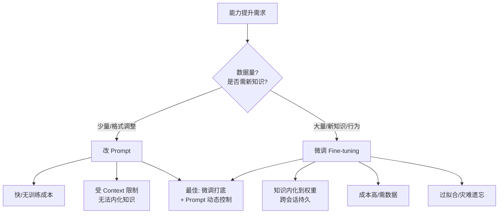

# Prompt 和微调的关系

Prompt 是推理时上下文策略；微调是改权重。数据少、迭代快优先 Prompt + 评测；要固化领域行为、长期一致再考虑微调；二者常组合。

**关键细节与原理**：
1. **知识内化 vs 上下文学习**：
   - **Prompting (ICL)**：利用模型的上下文学习能力，无需更新权重，知识存储在 Prompt 中。受限于上下文窗口，每次推理都需要重新输入。适合逻辑推理、格式转换。
   - **Fine-tuning (SFT)**：通过梯度下降更新模型权重，将知识“内化”到参数中。推理时无需额外输入，延迟低。适合学习新的风格、领域术语或特定格式的输出习惯。
2. **遗忘问题**：微调可能导致模型在通用任务上的能力下降，因此通常需要混合通用数据与领域数据进行训练。
3. **组合策略**：先微调让模型学会“使用某种工具”或“掌握某种说话风格”，然后再通过 Prompt 传入具体的任务指令。这样可以节省 Prompt 的 Token 开销。

**实战案例**：
在某医疗问答项目中，我们尝试仅用 Prompt 注入诊疗指南，但模型常混淆相似症状；后使用 LoRA 微调了 1000 条高质量问答对，模型才真正掌握了领域术语（如将“肚子疼”修正为“腹部绞痛”），推理时 Prompt 长度减少了 40%。

**代码示例**：
```python
# Python: 使用 PEFT (LoRA) 进行微调的关键配置
from peft import LoraConfig, get_peft_model

# LoRA 配置：仅微调少量参数，降低显存与过拟合风险
lora_config = LoraConfig(
    r=16,                 # 秩，控制参数量
    lora_alpha=32,        # 缩放因子
    target_modules=["q", "v"], # 仅针对 Attention 层
    lora_dropout=0.05     # 防止过拟合
)

model = get_peft_model(base_model, lora_config)
```

**对比表格**：

| 维度 | Prompt Engineering (ICL) | Fine-tuning (SFT) |
| :--- | :--- | :--- |
| **成本** | 仅推理成本，每次请求重复输入 | 需算力训练，训练成本高，推理成本低 |
| **灵活性** | 极高，可实时调整指令 | 较低，更新知识需重新训练 |
| **上限** | 受限于模型基座能力与上下文窗口 | 可突破格式限制，注入新风格/知识 |
| **适用数据** | 零样本或少样本 | 需要几百到几千条高质量数据 |
| **幻觉风险** | 较高（依赖瞬时检索） | 较低（知识固化在权重中） |

**常见考点**：
1. 如果只有少量几条样例数据，应该选择 Prompt 还是微调？（必须选 Prompt，微调数据太少会导致过拟合）
2. 什么时候需要使用 RAG 而不是微调来注入知识？（知识实时变化、事实准确性要求高、需要引用来源时选 RAG）
3. 什么是 PEFT（如 LoRA），它与全量微调在工程落地上的区别？（LoRA 参数量小、训练快、便于切换不同适配器）

## 边界情况
1. **数据质量极差**：如果微调数据包含大量错误或噪声，微调后的模型会比基座模型表现更差（“垃圾进，垃圾出”），且难以恢复。
2. **指令冲突**：当微调数据的指令风格与推理时 Prompt 的指令风格差异过大时，模型可能会困惑，导致输出风格混杂或失效。
3. **多语言场景**：对于低资源语言，Prompt 往往失效（因为预训练语料少），此时微调可能是提升性能的唯一途径。

## 面试追问
1. 微调后的模型如果出现了“灾难性遗忘”，有什么工程手段可以缓解？
2. 在资源受限的情况下，如何评估微调数据集的质量是否达标？
3. 既然微调能降低推理成本，为什么在 RAG 系统中依然主要依赖 Prompt 而不是微调来检索知识？

## 易错点
1. **微调=知识注入**：误以为微调可以把海量百科全书塞进模型。实际上微调主要学习形式和风格，知识的容量有限且容易导致幻觉，事实性知识应优先用 RAG。
2. **忽视基座能力**：试图通过微调让 7B 模型达到 70B 模型的逻辑推理能力。微调无法突破模型的“智力天花板”，只能在基座能力范围内做特化。


## 核心流程图



## 记忆要点

- Prompt是推理时上下文策略，微调是更新模型权重
- 数据少、迭代快选Prompt；固化行为、降本选微调
- 微调主要学风格和形式，事实性知识应优先用RAG

## 结构化回答

**30 秒电梯演讲：** Prompt 是推理时上下文策略（不改权重），微调是更新模型权重（内化知识）。选型规则：数据少、迭代快选 Prompt；要固化领域行为、降推理成本选微调。关键是微调主要学风格和形式，事实性知识应优先用 RAG——微调的知识容量有限且易幻觉。两者常组合：先微调学风格再 Prompt 传任务指令。

**展开框架：**
1. **本质区别** — Prompting（ICL）利用上下文学习不改权重，受限于窗口每次重新输入；Fine-tuning（SFT）梯度下降内化知识到参数，推理无需额外输入延迟低。
2. **选型规则** — 数据少迭代快选 Prompt；固化行为降本选微调；知识实时变化、事实准确要求高选 RAG 而非微调。
3. **组合与避坑** — 先微调学工具使用或说话风格，再 Prompt 传具体任务省 Token；微调不等于知识注入（主要学形式），无法突破基座智力天花板。

**收尾：** 我做医疗问答时——仅用 Prompt 注入诊疗指南常混淆相似症状，用 LoRA 微调 1000 条高质量问答对后模型才掌握领域术语，Prompt 长度减 40%。您想深入聊灾难性遗忘的缓解，还是 LoRA 与全量微调的工程区别？

## 视频脚本

> 预计时长：2 分钟 | 由浅入深

| 时间 | 画面/字幕 | 口播台词 | 讲解要点 |
|------|----------|----------|----------|
| 0:00 | 标题卡：Prompt 和微调啥关系 | "Prompt 像临时工指令，微调像员工长期培训。" | 类比开场 |
| 0:15 | 本质区别对比表 | "Prompt 推理时上下文策略不改权重，微调更新权重内化知识。" | 本质区别 |
| 0:45 | 选型规则卡 | "数据少迭代快选 Prompt，固化行为降本选微调，事实知识选 RAG。" | 选型规则 |
| 1:10 | 组合策略图 | "先微调学风格和工具使用，再 Prompt 传任务指令省 Token。" | 组合策略 |
| 1:35 | 医疗问答案例 | "实战：LoRA 微调 1000 条问答掌握术语，Prompt 长度减 40%。" | 实战案例 |
| 1:50 | 总结口诀卡 | "记住：Prompt 灵活，微调固化，事实知识走 RAG。下期讲 ReAct vs Plan-Execute。" | 收尾 |

