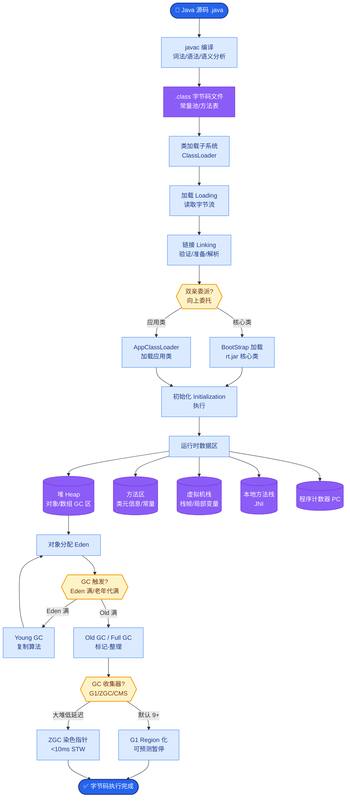
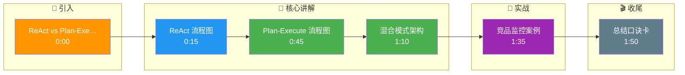

# Agent 里 ReAct 和 Plan-and-Execute 怎么选

环境动态、需频繁反馈用 ReAct；任务步骤清晰、可一次规划用 Plan-and-Execute；复杂系统常混合。

**关键细节与原理**：
1. **ReAct (Reason + Act)**：
   - **流程**：Thought → Action → Observation（循环）。
   - **特点**：逐步探索，每一步都根据上一步的观察调整。适合无法预知下一步结果的场景（如网页浏览、数据库查询）。缺点是容易陷入循环或累积 Token 成本高。
2. **Plan-and-Execute (Plan & Solve)**：
   - **流程**：先一次性生成完整计划，然后按步骤执行。
   - **特点**：全局视野强，步骤之间并行度高。适合任务明确、逻辑链条固定的场景（如“写一篇包含A、B、C要素的文章”）。缺点是如果计划第一步错了，后续全盘皆输。
3. **混合模式**：先用 Plan-and-Solve 拆解大任务为子任务，每个子任务内部使用 ReAct 动态执行。

**实战案例**：
在开发竞品监控 Agent 时，采用 ReAct 导致模型在某网站报 404 时不断重试同一个死链接，消耗了大量 Token；后来切换为 Plan-and-Execute，先规划出“搜索-进入-抓取”三个步骤，并在步骤间加入人工确认，Token 消耗降低了 60% 且成功率大幅提升。

**代码示例**：
```python
# Python: ReAct 循环控制伪代码（LangChain 风格）
def run_react_agent(query, max_steps=10):
    previous_actions = []
    for step in range(max_steps):
        # 1. 模型根据当前状态推理
        thought = llm.predict(f"Query: {query}, History: {previous_actions}")
        
        if "终止" in thought:
            return thought.split(":")[-1].strip() # 最终答案
        
        # 2. 执行动作并获取观察
        action = parse_action(thought)
        observation = tool_executor.run(action)
        
        # 3. 记录循环上下文
        previous_actions.append((thought, action, observation))
    
    return "超过最大步数限制，任务失败"
```

**对比表格**：

| 维度 | ReAct | Plan-and-Execute |
| :--- | :--- | :--- |
| **核心逻辑** | 边想边做 | 先想后做 |
| **适用场景** | 动态环境、探索性任务（如网页爬虫、debug） | 目标明确、步骤固定（如数据分析报告生成） |
| **容错性** | 高（单步失败可修正） | 低（初期计划错误导致全盘失败） |
| **Token 成本** | 高（长上下文循环） | 低（仅需计划+结果） |
| **延迟** | 高（串行交互） | 中（子任务可并行） |

**架构流程对比图**：
```text
ReAct (Looping):           Plan-and-Execute (Sequential):
┌───────┐                  ┌───────┐
│ Query │                  │ Query │
└───┬───┘                  └───┬───┘
    │                          │
    ▼                          ▼
┌─────────┐              ┌──────────┐
│ Thought │              │ Planner  │──┐
└───┬─────┘              └──────────┘  │ Plan List
    │                                  │ [Step1, Step2...]
    ▼                                  ▼
┌─────────┐              ┌──────────┐
│ Action  │              │ Executor │──┼─> Step 1 Done
└───┬─────┘              └──────────┘  │
    ▼                                  │
┌─────────┐                             │
│Observ.  │                             ▼
└───┬─────┘                      ┌──────────┐
    │   (Loop)                   │ Executor │──┼─> Step 2 Done
    └───────────────────────────└──────────┘
```

## 边界情况
1. **工具执行报错**：在 ReAct 模式下，如果 Tool 返回非预期的错误信息（如 HTML 错误页而非 JSON），模型可能会尝试解析错误内容，导致更严重的幻觉或死循环，需要增加 Parser 防护层。
2. **超长上下文溢出**：ReAct 随着步数增加，上下文可能超出模型窗口限制；Plan-and-Execute 在计划步骤极多时（如 100+ 步），Planner 可能会遗漏细节或合并步骤，导致执行失败。
3. **不确定的终止条件**：在 ReAct 中，模型可能不知道何时该停止（例如找不到答案时一直搜索），必须强制设定 Max Steps 或明确的“终止”Token。

## 面试追问
1. 在 ReAct 模式出现死循环时，除了限制 Max Steps，还有哪些更智能的打断机制？
2. 对于 Plan-and-Execute，如果执行过程中某一步失败，如何让模型动态修正后续计划而不是直接重头再来？
3. 在多智能体协作中，如何设计机制让不同 Agent 分别采用不同的推理模式（如一个 Planner 用 Plan-and-Solve，多个 Worker 用 ReAct）？

## 易错点
1. **过度规划**：误以为 Plan-and-Execute 总是优于 ReAct。实际上，对于探索性极强（如没有地图的迷宫寻路）的任务，预先规划是不可能的，必须用 ReAct。
2. **忽视 Planner 能力**：Planner 本身也是一个 LLM 调用，如果任务过于复杂，Planner 生成的第一步计划可能就是错的，导致后续所有高质量执行都浪费在错误的方向上。

## 核心流程图



## 记忆要点

- ReAct边想边做，适合动态环境；Plan-and-Execute先想后做，适合固定步骤
- ReAct容错高但成本高，Plan-and-Execute效率高但初期错则全盘错
- 复杂系统常混合：先Plan拆解，子任务内部用ReAct执行

## 结构化回答

**30 秒电梯演讲：** ReAct 是边想边做（Thought→Action→Observation 循环），适合动态环境和探索性任务，容错高但 Token 成本高；Plan-and-Execute 是先想后做（一次性生成完整计划再执行），适合步骤清晰的任务，效率高但初期计划错则全盘皆输。复杂系统常混合：先 Plan 拆解大任务，子任务内部用 ReAct 动态执行。

**展开框架：**
1. **ReAct 特点** — 逐步探索每步根据观察调整，适合网页浏览和数据库查询；缺点是易陷入循环、Token 累积成本高。
2. **Plan-and-Execute 特点** — 全局视野强、步骤间并行度高，适合逻辑链条固定任务；缺点是计划第一步错后续全浪费。
3. **混合模式** — 先 Plan-and-Solve 拆解大任务为子任务，每个子任务内部用 ReAct 动态执行，兼顾效率和容错。

**收尾：** 我做竞品监控 Agent 时——ReAct 遇 404 不断重试死链接烧 Token，切换 Plan-and-Execute 先规划"搜索-进入-抓取"三步加人工确认，Token 降 60% 成功率大幅提升。您想深入聊 ReAct 死循环的智能打断，还是 Plan 执行中失败的动态修正？

## 视频脚本

> 预计时长：2 分钟 | 由浅入深

| 时间 | 画面/字幕 | 口播台词 | 讲解要点 |
|------|----------|----------|----------|
| 0:00 | 标题卡：ReAct vs Plan-Execute | "ReAct 像摸着石头过河，Plan-Execute 像按攻略图通关。" | 类比开场 |
| 0:15 | ReAct 流程图 | "ReAct 边想边做 Thought-Action-Observation 循环，适合动态环境容错高。" | ReAct 特点 |
| 0:45 | Plan-Execute 流程图 | "Plan-Execute 先想后做，效率高但初期计划错则全盘皆输。" | Plan 特点 |
| 1:10 | 混合模式架构 | "复杂系统混合：先 Plan 拆解大任务，子任务内部用 ReAct 动态执行。" | 混合模式 |
| 1:35 | 竞品监控案例 | "实战：ReAct 遇 404 重试烧 Token，改 Plan 三步加确认 Token 降 60%。" | 实战案例 |
| 1:50 | 总结口诀卡 | "记住：动态用 ReAct，清晰用 Plan，复杂混合。下期讲 Function Calling vs JSON。" | 收尾 |

### 视频流程图




