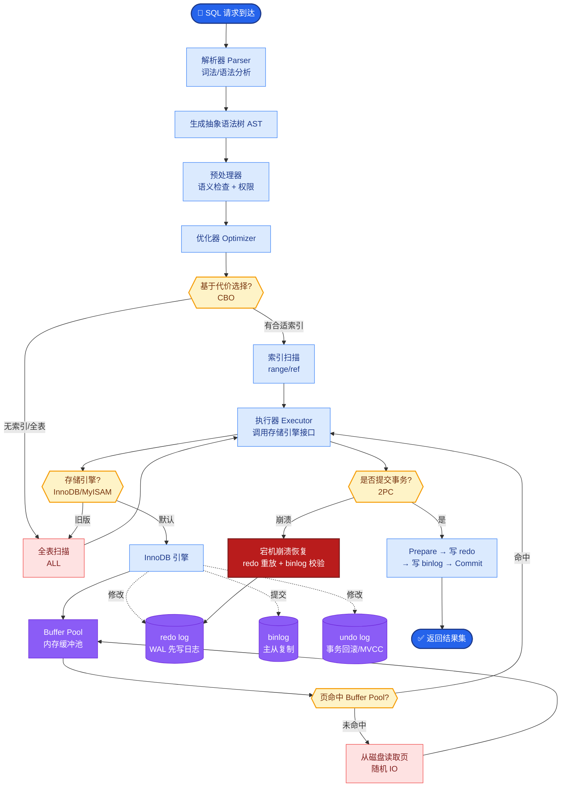

# RAG 与微调如何配合

**RAG 与微调是互补关系，而非互斥。**

- **微调的作用：**
  - 改善 LLM 的**领域表达能力**（如学会使用特定术语）。
  - 修正输出**格式**（如强制输出 JSON、特定的 XML 结构）。
  - 注入**行为模式**（如特定的指令遵循风格、语气）。
  - *局限*：无法有效灌输新的事实知识，容易出现幻觉。

- **RAG 的作用：**
  - 提供**实时、可验证的外部事实**。
  - 解决知识**时效性**问题（数据更新只需更新索引，不需重训模型）。
  - 提供答案的**可解释性**（来源引用）。
  - *局限*：受限于检索质量，如果检索不到正确上下文，生成效果会变差。

- **配合策略：**
  - **事实类问题**：优先 RAG，确保准确性。
  - **格式/风格类要求**：优先微调。
  - **复杂推理**：RAG 提供素材，微调过的模型更好地利用素材进行推理。

```text
┌─────────────────────────────────────────────────────────────┐
│                      知识注入与应用方式                       │
├─────────────────────────────────────────────────────────────┤
│                                                             │
│   静态/稳定的知识 + 领域术语 + 输出格式 ──► 微调 (FT)       │
│   ▲                    ▲                                   │
│   │                    │                                   │
│   │                    ▼                                   │
│   │           最终增强的 LLM (懂行文 + 懂格式)               │
│   │                    │                                   │
│   │                    ▼                                   │
│   └────────────── 动态/易变的事实 ──► RAG (外部检索)        │
│                                                             │
└─────────────────────────────────────────────────────────────┘
```

**实战案例**：在金融研报分析场景中，模型常因无法理解“EBITDA”等缩写而胡编乱造。我们通过微调让模型掌握术语定义，同时结合RAG实时拉取最新财报数据，既解决了专业术语的理解问题，又解决了数据时效性问题。

**代码示例（LangChain 架构思路）**：
```python
# 伪代码：结合微调模型与RAG检索器
from langchain.chains import RetrievalQA
from langchain.llms import OpenAI

# 1. 使用微调过的模型（掌握领域术语和JSON输出格式）
ft_llm = OpenAI(model_name="ft-financial-assistant-v1")

# 2. 搭配RAG检索器（提供最新事实）
retriever = vector_db.as_retriever(search_kwargs={"k": 5})

# 3. 组合使用
qa_chain = RetrievalQA.from_chain_type(
    llm=ft_llm, 
    chain_type="stuff", 
    retriever=retriever,
    return_source_documents=True  # 微调模型通常更擅长引用RAG来源
)
```

**对比表格**：

| 维度 | 微调 | RAG |
| :--- | :--- | :--- |
| **知识更新** | 差（需重训） | 优（实时更新索引） |
| **幻觉风险** | 较高（依赖模型内化知识） | 较低（基于检索事实） |
| **参数量/存储** | 高（需存储模型权重） | 低（需存储向量库） |
| **上下文窗口压力** | 小（知识已内化） | 大（知识需塞入 Prompt） |
| **私密性** | 高（知识隐式嵌入参数） | 低（知识明文存储在向量库） |

**## 边界情况**
1. **空检索结果**：当 RAG 未检索到相关内容时，模型可能产生幻觉。需结合“拒绝回答”的微调训练，让模型学会说“我不知道”而不是胡编。
2. **知识冲突**：当微调模型记忆的旧知识与 RAG 检索到的新知识冲突时（如政策变更），容易导致模型混淆。需在 Prompt 中明确指令强化 Context 的优先级（Context Priority），甚至进行对抗性训练。
3. **Token 超限**：复杂的 RAG 场景下，检索内容过长可能挤爆上下文窗口。需结合微调让模型具备更强的长文本摘要能力或关键信息提取能力。

**## 易错点**
1. **试图用微调取代 RAG**：误以为微调可以将几万页的文档“灌”进模型。实际上模型容量有限，强行灌输容易导致灾难性遗忘，且无法指明出处。
2. **忽视上下文长度限制**：直接使用基础 LLM 加上长上下文 RAG，未考虑推理成本随 Token 数量激增，也未对 RAG 内容进行压缩或筛选。

**## 面试追问**
1. 如果业务知识每天都会变动（如股票数据），RAG 和微调具体如何配合以降低更新延迟？
2. 当 RAG 检索到的文档包含噪声时，如何通过微调提升模型抗噪能力？
3. 如何量化评估微调和 RAG 结合带来的效果提升？


## 核心流程图



## 记忆要点

- 微调注入领域风格与格式，RAG提供实时事实与来源
- 事实类问题优先RAG，格式/风格类要求优先微调
- 二者互补：微调让模型更懂行，RAG让模型更懂事实

## 结构化回答

**30 秒电梯演讲：** RAG 和微调是互补关系：微调注入领域风格、术语和输出格式（内功修心），RAG 提供实时可验证的外部事实和来源引用（外挂百科）。选型规则：事实类问题优先 RAG 确保准确，格式风格类要求优先微调。复杂推理时 RAG 提供素材，微调过的模型更好地利用素材。别试图用微调取代 RAG——模型容量有限，强行灌知识会灾难性遗忘。

**展开框架：**
1. **微调作用** — 改善领域表达能力（术语）、修正输出格式（JSON/XML）、注入行为模式；局限是无法有效灌输新事实易幻觉。
2. **RAG 作用** — 提供实时可验证事实、解决时效性（更新索引不重训）、提供可解释性（来源引用）；局限是受检索质量制约。
3. **配合策略** — 事实类优先 RAG，格式风格优先微调，复杂推理 RAG 加微调模型；知识冲突时 Prompt 明确 Context 优先级。

**收尾：** 我做金融研报分析时——模型不懂 EBITDA 胡编，微调掌握术语定义加 RAG 实时拉最新财报，既解决术语又解决时效。您想深入聊知识冲突的处理，还是微调加 RAG 的效果量化评估？

## 视频脚本

> 预计时长：2 分钟 | 由浅入深

| 时间 | 画面/字幕 | 口播台词 | 讲解要点 |
|------|----------|----------|----------|
| 0:00 | 标题卡：RAG 与微调咋配合 | "微调是内功修心，RAG 是外挂百科，缺一不可。" | 类比开场 |
| 0:15 | 微调作用图 | "微调注入领域风格术语和输出格式，但无法有效灌输新事实。" | 微调作用 |
| 0:45 | RAG 作用图 | "RAG 提供实时可验证事实、解决时效性、提供来源引用。" | RAG 作用 |
| 1:10 | 配合策略对比表 | "事实类优先 RAG，格式风格优先微调，复杂推理两者结合。" | 配合策略 |
| 1:35 | 金融研报案例 | "实战：微调掌握 EBITDA 术语，RAG 拉最新财报，既懂行又懂事实。" | 实战案例 |
| 1:50 | 总结口诀卡 | "记住：微调懂行，RAG 懂事实，别用微调取代 RAG。下期讲多模态 RAG。" | 收尾 |

