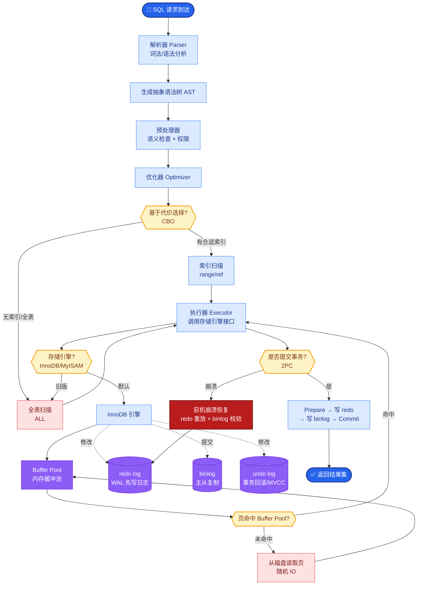

# 多模态 RAG 要点

**多模态 RAG 的核心在于统一表征与跨模态对齐。**

- **图像/表格编码**：
  - 不能仅依赖 OCR 提取文字，会丢失空间结构。
  - 需使用专门的视觉编码器（如 CLIP, LLaVA 的 Projector）将图像/表格 Patch 转化为特征向量。
- **跨模态对齐**：
  - 将文本向量和图像向量映射到同一特征空间。
  - 使得 Query 可以通过文本检索到相关图片，或通过图片检索到相关文本。
- **混合索引与路由**：
  - 建立多路索引：一路文本向量，一路图像向量，一路表格结构化数据。
  - **路由层**：根据 Query 类型决定调用哪一路或哪几路索引（如问“图表中的趋势”需走图像+文本双路）。
- **多模态生成**：
  - LLM 需具备视觉理解能力（如 GPT-4V, LLaVA），或在 Prompt 中穿插图像 Token。

```text
┌──────────────┐
│   用户 Query │ (文本/图片)
└──────┬───────┘
       │
       ▼
┌──────────────┐
│  意图路由层  │ ──► 文本Query ──► 文本向量库
└──────┬───────┘      图片Query ──► 图像向量库
       │             表格Query ──► 表格结构库
       ▼
┌──────────────┐
│  混合检索    │ (分别检索 + Score Fusion)
└──────┬───────┘
       │
       ▼
┌──────────────┐
│  多模态Prompt│ (Text + <ImageToken>)
└──────┬───────┘
       │
       ▼
┌──────────────┐
│  多模态 LLM  │ (生成包含文字描述和图片分析的结果)
└──────────────┘
```

**实战案例**：在电商客服场景中，用户常上传“衣服破损”图片并询问维权。我们使用多模态 RAG，通过 CLIP 模型在知识库中检索“破损鉴定标准图”和“售后流程图”，然后将检索到的标准图与用户图片一同输入 LLaVA 进行对比分析，生成了精准的赔付建议，避免了纯文本检索无法理解视觉内容的尴尬。

**代码示例（CLIP 检索图片）**：
```python
import clip
import torch
from PIL import Image

# 加载模型
device = "cuda" if torch.cuda.is_available() else "cpu"
model, preprocess = clip.load("ViT-B/32", device=device)

# 1. 编码文本 Query
text = "a blue shirt with a hole on the sleeve"
text_tokens = clip.tokenize([text]).to(device)

# 2. 编码图片库（假设已有图片特征）
# image_features = ...

with torch.no_grad():
    # 获取文本特征
    text_features = model.encode_text(text_tokens)
    # 计算余弦相似度
    logits_per_image = (image_features @ text_features.T).squeeze(1)
    probs = logits_per_image.softmax(dim=-1).cpu().numpy()
    # 取最相关图片索引
    best_img_idx = probs.argmax()
```

**对比表格**：

| 维度 | 单模态 RAG (Text) | 多模态 RAG (Text + Image) |
| :--- | :--- | :--- |
| **输入能力** | 仅文本 | 文本、图像、音频、视频 |
| **检索颗粒度** | 段落、文档 | 页面、图表切片、物体区域 |
| **技术栈复杂度** | 较低（Embedding + Vector DB） | 高（需多编码器、对齐训练、路由逻辑） |
| **存储开销** | 较小 | 较大（高维图像特征） |
| **适用场景** | 文档问答、知识搜索 | 电商导购、医疗影像分析、工业故障检测 |

**## 边界情况**
1. **图文不对齐**：检索到的图片与文本 Query 在语义上接近，但实际内容不相关（例如检索到“红苹果”的图片，但问题是“苹果公司的财报”）。需要在 Prompt 中增加多模态 grounding 指令。
2. **高分辨率图像截断**：LLM 的输入分辨率有限，超大图片被压缩后细节丢失，导致检索或识别失败。需采用切片或局部放大的策略。
3. **跨模态幻觉**：多模态模型可能根据文本想象出图片中不存在的细节，反之亦然。需在评估环节引入专门的幻觉检测指标。

**## 易错点**
1. **直接用 OCR 替代视觉向量**：认为只要把图片转为文字存入向量库就是多模态 RAG。这会丢失图片中的颜色、纹理、布局等关键信息。
2. **忽略多路检索结果的排序融合**：简单地将文本和图片检索结果拼在一起，未进行归一化和重排序，导致相关性差的结果挤占了上下文窗口。

**## 面试追问**
1. 在视频 RAG 中，如何处理视频帧的高频冗余和时间维度信息？
2. 如何解决跨模态检索中的“语义鸿沟”问题，即视觉特征和文本语义空间分布不一致？
3. 如果显存有限，无法同时加载大语言模型和视觉编码器，有什么优化部署方案？

## 核心流程图



## 记忆要点

- 核心是统一表征与跨模态对齐，需多编码器（CLIP等）
- 建多路索引（文本/图像/表格），路由层决定检索路径
- 单纯OCR会丢失视觉信息，必须用视觉向量

## 结构化回答

**30 秒电梯演讲：** 多模态 RAG 的核心是统一表征与跨模态对齐——不能只靠 OCR 提取文字（会丢失颜色纹理布局），必须用视觉编码器（CLIP、LLaVA）将图像表格转特征向量，映射到与文本同一特征空间。建多路索引（文本/图像/表格），路由层根据 Query 类型决定检索路径，多模态 LLM（GPT-4V）在 Prompt 中穿插图像 Token 生成。

**展开框架：**
1. **编码与对齐** — 视觉编码器（CLIP/LLaVA Projector）转图像 Patch 为特征向量，与文本向量映射同一空间实现跨模态检索。
2. **多路索引与路由** — 文本向量库、图像向量库、表格结构库三路索引，路由层按 Query 类型决定走哪路或多路。
3. **避坑关键** — 别用 OCR 替代视觉向量（丢视觉信息）；多路检索结果必须归一化重排序，否则相关性差的挤占上下文。

**收尾：** 我做电商客服时——用户上传"衣服破损"图片维权，用 CLIP 检索"破损鉴定标准图"加 LLaVA 对比分析，生成精准赔付建议，纯文本检索做不到。您想深入聊图文不对齐的多模态 grounding，还是高分辨率图像的切片策略？

## 视频脚本

> 预计时长：3 分钟 | 由浅入深

| 时间 | 画面/字幕 | 口播台词 | 讲解要点 |
|------|----------|----------|----------|
| 0:00 | 标题卡：多模态 RAG 要点 | "像给盲人讲图，把图表文都翻译成它能懂的语言。" | 类比开场 |
| 0:20 | 编码与对齐图 | "视觉编码器 CLIP/LLaVA 转图像为特征向量，与文本映射同一空间。" | 编码对齐 |
| 0:55 | 多路索引架构 | "建文本、图像、表格三路索引，路由层按 Query 类型决定检索路径。" | 多路索引 |
| 1:30 | OCR 替代警示 | "坑：OCR 会丢颜色纹理布局，必须用视觉向量。" | 避坑关键 |
| 2:10 | CLIP 检索代码截图 | "代码：CLIP 编码文本和图片，算余弦相似度取最相关图片。" | 代码演示 |
| 2:45 | 电商破损案例 | "实战：用户传破损图，CLIP 检索标准图 LLaVA 对比，精准赔付建议。" | 实战案例 |
| 3:00 | 总结口诀卡 | "记住：统一表征跨模态对齐，多路索引加路由，别用 OCR 替视觉。下期讲分块策略。" | 收尾 |

### 视频流程图


