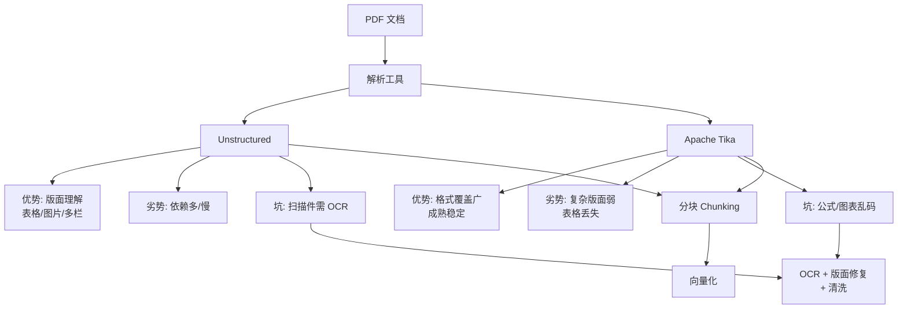

# RAG系统中PDF解析有哪些常见坑?Unstructured和Apache Tika各有什么优缺点

**PDF 解析是 RAG 系统中数据入链的关键一环，也是“脏活累活”的重灾区。**

**常见坑点：：
1.  **双栏排版乱序**：传统解析器（如 pdfplumber 基础用法）往往按从左到右、从上到下的流式读取，导致双栏论文的内容被交叉拼接，语义完全错乱。
2.  **表格丢失与错位**：OCR 容易把表格线识别成乱码，或者丢失单元格结构，导致 Excel 数据无法还原。
3.  **公式与图片不可读**：公式被转为 LaTeX 源码但缺少上下文，或图片直接被丢弃，仅保留 "Image 1" 占位符。
4.  **选择性复制限制**：部分 PDF 加了防复制水印，导致流提取返回空字节，必须依赖 OCR。

**实战案例**：在做法律文档 RAG 时，发现很多扫描版合同页眉页脚包含了大量无关的“保密”字样，且页码干扰了分块。我们在解析阶段引入了基于布局检测的过滤逻辑，直接剔除页眉页脚区域，并将“第X页”重写为 chunk 的元数据，而不是留在正文中。

**代码示例（Unstructured 处理复杂表格）**：
```python
from unstructured.partition.pdf import partition_pdf

# 使用 Unstructured 的高级分区策略，特别针对表格
elements = partition_pdf(
    filename="complex_doc.pdf",
    strategy="hi_res",  # 使用高分辨率模型检测布局
    extract_images_in_pdf=True, # 同时提取图片
    infer_table_structure=True, # 关键：推断表格结构
    chunking_strategy="by_title"
)

# 提取并打印表格内容
for element in elements:
    if element.category == "Table":
        print(element.metadata.text_as_html)
```

**对比表格**：

| 维度 | Apache Tika | Unstructured |
| :--- | :--- | :--- |
| **核心原理** | 基于 Java 的通用解析工具箱，调用各种 Parser | 基于 Python，深度集成 Layout Models (Yolo, Detectron2) |
| **表格处理** | 较弱，多为线性流，易丢失结构 | 强，支持 `infer_table_structure` 输出 HTML/JSON 结构 |
| **OCR 能力** | 依赖外部 Tesseract，集成度一般 | 内置 Tesseract，且支持高分辨率模式，精度可控 |
| **易用性** | Server 模式部署较重，语言需跨进程调用 | Python 原生，对 LangChain/LlamaIndex 等框架支持友好 |
| **速度** | 快（纯文本提取时） | 较慢（涉及模型推理） |

**## 边界情况**
1. **扫描件与数字混合文档**：同一份 PDF 中部分页面是可提取的文本，部分是扫描图片。解析器需要智能判断何时切换到 OCR 模式，否则会导致扫描页内容丢失。
2. **超大文件 OOM**：解析数百兆的高清扫描 PDF 时，全图加载 OCR 可能会导致显存或内存溢出。需支持分页处理或流式处理。
3. **加密 PDF**：遇到密码保护的 PDF，自动解析流程会中断。需要预处理阶段加入密码破解或跳过逻辑。

**## 易错点**
1. **过度依赖 OCR**：对本来就是数字生成的 PDF（有文本层）强行使用 OCR，不仅速度慢，还可能引入识别错误。应优先尝试提取文本层。
2. **忽略公式解析**：将复杂的数学公式直接转为乱码 LaTeX 或丢弃，导致理工科 RAG 系统核心信息丢失。需集成专门的公式识别工具（如 LaTeX-OCR）。

**## 面试追问**
1. 对于双栏或三栏布局的学术论文，除了 Unstructured，还有什么基于布局检测的解决方案可以保证阅读顺序正确？
2. 如何评估 PDF 解析的质量？有哪些具体的指标？
3. 解析出的表格如果包含合并单元格，如何将其转化为 LLM 易于理解的 Markdown 或 JSON 格式？


## 核心流程图




## 记忆要点

- 常见坑：双栏乱序、表格丢失、公式不可读、扫描件需OCR
- Tika基于Java通用解析快，Unstructured基于Python布局检测强
- 数字PDF优先提取文本层，扫描件再用OCR，勿一刀切

## 结构化回答

**30 秒电梯演讲：** PDF 解析是 RAG 的脏活累活，四大坑：双栏排版乱序（从左到右流式读取交叉拼接）、表格丢失错位（OCR 把表格线识别成乱码）、公式图片不可读、扫描件需 OCR。工具选型：Apache Tika 基于 Java 通用解析快但表格弱；Unstructured 基于 Python 集成布局检测（Yolo/Detectron2）表格强。原则是数字 PDF 优先提取文本层，扫描件再用 OCR，别一刀切。

**展开框架：**
1. **四大坑点** — 双栏乱序（流式读取交叉拼接）、表格丢失（OCR 乱码）、公式图片不可读（LaTeX 缺上下文）、防复制水印致流提取空字节。
2. **工具对比** — Tika 基于 Java 通用解析快、表格弱；Unstructured 基于 Python 布局检测强、支持 infer_table_structure 输出 HTML、但涉及模型推理较慢。
3. **避坑原则** — 数字 PDF 优先提取文本层（快且准），扫描件再 OCR；混合文档智能判断何时切换 OCR；超大文件分页处理防 OOM。

**收尾：** 我做法律文档 RAG 时——扫描版合同页眉页脚"保密"字样干扰分块，引入布局检测过滤剔除页眉页脚，把"第 X 页"重写为 chunk 元数据。您想深入聊双栏布局的阅读顺序保证，还是表格合并单元格的 Markdown 转换？

## 视频脚本

> 预计时长：3 分钟 | 由浅入深

| 时间 | 画面/字幕 | 口播台词 | 讲解要点 |
|------|----------|----------|----------|
| 0:00 | 标题卡：PDF 解析常见坑 | "像把满地乱放的报纸整理成数据库，排版越乱越难搞。" | 类比开场 |
| 0:20 | 四大坑点图 | "双栏乱序、表格丢失错位、公式图片不可读、扫描件需 OCR。" | 四大坑点 |
| 0:55 | 工具对比表 | "Tika 基于 Java 通用快表格弱，Unstructured 布局检测强表格好。" | 工具对比 |
| 1:30 | 避坑原则卡 | "数字 PDF 优先文本层，扫描件再 OCR，混合文档智能切换。" | 避坑原则 |
| 2:10 | Unstructured 代码截图 | "代码：partition_pdf 用 hi_res 策略和 infer_table_structure 推断表格。" | 代码演示 |
| 2:45 | 法律合同案例 | "实战：扫描合同页眉页脚干扰分块，布局检测过滤剔除重写元数据。" | 实战案例 |
| 3:00 | 总结口诀卡 | "记住：四大坑要防，Tika 快 Unstructured 强，别一刀切 OCR。下期讲 FAISS 索引。" | 收尾 |

