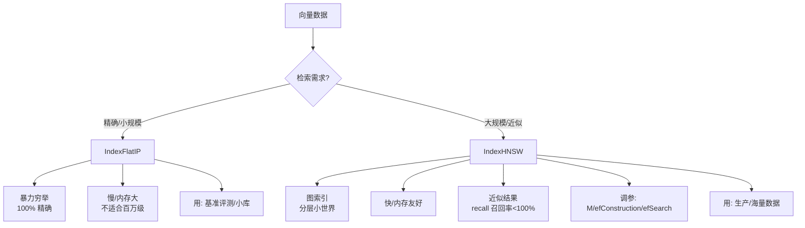

# FAISS中IndexFlatIP和IndexHNSW有什么区别?如何选择

**FAISS 是向量检索的核心库，IndexFlatIP 和 IndexHNSW 分别代表了“暴力检索”与“近似检索”的两个极端。**

- **IndexFlatIP (暴力检索)**：
  - **原理**：对 Query 向量与索引库中**所有**向量进行点积计算。
  - **特点**：**100% 召回率**（无精度损失），无需训练。
  - **缺点**：查询速度慢（O(N)，随数据量线性增长），内存占用大。
  - *适用*：数据量小（< 100万）或作为基准对比。

- **IndexHNSW (层次导航小世界图)**：
  - **原理**：构建基于图的索引，通过在图中跳转逼近最近邻。
  - **特点**：**查询速度极快**（对数级复杂度），召回率可通过参数调节。
  - **缺点**：构建索引慢，内存占用较高（需存储图结构），有精度损失。
  - *适用*：海量数据（千万级以上），对实时性要求高的场景。

**实战案例**：在千万级电商评论向量的检索中，初始使用 IndexFlatIP 导致单次查询耗时 2 秒，无法满足线上交互需求。切换到 IndexHNSW 并设置 `efConstruction=200` 后，查询延迟降至 20ms 内，虽然召回率从 100% 下降到了 98%，但对最终生成效果影响微乎其微。

**代码示例（构建与对比）**：
```python
import faiss
import numpy as np

# 假设 d=768, nb=10000
 d, nb = 768, 10000 
xb = np.random.random((nb, d)).astype('float32')

# 1. IndexFlatIP (暴力)
index_flat = faiss.IndexFlatIP(d)
index_flat.add(xb)

# 2. IndexHNSW (近似图索引)
# M: 每个节点的最大连接数, efConstruction: 构建时的搜索宽度
index_hnsw = faiss.IndexHNSWFlat(d, M=32)
index_hnsw.hnsw.efConstruction = 200 
index_hnsw.add(xb)

# 查询时设置 efSearch：越大召回率越高，但越慢
index_hnsw.hnsw.efSearch = 100 
```

**对比表格**：

| 维度 | IndexFlatIP | IndexHNSW |
| :--- | :--- | :--- |
| **算法类型** | 暴力检索 | 图索引近似检索 |
| **构建速度** | 快 | 慢 (需构建图结构) |
| **查询速度** | 慢 | 极快 |
| **内存占用** | 低 (仅存向量) | 高 (存向量 + 图边) |
| **召回率** | 100% (精确) | 可调 (通常 95%+) |
| **支持 Add** | 支持 | 支持 (但略慢) |
| **主要参数** | 无 | `M`, `efConstruction`, `efSearch` |

**## 边界情况**
1. **删除向量**：IndexFlatIP 是不支持删除操作的（除非移除重建）。IndexHNSW 理论上支持标记删除，但频繁删除会导致图结构碎片化，影响性能。通常需要定期重建索引。
2. **批量查询**：在做批量向量检索（nprobe > 1）时，HNSW 的并行化效率通常不如 IVF 系列索引，需注意吞吐量瓶颈。
3. **内存受限环境**：HNSW 的图结构会带来额外的内存开销（通常增加 20%-50%）。如果内存极其紧张，可能需要考虑 IVF-PQ 等量化方案牺牲一点精度换取空间。

**## 易错点**
1. **向量未归一化**：IndexFlatIP 是基于点积的，如果输入向量没有经过 L2 归一化，点积的大小会受向量模长影响，导致检索结果偏向长文本，而非语义相关性。
2. **efSearch 设置过低**：为了追求极致速度将 `efSearch` 设得比 `top_k` 还小，导致召回率急剧下降。一般 `efSearch` 应至少为 `top_k` 的 2-10 倍。

**## 面试追问**
1. 在亿级数据规模下，如果内存无法完全放下 HNSW 索引，你会怎么优化？
2. IVF 和 HNSW 在实际的动态更新场景（频繁增删数据）下，表现有何不同？
3. 如何评估向量检索系统的召回率？没有标准标签时怎么做？


## 核心流程图




## 记忆要点

- IndexFlatIP暴力检索100%召回但慢，适合小数据或基准
- IndexHNSW图索引近似检索极快，适合海量数据
- HNSW参数M和ef控制速度与精度权衡，向量需L2归一化

## 结构化回答

**30 秒电梯演讲：** IndexFlatIP 是暴力检索——对所有向量算点积，100% 召回无精度损失，但查询慢 O(N)，适合小数据（<100 万）或基准对比。IndexHNSW 是层次导航小世界图索引——通过图跳转逼近最近邻，查询极快对数级复杂度，适合海量数据（千万级以上）。HNSW 参数 M 和 efConstruction/efSearch 控制速度精度权衡，向量必须 L2 归一化。

**展开框架：**
1. **FlatIP 特点** — 暴力点积 100% 召回、无需训练、查询慢 O(N)、内存仅存向量；适合小数据或基准。
2. **HNSW 特点** — 图索引近似检索极快、构建慢、内存高（向量加图边）、召回可调 95%+；适合海量实时场景。
3. **参数与避坑** — M 控制节点连接数、efConstruction 构建搜索宽度、efSearch 查询搜索宽度（至少 top_k 的 2-10 倍）；向量未 L2 归一化会偏向长文本。

**收尾：** 我做千万级电商评论检索时——IndexFlatIP 单次查询 2 秒无法满足线上，切换 IndexHNSW 设 efConstruction=200 后延迟降到 20ms，召回率从 100% 降到 98% 影响微乎其微。您想深入聊亿级数据内存放不下的优化，还是 IVF 和 HNSW 的动态更新对比？

## 视频脚本

> 预计时长：3 分钟 | 由浅入深

| 时间 | 画面/字幕 | 口播台词 | 讲解要点 |
|------|----------|----------|----------|
| 0:00 | 标题卡：FlatIP vs HNSW | "FlatIP 像逐个核对身份证慢但准，HNSW 像看熟人圈子快但可能漏。" | 类比开场 |
| 0:20 | FlatIP 特点 | "FlatIP 暴力点积 100% 召回，查询慢 O(N)，适合小数据或基准。" | FlatIP |
| 0:55 | HNSW 特点 | "HNSW 图索引近似检索极快，对数级复杂度，适合海量实时场景。" | HNSW |
| 1:30 | 参数控制图 | "M 控连接数，efConstruction 构建宽度，efSearch 查询宽度至少 top_k 的 2-10 倍。" | 参数控制 |
| 2:10 | HNSW 代码截图 | "代码：IndexHNSWFlat(d, M=32)，设 efConstruction 和 efSearch。" | 代码演示 |
| 2:45 | 电商评论案例 | "实战：FlatIP 查询 2 秒，HNSW 降到 20ms 召回 98% 影响微小。" | 实战案例 |
| 3:00 | 总结口诀卡 | "记住：小数据 FlatIP，大数据 HNSW，向量必归一化。下期讲 MMR。" | 收尾 |

