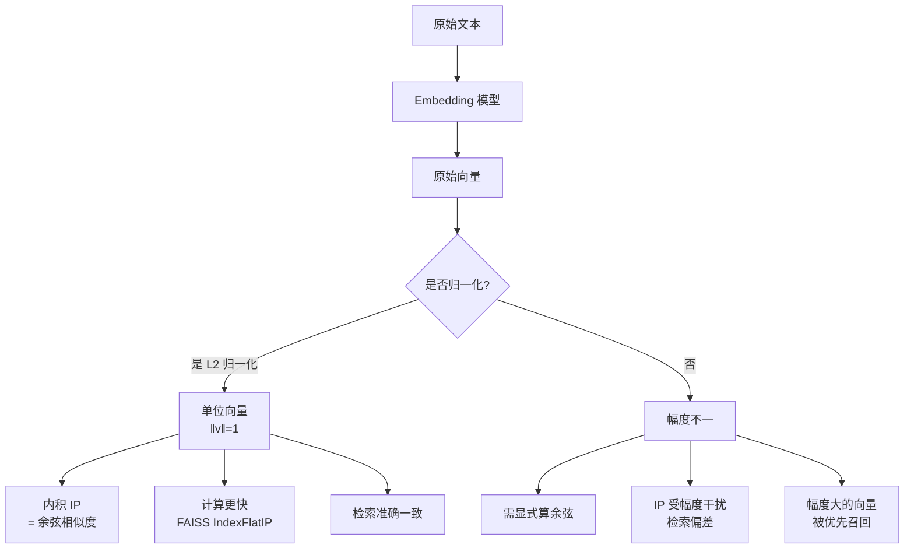

# RAG中Embedding向量是否需要归一化?归一化对检索有什么影响

- **归一化的影响:**

- **归一化前:** 向量的长度(模长)不固定,余弦相似度需要除以两个向量的模长.

- **归一化后:** 所有向量长度=1,余弦相似度 = 点积.

- **ASCII 示意图 (向量空间变化):**
```
归一化前 (欧氏空间):
A ●──────● (模长 5.0)
B   ●───●   (模长 2.0)
计算: CosSim = (A·B) / (|A| * |B|)

       ↓ (归一化操作)

归一化后 (单位超球面):
A ●─(1.0)     (映射到球面)
B ●─(1.0)     (映射到球面)
计算: CosSim = A·B (直接点积)
```

- **好处:**
1. **计算更快** - 点积比余弦相似度少了两次开方和一次除法
2. **精度更高** - 浮点运算步骤减少，累积误差变小
3. **索引兼容** - FAISS的IndexFlatIP(内积索引)可直接用

- **底层原理:**
  - 点积物理意义在归一化后变成了向量在方向上的投影。
  - 大规模检索时，内积计算可以利用 SIMD 指令集加速，比余弦相似度的除法操作效率高得多。

- **实战案例**：在人脸识别或指纹比对场景中，如果未归一化，图片亮度（向量模长）会成为强干扰项，导致一张暗光下的人脸与亮光下的同一人脸相似度极低；归一化后，系统仅关注面部特征的方向，消除了环境光线的"噪声"影响。

- **实践代码:**
```python
import numpy as np

def normalize_embeddings(vectors):
    """L2归一化实战实现"""
    norms = np.linalg.norm(vectors, axis=1, keepdims=True)
    # 防止除以0
    norms[norms == 0] = 1
    return vectors / norms

# 使用 FAISS IndexFlatIP (内积) 加速检索
import faiss
index = faiss.IndexFlatIP(dimension) # dimension: 向量维度
index.add(normalize_embeddings(vectors)) # 添加已归一化向量
```

- **对比表格: 归一化前后的计算差异**

| 维度 | 归一化前 (欧氏空间) | 归一化后 (单位超球面) |
| :--- | :--- | :--- |
| **向量模长** | 不固定 (受文本长度/词频影响) | 固定为 1 |
| **相似度度量** | 余弦相似度 或 欧氏距离 | 内积 |
| **计算复杂度** | 高 (含除法、开方) | 低 (纯乘加运算，易SIMD优化) |
| **物理意义** | 方向 + 长度 (幅度) | 纯方向 (语义) |
| **检索稳定性** | 低 (长文档偏向高分) | 高 (文档长度不干扰评分) |

- **大部分Embedding模型已内置归一化:**
- OpenAI text-embedding-3 → 已归一化
- BGE系列 → 已归一化
- Sentence-Transformers → 可选归一化(normalize_embeddings=True)

- **检查方法:**
```python
norm = np.linalg.norm(embedding)
print(f'Norm: {norm}')  # 应接近1.0
```

- **建议:** 总是做归一化,用IndexFlatIP(内积)代替余弦相似度。

- **边界情况处理:**
  - **全零向量**: 极少数情况下（如输入全为停用词或异常符号），模型可能输出全0向量。L2归一化时会出现除以0错误，需将其处理为任意单位向量（如 `[1, 0, ..., 0]`）或单独过滤。
  - **混合精度**: 在使用 float16 或 bfloat16 进行存储和计算时，向量模长极小可能发生下溢。归一化可以将数值映射到统一量级，提高低精度计算的数值稳定性。
  - **未归一化的存量数据**: 若新数据归一化而旧数据未归一化，直接混用 IndexFlatIP 检索会导致结果严重偏差（旧数据的模长会主导评分）。必须对存量数据进行一次性重处理。

## 面试追问
1. 既然归一化后使用点积等价于余弦相似度，那么是否可以计算欧氏距离？归一化后的欧氏距离和余弦相似度有什么数学关系？
2. 在使用 HNSW 或 IVF 等近似索引时，归一化对量化精度有什么影响？
3. 如果下游任务需要向量的「模长」信息（例如衡量文本的信息密度或重要性），归一化是否会造成信息丢失？该如何解决？

## 易错点
1. **误以为所有模型都默认输出归一化向量**: 虽然主流模型（如 OpenAI, BGE）通常默认归一化，但某些开源模型或特定微调后的模型输出的 Embedding 模长差异很大（可能与词频或文本长度相关）。直接混用这些未归一化的向量进行点积检索会导致检索效果急剧下降。
2. **混淆点积与内积索引的物理意义**: 在 FAISS 中，`IndexFlatIP` 严格计算点积。如果输入向量未归一化，`IndexFlatIP` 实际上是在计算「方向相似度 + 模长加权的混合得分」，这通常不是我们想要的（即长文档会获得不合理的虚高分数）。必须确保输入向量的模长一致性。


## 核心流程图




## 记忆要点

- 归一化后向量模长为1，余弦相似度计算简化为点积，无需除法和开方。
- 计算优势：点积计算更快，且支持SIMD指令加速，适合大规模检索。
- 消除模长干扰：避免长文档因词多而获得虚高分数，仅关注语义方向。
- 实战建议：总是做L2归一化，配合FAISS的IndexFlatIP(内积索引)使用。

## 结构化回答

**30 秒电梯演讲：** RAG 中 Embedding 向量必须 L2 归一化——归一化后向量模长为 1，余弦相似度计算简化为点积，无需除法和开方。三大优势：计算更快（点积支持 SIMD 指令加速）、精度更高（浮点运算步骤减少）、消除模长干扰（避免长文档因词多获虚高分数）。实战总是做 L2 归一化配合 FAISS 的 IndexFlatIP（内积索引）使用。

**展开框架：**
1. **归一化原理** — 向量除以模长映射到单位超球面，模长变 1，余弦相似度等价于点积，物理意义变为纯方向投影。
2. **计算优势** — 点积比余弦相似度少两次开方和一次除法，支持 SIMD 指令集加速，大规模检索效率高得多。
3. **消除干扰与避坑** — 避免长文档虚高分数；新旧数据混用必须都归一化否则旧数据模长主导评分；全零向量需特殊处理防除零。

**收尾：** 我做人脸识别时——未归一化图片亮度成强干扰，暗光和亮光同一人脸相似度极低，归一化后仅关注面部特征方向消除光线噪声。您想深入聊归一化后欧氏距离与余弦相似度的数学关系，还是混合精度下的数值稳定性？

## 视频脚本

> 预计时长：3 分钟 | 由浅入深

| 时间 | 画面/字幕 | 口播台词 | 讲解要点 |
|------|----------|----------|----------|
| 0:00 | 标题卡：向量要归一化吗 | "把所有绳子截成一样长，比头尾距离就行不用量半天。" | 类比开场 |
| 0:20 | 归一化原理图 | "归一化后模长为 1，余弦相似度等价点积，物理意义纯方向。" | 归一化原理 |
| 0:55 | 计算优势对比 | "点积比余弦少开方除法，支持 SIMD 加速，大规模检索更快。" | 计算优势 |
| 1:30 | 消除干扰示意 | "消除长文档虚高分数，新旧数据混用必须都归一化。" | 消除干扰 |
| 2:10 | 归一化代码截图 | "代码：norms = np.linalg.norm，vectors / norms，配合 IndexFlatIP。" | 代码演示 |
| 2:45 | 人脸亮度案例 | "实战：未归一化光线成干扰，归一化后仅关注面部方向消除噪声。" | 实战案例 |
| 3:00 | 总结口诀卡 | "记住：总是 L2 归一化，用 IndexFlatIP，防全零和混用。下期讲中文 BM25 分词。" | 收尾 |

