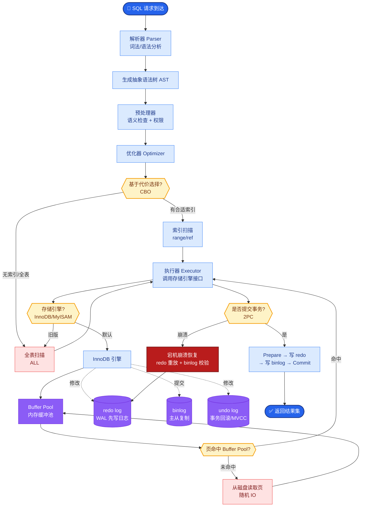

# LightRAG 是什么?它如何简化 GraphRAG 的复杂度

- **LightRAG** 是 2024 年提出的轻量级 GraphRAG 替代方案,保留图谱增强优势的同时大幅降低成本.

- **ASCII 架构对比:**
```
GraphRAG 构建流程:
Docs → LLM(全量抽取) → 完整图谱 → 社区发现 → LLM(全量摘要) → 高昂成本

LightRAG 构建流程:
Docs → 轻量级抽取/规则 → 图谱 → (No Global Summary) 或 简化摘要 → 低成本

LightRAG 查询流程:
Query
  ├─ [Naive Mode]  -> 实体匹配 (局部)
  ├─ [Local Mode]  -> 邻居实体扩展 (1-hop)
  └─ [Global Mode] -> 社区摘要检索 (全局)
```

- **核心改进:**

- **1. 双层检索模式:**
- Low-level:精确实体匹配(类似传统 RAG)
- High-level:社区级别的主题检索(类似 GraphRAG)
- 查询时自动选择合适的层级 (支持 naive, local, global 三种模式)

- **2. 增量更新友好:** 新文档加入时只需更新局部图谱,不需要重建整个图.

- **3. 成本优化:**
- 实体抽取用小模型或规则 (减少 LLM 调用)
- 减少社区摘要的 LLM 调用次数 (LightRAG 优化了摘要生成的触发条件)
- 图谱存储用轻量级图数据库 (如基于 JSON 或 NanoVectorDB)

- **vs GraphRAG:** 构图成本降低 5-10 倍,但效果在多数场景下接近.适合中小规模知识库.

- **适用场景:** 文档量 1000-10000 篇级别的企业知识库,预算有限的团队.

- **实战案例:** 在实际的企业内部 Wiki 建设中，团队发现 GraphRAG 每天晚上跑批处理都要消耗 $200+ 的 Token 费用且经常超时。改用 LightRAG 后，利用其增量更新特性，白天实时插入新文档仅需秒级响应，且成本降低至原来的 1/10，虽然全局摘要能力略有下降，但完全满足日常运维知识查询的需求。

- **代码示例:**
```python
from lightrag import LightRAG, QueryParam

# 初始化 (默认使用轻量级 KV 存储)
rag = LightRAG(
    working_dir="./dick_v_kb",
    llm_model_func=your_llm_model_function # 可接入低成本模型如 Qwen-7B
)

# 增量插入: 自动去重并更新图结构，无需全量重建
await rag.ainsert("昨天服务器发生 OOM 的原因是 Java 堆内存配置过小...")

# 混合模式查询 (自动决策走局部还是全局)
result = await rag.aquery(
    "服务器 OOM 的常见原因有哪些?",
    param=QueryParam(mode="mix") # mix 模式结合了局部邻居和社区摘要
)
```

| 特性 | GraphRAG (Microsoft) | LightRAG |
| :--- | :--- | :--- |
| **索引构建** | 全量 Leiden 层级聚类 | 轻量实体抽取 + 动态邻域 |
| **摘要策略** | 预计算所有社区摘要 | 按需生成或简化摘要 |
| **更新机制** | 通常需全量重建 | 原生支持增量更新 |
| **资源消耗** | 高 (GPU/Token 昂贵) | 低 (CPU/小模型可行) |
| **查询模式** | 全局/局部检索 | Naive/Local/Global/Mix |
| **落地难度** | 复杂 (依赖复杂 Pipeline) | 简单 (pip install 即用) |

## 常见考点
1. **LightRAG 的三种查询模式何时切换**？（Naive 用于简单事实，Local 用于关联推理，Global 用于宏观总结）
2. **LightRAG 如何保证轻量化下的图质量**？（通过优化的 Prompt 和较低成本的模型进行抽取，侧重关键实体而非全量）
3. **LightRAG 的存储格式**？（通常使用简单的 KV 存储或图数据库，便于集成到现有 Python 应用中）

## 核心流程图



## 记忆要点

- 轻量化改进：用小模型或规则抽取实体，减少LLM调用，降低构图成本。
- 增量更新：支持文档插入时局部更新图谱，无需像GraphRAG那样全量重建。
- 查询模式：支持Naive/Local/Global/Mix模式，根据问题复杂度自动选择检索范围。
- 适用场景：中小规模知识库(1000-10000篇)，预算有限但需要图谱推理能力的团队。

## 结构化回答

**30 秒电梯演讲：** LightRAG 是 2024 年提出的轻量级 GraphRAG 替代方案，保留图谱增强优势的同时大幅降低成本。三大改进：用小模型或规则抽取实体减少 LLM 调用、支持文档插入时局部更新图谱无需全量重建、支持 Naive/Local/Global/Mix 四种查询模式按复杂度自动选择。构图成本比 GraphRAG 低 5-10 倍，适合中小规模知识库（1000-10000 篇）预算有限的团队。

**展开框架：**
1. **轻量化抽取** — 实体抽取用小模型或规则，减少 LLM 调用次数，优化摘要生成触发条件，图谱存储用轻量级 KV。
2. **增量更新友好** — 新文档加入只需局部更新图谱，白天实时插入秒级响应，无需 GraphRAG 那样的全量重建批处理。
3. **查询模式选择** — Naive 简单事实、Local 关联推理、Global 宏观总结、Mix 结合局部邻居和社区摘要，按问题复杂度自动切换。

**收尾：** 我在企业 Wiki 建设中——GraphRAG 每晚跑批消耗 $200+ 且常超时，改用 LightRAG 增量更新后白天实时插入秒级响应，成本降至 1/10，全局摘要能力略降但完全满足运维查询。您想深入聊 Mix 模式如何结合局部和全局，还是 LightRAG 适合多大规模知识库？

## 视频脚本

> 预计时长：3 分钟 | 由浅入深

| 时间 | 画面/字幕 | 口播台词 | 讲解要点 |
|------|----------|----------|----------|
| 0:00 | 标题卡：LightRAG 轻奢版 | "GraphRAG 是豪华大餐，LightRAG 是够用的简餐，便宜 10 倍。" | 类比开场 |
| 0:20 | GraphRAG vs LightRAG 流程图 | "轻量抽取实体，增量更新图谱，无需全量重建批处理。" | 轻量化改进 |
| 0:55 | 四种查询模式卡 | "Naive 简单事实，Local 关联，Global 宏观，Mix 结合。" | 查询模式 |
| 1:30 | 增量更新演示 | "新文档局部更新图，白天秒级插入，GraphRAG 要等晚上批跑。" | 增量更新 |
| 2:10 | LightRAG 代码截图 | "代码：LightRAG + ainsert 增量插入 + aquery mix 模式查询。" | 代码演示 |
| 2:45 | 企业 Wiki 案例 | "实战：GraphRAG 每晚 $200+ 超时，LightRAG 成本降至 1/10 秒级。" | 实战案例 |
| 3:00 | 总结口诀卡 | "记住：小模型抽取增量更新四模式，成本低适合中小库。下期讲 HyDE。" | 收尾 |

### 视频流程图


