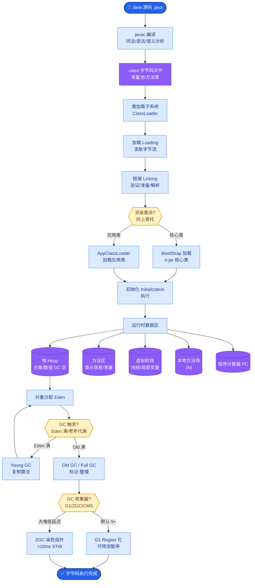

# Semantic Chunking(语义切分)是什么?它比固定长度切分好在哪里

- **Semantic Chunking** 是根据内容语义边界进行文档切分的技术.

- **ASCII 算法流程图:**
```
Step 1: 句子分割
[Sentence 1] [Sentence 2] [Sentence 3] [Sentence 4] ...

Step 2: 计算相邻 Embedding 相似度
S1(0.95) S2(0.92) S3(0.45) S4(0.98)
   └─────┘   └─────┘   └─────┘   └─────┘
   高相似    高相似    低相似!   高相似
                ↓
Step 3: 寻找局部最小值
             (在此切分)

Step 4: 合并 Chunk
[Chunk 1: S1, S2] [Chunk 2: S3, S4, ...]
```

- **三种 Chunk 策略对比:**

- **1. 固定长度切分:** 每 N 个 token 切一刀.简单但可能截断句子,破坏语义完整性.
- **2. 递归切分:** 按段落 -> 句子 -> 词的层级递归切分.比固定长度好,但仍然基于规则.
- **3. 语义切分:** 计算相邻句子的 Embedding 相似度,在相似度骤降的位置切分.确保每个 Chunk 内语义连贯.

- **语义切分的实现:**
1. 将文档按句子分割
2. 计算相邻句子的 Embedding 相似度
3. 设置阈值,相似度低于阈值的位置即为切分点 (通常是 percentile 切分)
4. 合并过短的 Chunk,拆分过长的 Chunk

- **效果:** 检索准确率提升 10-20%,因为每个 Chunk 语义完整,不会出现半个概念被截断的情况.

- **代价:** 需要额外的 Embedding 计算,预处理时间更长 (预处理慢，查询快).

- **实战案例:** 在处理一份 100 页的技术白皮书时，使用固定 token 切分导致“核心算法原理”的描述被从中间切断，导致 LLM 无法理解完整逻辑。改用语义切分后，系统自动在算法段落的结尾处断开，且将相关的代码块和解释自然归并在同一个 Chunk 中，回答准确率从 60% 提升至 85%。

- **代码示例:**
```python
from langchain_experimental.text_splitter import SemanticChunker
from langchain_openai.embeddings import OpenAIEmbeddings

# 初始化语义切分器
embeddings = OpenAIEmbeddings()
text_splitter = SemanticChunker(
    embeddings, 
    breakpoint_threshold_type="percentile" # 基于百分位动态确定阈值
)

with open("tech_whitepaper.txt") as f:
    text = f.read()

# 执行切分：内部计算句子间 embedding 相似度，并在“断崖”处切分
docs = text_splitter.create_documents([text])

for i, doc in enumerate(docs):
    print(f"Chunk {i} length: {len(doc.page_content)}")
```

| 维度 | 固定长度切分 | 递归切分 | 语义切分 |
| :--- | :--- | :--- | :--- |
| **切分依据** | Token 数量/字符数 | 结构标点 | Embedding 相似度 |
| **语义完整性** | 低 (易截断) | 中 (尊重段落) | 高 (尊重主题) |
| **检索上下文** | 包含噪音较多 | 较为聚焦 | 高度聚焦 |
| **计算成本** | 极低 | 低 | 高 (需计算 Embeddings) |
| **处理速度** | 快 | 快 | 慢 (离线阶段) |
| **适用场景** | 通用文档，逻辑不强 | 法律合同，结构清晰 | 散文、技术文档、长对话 |

## 常见考点
1. **如何确定语义切分的阈值**？（通常使用相似度分布的百分位，如 Percentile=95，取相似度最低的 5% 处作为切分点）
2. **Semantic Chunking 的缺点是什么**？（计算成本高，且可能因为某句话 embedding 计算偏差导致错误切分）
3. **与 RecursiveCharacterTextSplitter 结合使用**？（可以先做语义切分，如果结果块过大，再对大块进行递归切分）


## 核心流程图



## 记忆要点

- 原理：计算相邻句子的Embedding相似度，在相似度骤降的局部最小值处切分。
- 优势：确保每个Chunk内部语义连贯，避免固定长度切分导致的上下文断裂。
- 阈值设定：通常基于百分位(如Percentile=95)动态确定切分点，而非固定阈值。
- 代价：预处理阶段需计算所有句子的向量，耗时较长，但检索质量显著提升。

## 结构化回答

**30 秒电梯演讲：** Semantic Chunking 是按内容语义边界切分文档的技术——计算相邻句子的 Embedding 相似度，在相似度骤降的局部最小值处切分。优势是确保每个 Chunk 内部语义连贯，避免固定长度切分导致的上下文断裂。阈值设定基于百分位（如 Percentile=95）动态确定切分点而非固定阈值。代价是预处理阶段需计算所有句子向量耗时较长，但检索质量显著提升。

**展开框架：**
1. **原理机制** — 文档按句子分割 → 计算相邻句子 Embedding 相似度 → 相似度骤降处为切分点 → 合并过短 Chunk 拆分过长 Chunk。
2. **对比固定切分** — 固定长度易截断句子破坏语义；递归切分按段落句子层级但仍基于规则；语义切分尊重主题，检索准确率提升 10-20%。
3. **阈值与代价** — 用相似度分布百分位（如最低 5%）动态定切分点；预处理慢但查询快，适合散文、技术文档、长对话。

**收尾：** 我处理 100 页技术白皮书时——固定 token 切分把"核心算法原理"从中间切断，LLM 无法理解完整逻辑；改用语义切分后在算法段落结尾断开，相关代码块自然归并，回答准确率从 60% 升至 85%。您想深入聊语义切分的阈值如何设定，还是代码块和表格等非文本内容如何处理？

## 视频脚本

> 预计时长：3 分钟 | 由浅入深

| 时间 | 画面/字幕 | 口播台词 | 讲解要点 |
|------|----------|----------|----------|
| 0:00 | 标题卡：语义切分 | "看意群切句，意思变了就换一段，不数数切。" | 类比开场 |
| 0:20 | 算法流程图 | "句子分割计算相邻相似度，骤降处切分合并过短拆分过长。" | 原理机制 |
| 0:55 | 三种切分对比表 | "固定易截断，递归按结构，语义尊重主题准确率升 10-20%。" | 对比切分 |
| 1:30 | 阈值设定示意 | "用相似度分布百分位如最低 5% 动态定切分点，非固定阈值。" | 阈值设定 |
| 2:10 | SemanticChunker 代码 | "代码：SemanticChunker + breakpoint_threshold_type percentile。" | 代码演示 |
| 2:45 | 白皮书案例 | "实战：固定切分切断算法原理，语义切分后准确率 60% 升 85%。" | 实战案例 |
| 3:00 | 总结口诀卡 | "记住：相似度骤降处切，百分位定阈值，预处理慢查询快。下期讲 RAG 排查。" | 收尾 |

