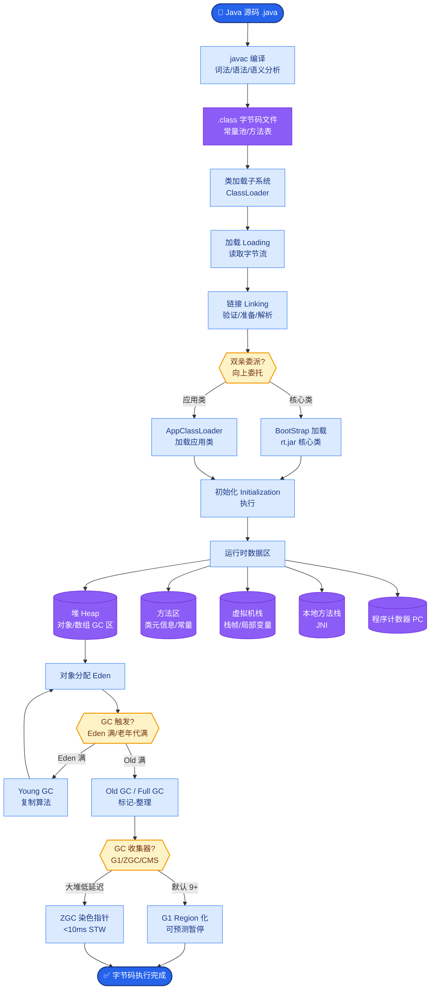
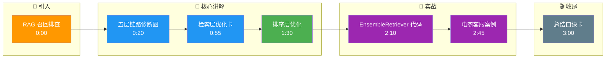

# RAG 系统召回率低,如何系统性排查和优化

RAG 召回率优化是面试超高频题,需要分环节排查:

- **排查链路:文档处理 -> 检索 -> 排序 -> 上下文 -> 生成**

- **ASCII 系统诊断图:**
```
[用户问题] │
   ▼
[检索模块] ◄──┐
   │         │
   ├─ Vector │
   └─ BM25   │
   ▼         │
[排序模块]   │ (召回阶段)
   ▼         │
[上下文] ────┘
   │
   ▼
[生成模块]
```

- **1. 文档处理层:**
- Chunk 太大?尝试减小 Chunk Size 或用语义切分
- Chunk 太小?尝试增加 Overlap 或合并相关 Chunk
- 文档解析错误?检查 PDF/表格提取质量

- **2. 检索层 (关键):**
- Embedding 模型不够好?换更好的 Embedding(如 BGE-M3、text-embedding-3-large)
- 只用了向量检索?加入 BM25 稀疏检索做 Hybrid Search (解决关键词匹配问题)
- 查询太短?用 HyDE 或 Query Rewrite 增强 (解决语义不对齐)

- **3. 排序层:**
- 没有重排序?加 Rerank 模型(如 Cohere Rerank、bge-reranker) (通常最有效的优化手段)
- 候选池太小?扩大 top-k (例如先检索 top 100, rerank 后取 top 10)

- **4. 上下文层:**
- 正确证据被排到后面?检查上下文组装顺序 (按相关性降序排列)
- 太多无关内容?限制注入的 Chunk 数量 (减少噪音干扰)

- **5. 生成层:**
- 证据进了上下文但答案仍然错?检查 Prompt 是否要求引用来源 (CoT 提示)

- **实战案例:** 某电商客服 RAG 系统上线后，用户反馈查不到具体的“退货政策”细节。经排查发现，是因为“退货”和“退款”等词在向量空间中被通用语义模糊化了。我们在检索层加入了 BM25 稀疏检索，并使用 Rerank 模型对召回结果进行重排，同时将 Top-K 从 5 增加到 10 再重排取 Top 5，最终查全率从 65% 提升到了 92%。

- **代码示例:**
```python
from langchain.retrievers import EnsembleRetriever
from langchain_community.retrievers import BM25Retriever
from langchain_community.vectorstores import FAISS

# 1. 构建 Hybrid Search (结合 Dense 和 Sparse)
vectorstore = FAISS.from_documents(docs, embeddings)
vector_retriever = vectorstore.as_retriever(search_kwargs={"k": 20})

bm25_retriever = BM25Retriever.from_documents(docs)
bm25_retriever.k = 20

# 加权融合 (通常 vector 权重在 0.5-0.7 之间)
ensemble_retriever = EnsembleRetriever(
    retrievers=[bm25_retriever, vector_retriever], 
    weights=[0.4, 0.6]
)

# 2. 引入 Rerank (关键优化步骤)
from langchain_community.llms import HuggingFaceHub
reranker = HuggingFaceHub(repo_id="BAAI/bge-reranker-large")

# 实际工程中这里会先取 Top 50，rerank 后取 Top 10
# docs = ensemble_retriever.get_relevant_documents(query)
# reranked_docs = reranker.compress(docs, query)
```

| 优化阶段 | 常用手段 | 成本/收益 | 适用场景 |
| :--- | :--- | :--- | :--- |
| **文档处理** | 语义切分, 清洗数据 | 开发成本中, 收益高 | 文档结构复杂, 语义连贯性强 |
| **检索增强** | HyDE, Query Expansion | 增加 Token 费用, 延迟高 | 用户提问模糊, 术语缺失 |
| **混合检索** | Vector + BM25 | 计算成本极低, 收益显著 | 关键词重要的场景 (如 SKU, 型号) |
| **重排序** | Cross-Encoder Rerank | GPU 成本较高, 延迟高 | 对准确率要求极高的 Top-K 场景 |
| **微调 Embedding** | 领域数据微调 | 训练成本高, 长期收益大 | 有大量领域标注数据的特定行业 |

## 常见考点
1. **如何验证是召回问题还是推理问题？**（通过对比「检索到的 Top-k 文档是否包含答案」来判断。若包含但 LLM 答错，是推理/提示问题；若不包含，是召回问题）
2. **Hybrid Search 的权重如何调优**？（通常通过验证集调整 `alpha` 参数，如 `score = alpha * vec_score + (1-alpha) * bm25_score`）
3. **Rerank 模型带来的延迟**？（Rerank 模型通常较慢，建议仅对粗排后的 Top 50-100 进行精排，而不是全量重排）

## 核心流程图



## 记忆要点

- 排查链路：文档处理(切分)→检索(Embedding/BM25)→排序(Rerank)→上下文。
- 检索层优化：换更强的Embedding模型，加BM25混合检索，解决关键词匹配问题。
- 排序层优化：引入Cross-Encoder Rerank模型，通常是最有效的单点提升手段。
- 上下文优化：检查Top-K召回是否包含答案，若包含但答错则是Prompt或推理问题。

## 结构化回答

**30 秒电梯演讲：** 像修水管，从水源(文档)一路查到水龙头(生成)，哪漏堵哪。

**展开框架：**
1. **分段定位问题** — 分段定位问题（核心概念）
2. **文档切分** — 文档切分是基础
3. **混合检索加重排** — 混合检索加重排是关键

**收尾：** 如何量化评估 RAG 的召回率？

## 视频脚本

> 预计时长：3 分钟 | 由浅入深

| 时间 | 画面/字幕 | 口播台词 | 讲解要点 |
|------|----------|----------|----------|
| 0:00 | 标题卡：RAG 召回排查 | "像修水管，从水源一路查到水龙头，哪漏堵哪。" | 类比开场 |
| 0:20 | 五层链路诊断图 | "文档切分检索排序上下文生成，逐层定位问题。" | 排查链路 |
| 0:55 | 检索层优化卡 | "换更强 Embedding，加 BM25 混合检索解决关键词匹配。" | 检索层 |
| 1:30 | 排序层优化 | "引入 Cross-Encoder Rerank 通常是最有效的单点提升。" | 排序层 |
| 2:10 | EnsembleRetriever 代码 | "代码：EnsembleRetriever 加权融合 + bge-reranker 精排。" | 代码演示 |
| 2:45 | 电商客服案例 | "实战：退词语义模糊查不到，加 BM25+Rerank 查全率 65% 升 92%。" | 实战案例 |
| 3:00 | 总结口诀卡 | "记住：五层链路逐层查，混合检索+Rerank 最有效。下期讲 Rerank。" | 收尾 |

### 视频流程图




