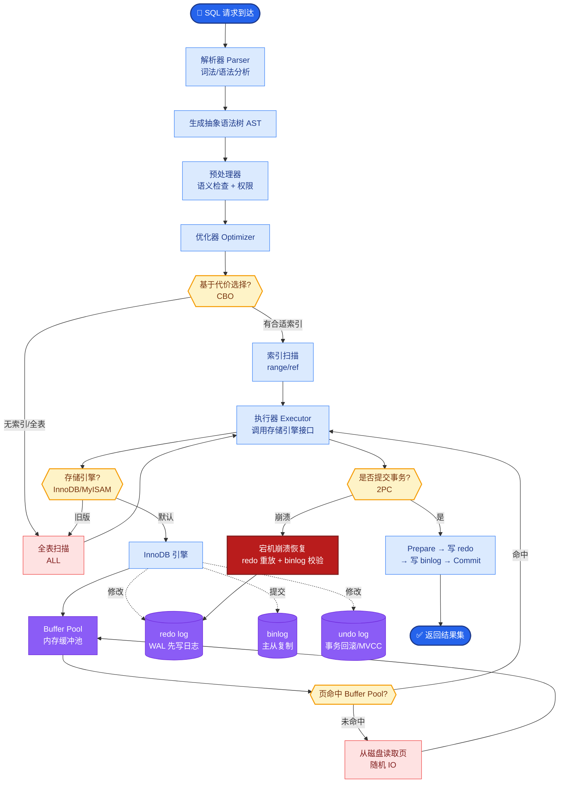

# Query Rewrite(查询重写)有哪些策略?什么场景需要用

- **Query Rewrite** 是在检索前对用户查询进行改写增强的技术，旨在解决用户意图表达不清、与文档语义鸿沟或上下文依赖等问题。

- **常见策略及原理:**

  - **1. 查询扩展:**
    - **原理**：生成同义词、上位词或相关概念，构建一个更丰富的查询向量，提升召回率。
    - **示例**："Transformer 原理" -> "Transformer 自注意力机制" + "Transformer 位置编码"。
    - **方法**：LLM 生成、伪相关反馈（PRF）、基于同义词库。
  
  - **2. 查询分解:**
    - **原理**：将包含多个意图的复杂问题拆解为独立的原子问题，分别检索后综合回答。
    - **示例**："对比 A 和 B 的优劣" -> "A 的优势"、"B 的优势"、"A 与 B 的性能对比"。
    - **处理**：路由分发，并行检索，最后进行 Answer Synthesis。
  
  - **3. 回指消解:**
    - **原理**：利用对话历史，将代词（它、那个）或省略的主语替换为具体实体。
    - **示例**：User:"iPhone 15 怎么样?" -> Bot:"..." -> User:"它贵吗?" -> Rewrite:"iPhone 15 贵吗?"。
  
  - **4. HyDE (Hypothetical Document Embeddings):**
    - **原理**：利用 LLM 生成一个"假设性的完美答案"，然后对这个答案做 Embedding 检索，而不是对原始 Query 检索。因为"答案"和"真实文档"在向量空间中距离通常比"问题"更近。
    - **风险**：如果 LLM 生成的内容包含幻觉，可能检索到错误文档。

```text
┌──────────────┐
│   用户原始    │
│    Query     │
└──────┬───────┘
       │
       ▼
┌──────────────┐
│ Query Rewrite│ (LLM / Rule-based)
│   (改写层)    │
└──────┬───────┘
       │
       ├─> Query 1 ──┐
       ├─> Query 2 ───┤─> 向量检索 (并行)
       └─> Query 3 ──┘
              │
              ▼
       合并去重 -> Rerank -> LLM
```

- **适用场景:**
  - 用户查询模糊、口语化或过短（如 "怎么弄"）。
  - 多轮对话场景，依赖上文。
  - 专业领域问答，用户词汇与文档术语不匹配。

- **代价与权衡:**
  - **延迟**：增加 1 次 LLM 调用（约 200ms~1s）。
  - **准确性**：改写可能引入噪声，导致检索跑偏。
  - **优化**：简单场景使用少量样本 Few-shot 提示；对明确意图的 Query 可跳过改写（通过路由器判断）。

## 常见考点
1. **HyDE 的局限性**：HyDE 在什么情况下效果不好？（答：事实性查询或需要精确匹配的场景，因为生成的假设内容可能虚构事实）。
2. **实现方式**：如何高效实现多路查询的检索？（答：并发请求向量数据库；注意避免请求量过大触发限流）。
3. **评估**：如何判断 Query Rewrite 是否有效？（答：通过检索指标的 Recall@K 提升，或下游 Answer Relevancy 提升）。


## 核心流程图



## 记忆要点

- 核心目的：解决意图不清、术语鸿沟、上下文依赖，提升召回率。
- 四大策略：查询扩展（同义词）、查询分解（拆意图）、回指消解（补全代词）、HyDE（生成假答案检索）。
- HyDE 原理：答案向量与文档向量距离比问题向量更近，但需防幻觉。
- 适用场景：模糊口语化查询、多轮对话、专业术语不匹配。
- 代价权衡：增加一次 LLM 调用延迟，简单查询可通过路由跳过改写。

## 结构化回答

**30 秒电梯演讲：** Query Rewrite 是检索前对用户查询改写增强的技术，解决意图不清、术语鸿沟、上下文依赖三大痛点。四大策略：查询扩展（同义词上位词）、查询分解（拆多意图为原子问题）、回指消解（多轮对话补全代词）、HyDE（生成假答案再检索）。HyDE 原理是答案向量与文档向量距离比问题向量更近，但需防幻觉。代价是增加一次 LLM 调用延迟，简单查询可通过路由跳过改写。

**展开框架：**
1. **查询扩展** — 生成同义词、上位词或相关概念构建更丰富查询向量，如"Transformer 原理"扩展为"自注意力机制"+"位置编码"，方法有 LLM 生成、伪相关反馈（PRF）、同义词库。
2. **查询分解与回指消解** — 拆多意图复杂问题为独立原子问题并行检索后综合；多轮对话用历史将代词替换为具体实体，如"它贵吗"→"iPhone 15 贵吗"。
3. **HyDE 与代价权衡** — LLM 生成假设完美答案对其 Embedding 检索，答案向量比问题向量离文档更近；代价是延迟 +200ms~1s，改写可能引入噪声，简单场景可路由跳过。

**收尾：** 我做多轮客服机器人时——用户问"它怎么退款"指代不清，加了回指消解结合历史改写为"iPhone 15 怎么退款"后，召回准确率从 55% 升到 80%。您想深入聊多查询扩展的结果如何合并，还是 Query Rewrite 会不会引入噪声？

## 视频脚本

> 预计时长：3 分钟 | 由浅入深

| 时间 | 画面/字幕 | 口播台词 | 讲解要点 |
|------|----------|----------|----------|
| 0:00 | 标题卡：Query Rewrite | "把用户模糊方言翻译成数据库能懂的普通话。" | 类比开场 |
| 0:20 | 四大策略卡 | "扩展同义词、分解多意图、回指消解补代词、HyDE 假答案。" | 四大策略 |
| 0:55 | 查询扩展示意 | "Transformer 原理扩展为自注意力+位置编码，提升召回。" | 查询扩展 |
| 1:30 | HyDE 原理图 | "答案向量离文档比问题向量近，但需防幻觉引入噪声。" | HyDE 原理 |
| 2:10 | 改写流程代码截图 | "代码：LLM 改写 Query + 并行向量检索 + Rerank 合并。" | 代码演示 |
| 2:45 | 多轮客服案例 | "实战：它怎么退款指代不清，回指消解后召回 55% 升 80%。" | 实战案例 |
| 3:00 | 总结口诀卡 | "记住：四策略弥合语义鸿沟，代价是延迟，简单查询跳过。下期讲向量库选型。" | 收尾 |

