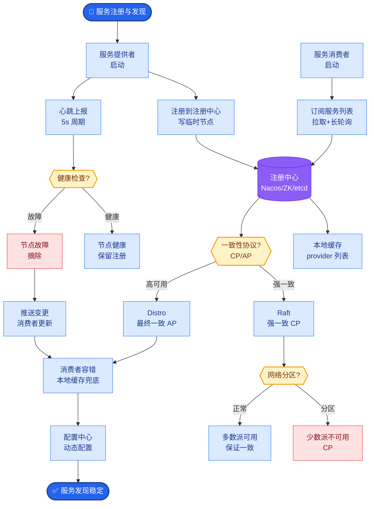

# 向量数据库选型:Milvus、Pinecone、Weaviate 各有什么优劣

**主流向量数据库对比：** 

- **Milvus:**
  - **架构**：云原生架构，存储与计算分离。支持存算分离，扩缩容灵活。
  - **性能**：支持十亿级向量，单节点可达百万级 QPS。
  - **索引**：算法最丰富（IVF_FLAT, IVF_PQ, HNSW, DiskANN, SCANN 等），支持 GPU 索引加速。
  - **功能**：原生支持 Hybrid Search（向量+标量过滤+全文检索），支持 Scalar Filtering 和多向量字段。
  - **部署**：基于 Kubernetes，运维复杂度高（需协调 Etcd, Pulsar, MinIO 等组件），适合大团队私有化部署。

- **Pinecone:**
  - **架构**：全托管 SaaS，无基础设施管理负担。
  - **性能**：效果稳定，专为优化延迟设计，支持 Namespaces 多租户隔离。
  - **模式**：支持 Serverless（按读取/写入量计费，适合低频或波动流量）和 Pod-based（预置资源，低延迟）。
  - **限制**：闭源，数据必须在其云端，无法私有化部署，部分高级功能（如 Sparse Vector）需要付费。

- **Weaviate:**
  - **特性**：模块化设计，内置向量化模块（可直接接 OpenAI/Cohere/HL 等模型），入库时自动向量化。
  - **查询**：独特的 GraphQL API，对开发者友好，支持 BM25 混合检索。
  - **生态**：侧重于知识图谱结合，支持 Object relationships。
  - **性能**：社区活跃度中等，单节点性能上限不如 Milvus，资源消耗相对较高。

```text
┌───────────────────────────────────────────────┐
│                 选型决策树                     │
├───────────────────────────────────────────────┤
│                                               │
│   是否允许数据上云?                            │
│      /           \\                           │
│    是             否 (私有化/合规)             │
│    |               |                          │
│    |               +---> 数据规模?             │
│    |                     /      \\            │
│    |                小/原型      亿级/生产     │
│    |                   |           |          │
│    |                   |           +-> Milvus │
│    |                   |                      │
│    |                   +-> Weaviate/Qdrant    │
│    |                                          │
│    +---> 团队运维能力?                         │
│          /        \\                          │
│      弱/不想管      追求极致控制                │
│         |               |                     │
│         +-> Pinecone    |                     │
│                          |                     │
│                          +-> 自建 Milvus (K8s) │
└───────────────────────────────────────────────┘
```

- **其他选择:**
  - **Qdrant**: Rust 编写，性能优异且资源占用低，自带 Dashboard，开箱即用，是开源界 Milvus 的强有力竞争者。
  - **Chroma**: 轻量级，Python 友好，适合本地原型或 Notebook 演示，生产并发能力较弱。
  - **pgvector**: PostgreSQL 扩展。优势是与现有数据共存，支持强一致性 ACID；劣势是索引算法较少（主要支持 IVFFlat/HNSW），高性能查询优化较难，适合已有 PG 堆栈且向量规模千万级以下的场景。

- **选型建议:**
  - **原型验证**：Chroma (最简单) 或 pgvector (不需新组件)。
  - **生产部署(私有化)**：Milvus (功能全、上限高) 或 Qdrant (易维护、高性能)。
  - **生产部署(SaaS)**：Pinecone (省心) 或 Zilliz Cloud (Milvus 商业版)。

## 常见考点
1. **标量过滤**：在向量检索中如何进行高效的 "Filter then Search" 或 "Search then Filter"？（答：Milvus 支持位图索引加速标量过滤；通常先过滤再搜向量，否则向量搜完再过滤可能结果数不足）。
2. **索引选择**：IVF、HNSW、DiskANN 的区别？（答：HNSW 查询快但内存占用大；IVF 是平衡之选；DiskANN 内存占用极低适合超大规模数据，但构建慢）。
3. **一致性**：向量数据库入库后多久能搜到？（答：通常支持最终一致性，部分场景需要强一致性，Pinecone/Zilliz 等提供相关配置）。


## 核心流程图



## 记忆要点

- Milvus：存算分离，索引丰富，适合亿级私有化部署，运维复杂。
- Pinecone：全托管 SaaS，省心但数据出境，闭源无私有化。
- Weaviate：模块化设计，内置向量化，GraphQL 友好，适合知识图谱。
- Qdrant：Rust 编写，高性能低资源，自带 Dashboard，Milvus 强力竞品。
- pgvector：Postgres 扩展，适合千万级以下且已有 PG 堆栈的场景。

## 结构化回答

**30 秒电梯演讲：** 向量数据库选型核心看四个维度：数据规模、私有化合规、运维能力、混合检索需求。Milvus 存算分离索引丰富适合亿级私有化但运维复杂；Pinecone 全托管 SaaS 省心但数据出境闭源；Weaviate 模块化内置向量化 GraphQL 友好适合知识图谱；Qdrant 用 Rust 写高性能低资源自带 Dashboard 是 Milvus 强力竞品；pgvector 是 Postgres 扩展适合千万级以下已有 PG 堆栈。

**展开框架：**
1. **私有化部署 vs SaaS** — 数据合规要求高选私有化（Milvus/Qdrant）；求省事团队运维弱选 SaaS（Pinecone/Zilliz Cloud）；原型验证用 Chroma 最简单或 pgvector 不需新组件。
2. **性能与索引能力** — Milvus 索引最丰富（IVF/HNSW/DiskANN/SCANN）支持 GPU 加速达亿级；Qdrant Rust 编写高性能低资源；Weaviate 单节点上限不如 Milvus；pgvector 索引少主要 IVFFlat/HNSW。
3. **生态与运维权衡** — Milvus 基于 K8s 需协调 Etcd/Pulsar/MinIO 运维复杂；Weaviate 内置向量化模块入库自动 Embedding；Pinecone 支持 Serverless 按量计费；选型先看规模再运维能力。

**收尾：** 我做企业知识库选型时——初期用 Chroma 原型验证快速迭代，数据涨到千万级后切到 Milvus 私有化部署解决数据合规，运维成本确实高但功能全。您想深入聊 HNSW 和 IVF 索引的区别，还是向量数据库是否需要支持事务？

## 视频脚本

> 预计时长：3 分钟 | 由浅入深

| 时间 | 画面/字幕 | 口播台词 | 讲解要点 |
|------|----------|----------|----------|
| 0:00 | 标题卡：向量库选型 | "选数据库像选房子：自盖房功能全但累，住公寓省心但受限。" | 类比开场 |
| 0:20 | 五大方案对比表 | "Milvus 亿级私有，Pinecone 省心 SaaS，Qdrant Rust 高性能。" | 方案对比 |
| 0:55 | 选型决策树 | "数据上云否？规模多大？团队运维能力？三问定位方案。" | 决策树 |
| 1:30 | 索引能力卡 | "Milvus 索引最丰富支持 GPU，pgvector 索引少适合千万级以下。" | 索引能力 |
| 2:10 | Milvus 架构图 | "存算分离 K8s 部署需协调 Etcd Pulsar MinIO，运维复杂。" | 架构演示 |
| 2:45 | 知识库选型案例 | "实战：Chroma 原型验证，涨到千万级切 Milvus 私有化合规。" | 实战案例 |
| 3:00 | 总结口诀卡 | "记住：私有 Milvus/Qdrant，省事 Pinecone，原型 Chroma/pgvector。下期讲 RAG 评估。" | 收尾 |

