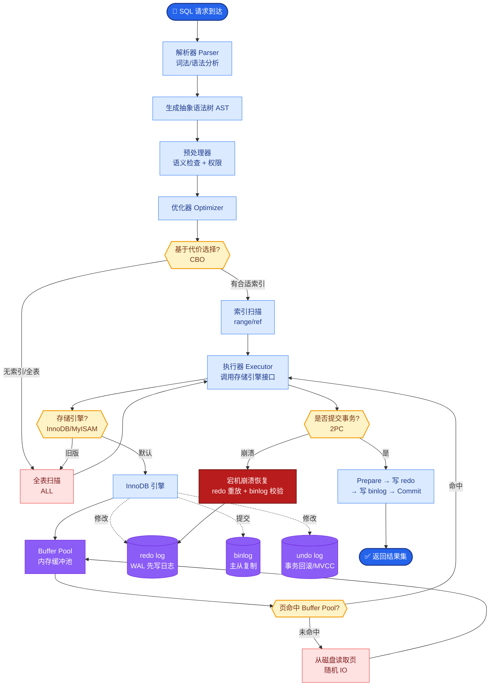
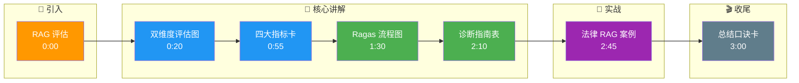

# 如何系统性地评估 RAG 系统的效果?有哪些关键指标

- **RAG 评估** 需要从检索（上下文质量）和生成（答案质量）两个维度分别度量，缺一不可。

- **Ragas / TruLens 框架核心指标详解:**

  - **1. Faithfulness (忠实度):**
    - **定义**：生成的答案中的所有陈述，有多少比例可以被检索到的上下文所支持。
    - **计算**：将答案拆解为原子事实，逐一判断是否在 Context 中出现。
    - **意义**：直接衡量幻觉程度。分数低意味着模型在 "瞎编"。

  - **2. Answer Relevancy (答案相关性):**
    - **定义**：生成的答案是否解决了用户的问题。通常通过将答案反向生成 "Embedding" 与原 Query 计算相似度，或根据答案反推问题看是否匹配。
    - **意义**：衡量答案是否 "答非所问" 或 "避重就轻"。

  - **3. Context Precision (上下文精确率):**
    - **定义**：在检索到的所有 Chunk 中，有多少是真正相关的（排在越前面权重越高）。
    - **公式**：relevant_docs @ k / k。
    - **意义**：衡量检索器的 "纯净度"，是否引入了噪声。

  - **4. Context Recall (上下文召回率):**
    - **定义**：标准答案（Ground Truth）中引用的所有相关文档，有多少被检索系统成功召回。
    - **意义**：衡量检索器的 "覆盖率"，是否漏掉了关键信息。

```text
用户 Query
   │
   ├───────────────────> 检索系统 ──> 检索上下文 
   │                                 │
   │                                 ▼
   │                           Context Precision
   │                           (检索到了吗？对吗？)
   │                                 │
   │                                 ▼
   │                           ┌─────────────┐
   │                           │   LLM 生成   │
   │                           └──────┬──────┘
   │                                  │
   │             ┌────────────────────┼────────────────────┐
   │             ▼                    ▼                    ▼
   │      Faithfulness        Answer Relevancy     Context Recall
   │      (看上下文查重)        (看答案切题吗)      (对照标答看漏了吗)
```

- **评估方法论:**
  - **Golden Set (黄金数据集)**：人工构造高质量的 Q+A 对。这是评估的基石，但构建成本极高。
  - **LLM-as-Judge**：使用 GPT-4o 或 Claude 3.5 Sonnet 作为裁判，根据上述指标的定义给 1-5 分或输出布尔值。
    - **Prompt 关键**：必须明确给出评分标准、CoT 推理要求。
  - **Ragas / TruLens / DeepEval**：封装了 LLM-as-Judge 逻辑的自动化评估框架。

- **常见问题诊断指南:**
  - **Faithfulness 低**：
    - 原因：Prompt 没限制脱离上下文、检索到的文档本身就是错的、检索噪声太多。
    - 对策：Prompt 添加 "仅根据上下文回答"、提升 Rerank 精度。
  - **Context Recall 低**：
    - 原因：Embedding 模型无法识别专业术语、Chunk 切分把关键信息切断、索引参数不当（如 nlist 太小）。
    - 对策：微调 Embedding、调整 Chunk Size、混合检索（BM25+Vector）。
  - **Answer Relevancy 低**：
    - 原因：Prompt 指令不明、模型过于保守不敢回答。
    - 对策：优化 System Prompt，明确输出格式。

## 常见考点
1. **Ragas 的计算成本**：评估 100 条数据需要调用多少次 LLM？（答：每条数据每个指标都要调用一次 LLM，成本较高，通常只抽样评估）。
2. **粒度问题**：Context Recall 需要 Ground Truth 标注时，通常要标注 "相关文档 ID"，这很难获取，怎么解决？（答：可以使用合成数据生成技术，先让 LLM 生成问题和答案，再检索生成上下文）。
3. **METEOR / ROUGE**：传统 NLP 指标（ROUGE）在 RAG 评估中为什么不好用？（答：ROUGE 仅看重字面重叠，无法评估语义一致性和事实准确性，容易误判）。

## 核心流程图



## 记忆要点

- 评估维度：检索质量（上下文）和生成质量（答案）缺一不可。
- 忠实度：答案陈述被上下文支持的比例，衡量幻觉程度。
- 上下文精确率：Top-K 中相关文档占比，衡量检索纯净度。
- 上下文召回率：标答中相关文档被召回的比例，衡量检索覆盖率。
- 答案相关性：答案是否解决用户问题，防答非所问。

## 结构化回答

**30 秒电梯演讲：** RAG 评估需从检索质量（上下文）和生成质量（答案）两个维度分别度量，缺一不可。Ragas/TruLens 框架四大核心指标：忠实度（答案陈述被上下文支持的比例衡量幻觉）、上下文精确率（Top-K 中相关文档占比衡量纯净度）、上下文召回率（标答相关文档被召回的比例衡量覆盖率）、答案相关性（答案是否解决用户问题防答非所问）。方法论是 Golden Set 人工标注 + LLM-as-Judge 自动评估。

**展开框架：**
1. **检索质量评估** — 上下文精确率看 Top-K 中相关文档占比衡量纯净度；上下文召回率看标答相关文档被召回的比例衡量覆盖率；两者诊断检索器是漏召还是引入噪声。
2. **生成质量评估** — 忠实度将答案拆解为原子事实逐一判断是否在 Context 中，直接衡量幻觉；答案相关性通过答案反推问题与原 Query 相似度，衡量是否答非所问。
3. **评估方法论与诊断** — Golden Set 人工构造 Q+A 对是基石成本极高；LLM-as-Judge 用 GPT-4o/Claude 当裁判；Faithfulness 低加"仅根据上下文回答"+Rerank，Context Recall 低调 Chunk Size+混合检索。

**收尾：** 我做法律 RAG 评估时——用 Ragas 跑 100 条 Golden Set，发现 Context Recall 低是 Chunk 切分把关键法条切断，调小 Chunk Size 加混合检索后指标显著提升。您想深入聊如何构建高质量的 Golden Set，还是 LLM-as-Judge 的偏差如何消除？

## 视频脚本

> 预计时长：3 分钟 | 由浅入深

| 时间 | 画面/字幕 | 口播台词 | 讲解要点 |
|------|----------|----------|----------|
| 0:00 | 标题卡：RAG 评估 | "像考试批卷，既看搜到的资料对不对，也看写的答案准不准。" | 类比开场 |
| 0:20 | 双维度评估图 | "检索质量看上下文，生成质量看答案，缺一不可。" | 评估维度 |
| 0:55 | 四大指标卡 | "忠实度衡量幻觉，精确率纯净度，召回率覆盖率，相关性切题。" | 核心指标 |
| 1:30 | Ragas 流程图 | "Golden Set 人工标注 + LLM-as-Judge 自动评估双管齐下。" | 评估方法 |
| 2:10 | 诊断指南表 | "Faithfulness 低加引用约束，Recall 低调 Chunk Size 混合检索。" | 问题诊断 |
| 2:45 | 法律 RAG 案例 | "实战：Ragas 发现 Recall 低是 Chunk 切断法条，调小后指标升。" | 实战案例 |
| 3:00 | 总结口诀卡 | "记住：检索生成双维度，四大指标，Golden Set+LLM 裁判。下期讲 MCP。" | 收尾 |

### 视频流程图




