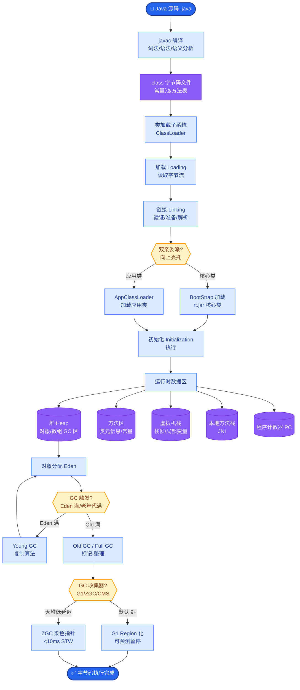
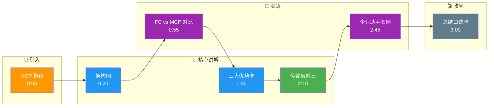

# MCP(Model Context Protocol)是什么?它和 Function Calling 有什么区别

- **MCP (Model Context Protocol)** 是 Anthropic 于 2024 年提出的开放协议，旨在标准化 LLM 与外部工具/数据源（本地文件、数据库、API 等）的连接方式，解决每次都要写不同集成代码的碎片化问题。

- **核心架构与通信:**
  - **MCP Host**：集成了 MCP 客户端的应用，如 Claude Desktop, Cursor IDE, Zed。
  - **MCP Client**：负责初始化连接，向 Server 发起请求（JSON-RPC）。
  - **MCP Server**：实现了 MCP 协议的本地或远程服务，对外暴露 `Tools`（可执行函数）和 `Resources`（可读取数据，如文件、SQL）。
  - **Transport Layer**：支持 `stdio`（标准输入输出，适合本地进程）或 `SSE`（Server-Sent Events，适合网络连接）。

```text
┌───────────────────────────────────────────────────┐
│                   MCP Host (IDE/LLM App)          │
│  ┌─────────────────────────────────────────────┐  │
│  │         MCP Client (Protocol Logic)         │  │
│  └──────────┬──────────────────────┬───────────┘  │
└─────────────┼──────────────────────┼──────────────┘
              │ Transport (stdio/SSE) │
              │                      │
      ┌───────▼──────────┐   ┌───────▼──────────┐
      │ MCP Server: File │   │ MCP Server: PG   │
      │   (Local Tool)   │   │   (Local Tool)   │
      └──────────────────┘   └──────────────────┘
              │                      │
      ┌───────▼──────────┐   ┌───────▼──────────┐
      │  Local Filesystem│   │  PostgreSQL DB   │
      └──────────────────┘   └──────────────────┘
```

- **与 Function Calling 的本质区别:**
  - **Function Calling (紧耦合)**：
    - 每个应用（如基于 LangChain 的 Bot）都需要手动定义 JSON Schema 传给 LLM。
    - 换一个 LLM 提供商（如从 OpenAI 换到 Anthropic），工具定义格式和调用逻辑可能完全不同，需要重写代码。
  - **MCP (松耦合/标准化)**：
    - **定义统一**：工具定义独立于 LLM 应用，只写一次 MCP Server。
    - **即插即用**：任何支持 MCP 的 Host（Claude Desktop, Cursor 等）都能自动发现并加载该 Server 提供的工具。
    - **类比**：Function Calling 像 "专用充电器"，MCP 像 "USB-C 通用接口"。

- **MCP 的关键优势:**
  1. **生态共享**：社区可以发布通用的 MCP Server（如 GitHub Reader, Postgres 连接器），大家直接用，不需要每个人都写一遍连接 GitHub 的代码。
  2. **安全与权限**：MCP Server 运行在本地或受控环境，拥有对数据库/文件的直接访问权限，而 LLM Cloud 只有间接调用权限（且 Server 可控制具体操作的粒度，如只读）。
  3. **动态发现**：Host 启动时自动扫描并加载可用工具，无需硬编码。

- **现状与生态:** Claude Desktop (原生支持), Cursor (文件操作), Zed 编辑器, Continue.dev 等已集成 MCP。

## 常见考点
1. **传输方式**：stdio 和 SSE 的区别是什么？（答：stdio 适合本地子进程通信，简单；SSE 适合通过 HTTP 长连接远程访问 Server，适合 Server 部署在不同机器上）。
2. **安全性**：MCP 如何防止 LLM 通过工具执行恶意操作？（答：MCP Server 本身是代码，可以在 Server 层做权限校验、参数校验，不盲目执行 LLM 传来的所有指令）。
3. **兼容性**：MCP 会替代 OpenAPI 吗？（答：不会，MCP 是模型与工具间的交互协议；OpenAPI 是服务间的接口描述。可以将 MCP Server 作为 OpenAPI 的一个 Client 实现层）。

## 核心流程图



## 记忆要点

- 定义：Anthropic 提出的开放协议，标准化 LLM 与外部数据/工具连接。
- 架构：Host (应用) <-> Client (逻辑) <-> Server (工具/资源) via JSON-RPC。
- 对比 Function Calling：FC 是紧耦合专用接口，MCP 是松耦合通用 USB-C。
- 优势：生态共享（Server 复用）、本地安全权限控制、动态发现。
- 传输层：stdio 适合本地进程，SSE 适合远程网络连接。

## 结构化回答

**30 秒电梯演讲：** MCP（Model Context Protocol）是 Anthropic 2024 年提出的开放协议，标准化 LLM 与外部工具/数据源的连接方式。架构是 Host（应用）↔ Client（逻辑）↔ Server（工具/资源）通过 JSON-RPC 通信。对比 Function Calling：FC 是紧耦合专用接口每次重写，MCP 是松耦合通用 USB-C 一次编写到处运行。三大优势：生态共享（Server 复用）、本地安全权限控制、动态发现。传输层 stdio 适合本地进程，SSE 适合远程网络。

**展开框架：**
1. **核心架构** — Host 集成客户端的应用（Claude Desktop/Cursor）；Client 负责初始化连接发起 JSON-RPC 请求；Server 暴露 Tools（可执行函数）和 Resources（可读取数据如文件 SQL）。
2. **对比 Function Calling** — FC 每个应用手动定义 JSON Schema，换 LLM 提供商需重写；MCP 定义独立于 LLM 应用只写一次 Server，任何支持 MCP 的 Host 自动发现加载，像 USB-C 通用接口。
3. **优势与传输层** — 生态共享（社区发布通用 Server 复用）、安全（Server 本地运行可控制权限粒度如只读）、动态发现（Host 启动自动扫描）；stdio 本地子进程简单，SSE 远程 HTTP 长连接。

**收尾：** 我做企业内部助手时——用 MCP 包装了 GitHub、Postgres、Jira 三个 Server，Claude Desktop 和 Cursor 自动发现即插即用，不用为每个工具写集成代码，权限控制也更细。您想深入聊 MCP 的安全模型是怎样的，还是如何开发一个 MCP Server？

## 视频脚本

> 预计时长：3 分钟 | 由浅入深

| 时间 | 画面/字幕 | 口播台词 | 讲解要点 |
|------|----------|----------|----------|
| 0:00 | 标题卡：MCP 协议 | "FC 是专用充电器，MCP 是 USB-C 通用接口，插哪都能用。" | 类比开场 |
| 0:20 | 架构图 | "Host Client Server 三层 via JSON-RPC，Server 暴露 Tools Resources。" | 核心架构 |
| 0:55 | FC vs MCP 对比 | "FC 紧耦合每次重写，MCP 松耦合一次编写到处运行。" | 对比 FC |
| 1:30 | 三大优势卡 | "生态共享 Server 复用，本地安全权限控制，动态发现。" | 三大优势 |
| 2:10 | 传输层对比 | "stdio 本地子进程简单，SSE 远程 HTTP 长连接。" | 传输层 |
| 2:45 | 企业助手案例 | "实战：MCP 包装 GitHub Postgres Jira，Cursor 自动发现即插即用。" | 实战案例 |
| 3:00 | 总结口诀卡 | "记住：开放协议标准化，USB-C 通用接口，生态共享安全。下期讲 Agent 工具。" | 收尾 |

### 视频流程图




