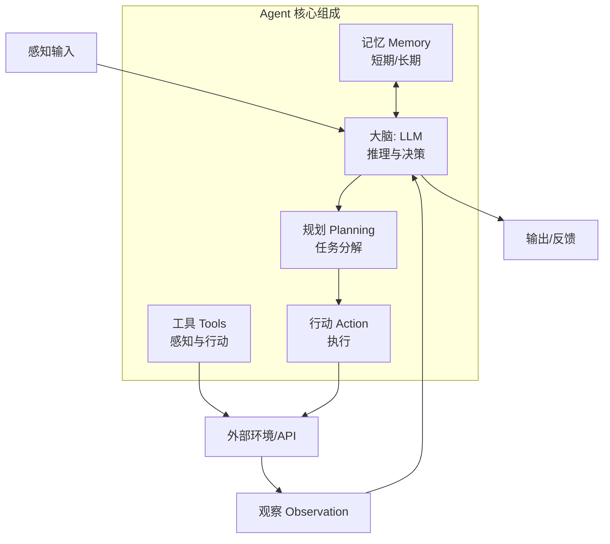

# Agent 的核心组成

### Agent 的核心组成

#### 1. 感知
把多模态输入（文本、文件、接口返回、页面结构等）转成模型可用的表示，并抽取任务相关状态。

#### 2. 规划
把目标拆成子目标与步骤；可以是一次性计划或每步重规划。

#### 3. 记忆
- **短期**：当前会话上下文、工具轨迹。
- **长期**：用户画像、文档知识、向量库、图数据库等。

#### 4. 工具
对外部世界可执行的操作抽象：需有清晰 schema（名称、描述、参数 JSON Schema）。

#### 5. 执行
真正调用工具或触发环境变化，并处理超时、重试、幂等等工程问题。

#### 6. 反思
对失败或质量不佳的结果进行自省：纠错、换策略、生成检查清单（常与「自我批评/验证器」配合）。

#### 技术细节
- **感知**：常与结构化抽取、OCR、HTML 解析结合；关键是减少噪声进上下文。
- **规划**：常见实现 CoT/ReAct、Planner-Executor 双模块、树搜索（LATS）。
- **记忆**：要点在于摘要压缩、引用溯源、记忆冲突解决、权限与隐私。
- **工具**：最小权限、参数校验、错误信息回灌模型。
- **反思**：可做成独立子调用：「列出本次推理的三处风险并修正」。

#### 边界情况与极端场景
1. **记忆冲突与过时**：长期记忆（向量库）可能包含过时信息，导致 Agent 基于错误知识决策。需引入“时间衰减”权重或人工反馈机制修正记忆。
2. **工具参数注入攻击**：如果工具参数直接由 LLM 生成并拼接执行，可能存在 Prompt 注入或 SQL 注入风险。需严格校验参数类型和范围。
3. **规划失效**：在初始规划阶段如果目标理解偏差，后续所有执行可能都在做无用功。需要引入“里程碑检查”机制，定期评估当前进度是否偏离。

#### 实战案例
- **工具幻觉**：某 Agent 调用了不存在的 `get_user_by_ip` 函数，导致解析器报错。解决方法是在 Prompt 中严格列出工具列表，并在解析层加 `try-except` 捕获未定义工具并反馈给模型。
- **记忆爆炸**：长对话导致 Token 超限，常见做法是使用滑动窗口或 LLM 自动生成对话摘要作为新的上下文输入。

#### 代码示例：工具 Schema
```json
{
  "type": "function",
  "function": {
    "name": "search_kb",
    "description": "在公司知识库中按关键词搜索",
    "parameters": {
      "type": "object",
      "properties": {
        "query": {"type": "string"},
        "top_k": {"type": "integer", "default": 5}
      },
      "required": ["query"]
    }
  }
}
```

## 面试追问
1. 你的 Agent 中，短期记忆和长期记忆是如何交互的？比如一个用户在当前对话修改了长期记忆中的偏好，如何保证一致性？
2. 如果工具 Schema 定义得很模糊（例如 description 写得不清楚），模型会表现如何？如何优化 Prompt 或 Schema 来提升工具调用的准确率？
3. 反思模块通常需要再调用一次 LLM，这会增加成本和延迟。什么情况下必须开启反思，什么情况下可以关闭？

## 易错点
1. **将“数据库”等同于“记忆”**：认为只要有向量库就是有记忆。Agent 的记忆核心在于“主动检索与写入”，即 Agent 能自主判断何时读、何时写，而不仅仅是被动的查询。
2. **忽视工具的错误处理设计**：只设计工具的正常返回，忽略异常返回（如超时、权限拒绝）。如果工具报错信息太技术化（如 HTTP 500 detail），LLM 可能无法理解并进行有效恢复。

## 核心流程图



## 记忆要点

- 感知：转多模态输入为模型表示，抽取状态，减少噪声。
- 规划：拆解目标为子步骤，常见 CoT/ReAct 或 Planner-Executor。
- 记忆：短期（上下文）+ 长期（向量库/图库），需主动读写。
- 工具：对外操作抽象，需清晰 Schema，最小权限，严格校验。
- 反思：对结果自省纠错，常作为独立子调用，提升质量但增成本。

## 结构化回答

**30 秒电梯演讲：** Agent 六大模块：感知（转多模态输入为模型表示减噪声）、规划（拆目标为子步骤 CoT/ReAct 或 Planner-Executor）、记忆（短期上下文+长期向量库需主动读写）、工具（对外操作抽象需清晰 Schema 最小权限）、执行（调用工具处理超时重试幂等）、反思（对失败结果自省纠错常作独立子调用）。记忆不是有向量库就行，核心是主动检索写入；工具错误信息要 LLM 能理解。

**展开框架：**
1. **六大模块** — 感知转多模态输入抽取状态、规划拆解子目标、记忆短期+长期、工具清晰 Schema 最小权限、执行处理工程问题、反思自省纠错。
2. **记忆与工具** — 记忆核心是主动检索写入而非被动查询；工具 description 要清晰否则模型调用准确率低，错误信息太技术化（HTTP 500 detail）LLM 无法理解恢复。
3. **边界情况** — 长期记忆过时需时间衰减权重；工具参数注入攻击（Prompt 注入、SQL 注入）需严格校验；规划失效需里程碑检查定期评估偏离。

**收尾：** 踩过工具幻觉坑——Agent 调用不存在的 get_user_by_ip 函数解析器报错，解决是在 Prompt 严格列工具列表加 try-except 捕获未定义工具反馈给模型。您想聊哪块，短期长期记忆交互一致性还是工具 Schema 优化？

## 视频脚本

> 预计时长：3 分钟 | 由浅入深

| 时间 | 画面/字幕 | 口播台词 | 讲解要点 |
|------|----------|----------|----------|
| 0:00 | 标题卡：Agent 的核心组成 | "像把人脑、眼耳、手脚、笔记本组合起来。" | 类比开场 |
| 0:20 | 六大模块总览 | "感知、规划、记忆、工具、执行、反思六大模块。" | 模块总览 |
| 0:50 | 感知与规划 | "感知转输入减噪声，规划拆子步骤用 CoT/ReAct。" | 前两模块 |
| 1:20 | 记忆与工具 | "记忆主动读写非被动查询，工具清晰 Schema 最小权限。" | 中两模块 |
| 1:55 | 工具幻觉警示 | "坑：Agent 调不存在的函数，Prompt 列工具列表+try-except。" | 实战教训 |
| 2:25 | 记忆过时边界 | "长期记忆过时需时间衰减，规划失效需里程碑检查。" | 边界情况 |
| 2:50 | 总结卡 | "记住：六模块+主动记忆+清晰工具+反思纠错。下期讲工作流。" | 收尾 |

### 视频流程图


