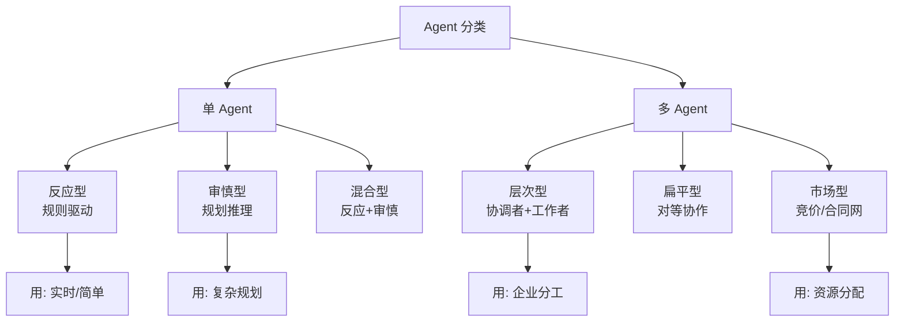

# Agent 的分类

### Agent 的分类

#### 概念解释（基于智能体理论）

| 类型 | 通俗理解 | 说明 |
| :--- | :--- | :--- |
| **反应式** | 类似反射 | 输入→动作，几乎不维护复杂内部模型，快速但死板。 |
| **基于模型** | 脑中有地图 | 维护内部状态（世界模型），能预测行动后果，应对不可见环境。 |
| **基于目标** | 明确终点 | 拥有预设的目标函数，能规划路径以达到目标状态。 |
| **基于效用** | 权衡利弊 | 引入概率和期望效用，在多目标冲突时选最优解。 |
| **学习型** | 自我进化 | 通过强化学习或经验积累，动态更新策略或模型参数。 |

#### 分类应用
大多数现代 LLM Agent 结合了 **基于模型**（LLM 理解世界）、**基于目标**（Prompt 设定的目标）和 **基于效用**（RLHF 或评分机制）的特性。

#### 边界场景与架构演进
1. **单 Agent vs 多 Agent**：
   - **单 Agent**：适合逻辑连贯、工具调用较少的任务。瓶颈在于上下文长度和注意力分散。
   - **多 Agent**：适合模块化分工（如一个写代码，一个测试）。但会引入通信开销和“共识死锁”风险（两个 Agent 意见不一致时无限循环）。
2. **同质化 vs 异质化**：
   - **同质化**：多个相同角色的 Agent 投票或辩论。优点是鲁棒性，缺点是成倍增加成本。
   - **异质化**：不同角色的 Agent（编码官、审查官）。需精心设计交互协议，否则容易陷入“吵架”模式。

#### 实战案例
- **单双模式切换**：在简单的“查天气”任务中，使用 ReAct（边想边做）这种反应式模式响应最快；但在复杂的“竞品分析报告”生成中，必须使用 Plan-and-Solve（先规划大纲再填充）模式，否则容易跑题或遗漏关键点。
- **多 Agent 协作踩坑**：在尝试用多 Agent 模拟客服和用户对练时，发现去中心化模式下极易出现“无限打招呼”的无效循环，改为中心化的 Supervisor 模式（裁判介入）后收敛性显著提升。

#### 常见考点
1. **架构对比**：单 Agent 与多 Agent 系统在处理复杂任务时的优劣势对比（如沟通开销 vs 专业化）。
2. **范式选择**：什么时候选择 React（边想边做）什么时候选择 Plan-and-Execute（先规划后执行）？
3. **协作模式**：多 Agent 协作中，Peer-to-Peer（去中心化）与 Supervisor（中心化）模式的适用场景。

## 面试追问
1. 在多 Agent 协作中，如果通信 Token 占据了大部分预算，你会如何优化交互协议？（考察压缩思维或共享上下文）
2. 你提到 Supervisor 模式能解决死循环，但如果 Supervisor 本身判断失误了怎么办？有没有去中心化的容错机制？
3. 现在很多框架支持“AutoGPT”模式（自我迭代），这种模式在什么情况下效果最差？

## 易错点
1. **盲目追求多 Agent**：认为任务越复杂就应该用越多 Agent。实际上，多 Agent 带来的协同复杂性（Prompt 对齐、消息传递）往往超过其带来的收益，尤其是当子任务依赖性很强时。
2. **混淆“学习型 Agent”与“RAG”**：认为接入了向量数据库就是“学习型 Agent”。严格意义上的学习型 Agent 指的是参数或策略会发生改变（如通过 RLHF 更新权重），而非仅仅是检索知识的增加。

## 技术原理

Agent 分类源于 Russell & Norvig 在《人工智能：一种现代方法》中提出的智能体理论，按"决策逻辑复杂度"和"对未来预测能力"递进：

- **反应式（Reflex）**：决策函数是 `输入 → 动作` 的简单映射（如 if-else 或训练好的分类器），不维护内部状态，不预测未来。优点是极快、可解释；缺点是死板，遇到未见过的情况就失效。对应早期专家系统和当前的简单意图分类。
- **基于模型（Model-based）**：维护内部状态（世界模型），能推断"不可见的环境"。比如自动驾驶 Agent 不仅看当前摄像头画面，还预测前车下一步动作。LLM Agent 的"基于模型"体现在 LLM 本身就是世界知识的压缩模型。
- **基于目标（Goal-based）**：拥有显式目标函数，能规划路径达到目标状态（如 A* 搜索、Plan-and-Solve）。这是 Plan-and-Execute 范式的理论基础。
- **基于效用（Utility-based）**：在多目标冲突时引入效用函数和概率期望，选期望收益最大的动作。这是 RLHF 和决策论的基础——不只看"能不能达到目标"，还看"达到目标的代价和风险"。
- **学习型（Learning）**：通过 RL 或经验更新策略/参数，严格意义上指参数发生改变（如 RLHF 更新权重），而非仅检索知识（RAG 不算学习型）。

现代 LLM Agent 通常融合基于模型（LLM 理解世界）+ 基于目标（Prompt 设定目标）+ 基于效用（评分/RLHF）三种特性。

## 注意事项

1. **别盲目追求多 Agent**：任务越复杂不代表该用越多 Agent。多 Agent 的协同复杂性（Prompt 对齐、消息传递、共识达成）往往超过收益，尤其子任务依赖性强时单 Agent 更稳。
2. **学习型 ≠ RAG**：严格的学习型 Agent 指参数/策略会改变（RLHF 更新权重），接入向量库只是检索增强不算学习，两者别混淆。
3. **协作模式按任务选**：去中心化 P2P 适合开放讨论但易吵架死循环；中心化 Supervisor 易收敛但 Supervisor 是单点。强合规走中心化，强探索走去中心化。
4. **范式按复杂度选**：简单查天气用 ReAct（反应式）最快；复杂竞品分析用 Plan-and-Solve（基于目标）防跑题。

## 代码示例

```python
# 基于 Russell & Norvig 理论的 Agent 分类伪代码
from abc import ABC, abstractmethod

# 1. 反应式 Agent：输入→动作映射，无状态
class ReflexAgent(ABC):
    def act(self, percept):
        return self.rules.get(percept, "default_action")  # if-else 查表

# 2. 基于模型 Agent：维护内部状态，预测后果
class ModelBasedAgent(ReflexAgent):
    def __init__(self):
        self.state = {}  # 内部世界模型
    def update_state(self, percept):
        self.state = self.model(self.state, percept)  # 推断不可见环境
    def act(self, percept):
        self.update_state(percept)
        return self.rules[self.state]  # 基于内部状态决策

# 3. 基于目标 Agent：规划路径达到目标状态（Plan-and-Solve）
class GoalBasedAgent(ModelBasedAgent):
    def act(self, percept):
        self.update_state(percept)
        plan = self.search(goal=self.goal, start=self.state)  # A* 规划
        return plan[0]  # 执行规划的第一步

# 4. 基于效用 Agent：多目标冲突时按期望效用选最优
class UtilityBasedAgent(GoalBasedAgent):
    def act(self, percept):
        actions = self.possible_actions()
        return max(actions, key=lambda a: self.expected_utility(a) * self.prob(a))

# 5. 学习型 Agent：通过 RL 更新策略参数（严格意义的学习）
class LearningAgent(UtilityBasedAgent):
    def feedback(self, reward):
        self.policy.update(reward)  # 参数/策略发生改变，非 RAG 的检索增强
```


## 核心流程图



## 记忆要点

- 反应式：输入->动作，无记忆，快速死板。
- 基于目标：预设终点，规划路径达到目标状态。
- 基于效用：引入概率期望，多目标冲突时选最优。
- 单 vs 多 Agent：单适合连贯任务，多适合分工但易通信死锁。
- 协作模式：去中心化（P2P）易吵架，中心化（Supervisor）易收敛。

## 结构化回答

**30 秒电梯演讲：** Agent 按决策逻辑复杂度分类：反应式（输入→动作无记忆快速死板）、基于模型（维护世界模型预测后果）、基于目标（预设终点规划路径）、基于效用（引入概率期望多目标冲突选最优）、学习型（RLHF 更新权重）。现代 LLM Agent 融合基于模型+目标+效用。单 Agent 适合连贯任务，多 Agent 适合分工但易通信死锁；协作去中心化 P2P 易吵架，中心化 Supervisor 易收敛。

**展开框架：**
1. **五种类型** — 反应式类似反射快速死板、基于模型脑中有地图预测后果、基于目标明确终点规划路径、基于效用权衡利弊多目标选最优、学习型自我进化更新参数。
2. **单 vs 多 Agent** — 单适合逻辑连贯工具调用少（瓶颈是上下文长度和注意力分散）；多适合模块化分工但引入通信开销和共识死锁风险。
3. **协作模式与避坑** — 同质化投票辩论鲁棒但成本翻倍；异质化编码官审查官需精心设计交互协议；盲目追求多 Agent 协同复杂性常超收益。

**收尾：** 用多 Agent 模拟客服和用户对练时踩过坑——去中心化模式极易"无限打招呼"无效循环，改为中心化 Supervisor 模式裁判介入后收敛性显著提升。您想聊哪块，通信 Token 优化还是 Supervisor 容错机制？

## 视频脚本

> 预计时长：2 分钟 | 由浅入深

| 时间 | 画面/字幕 | 口播台词 | 讲解要点 |
|------|----------|----------|----------|
| 0:00 | 标题卡：Agent 的分类 | "从低级动物反应式进化到有谋略的人类基于效用。" | 类比开场 |
| 0:15 | 五种类型表 | "反应式、基于模型、基于目标、基于效用、学习型。" | 类型总览 |
| 0:45 | 现代融合 | "LLM Agent 融合基于模型+目标+效用三种特性。" | 实际应用 |
| 1:10 | 单 vs 多 Agent | "单适合连贯任务，多适合分工但易通信死锁。" | 架构选择 |
| 1:35 | 协作模式对比 | "去中心化 P2P 易吵架，中心化 Supervisor 易收敛。" | 协作模式 |
| 1:50 | 总结卡 | "记住：五类型+单多选择+协作模式。下期讲工作流深入。" | 收尾 |
