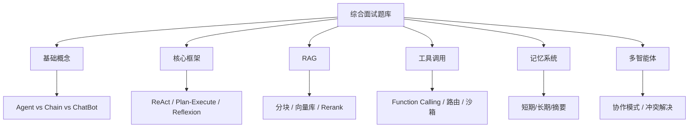

# 综合面试题库（15+ 题）

### Q13：请定义 LLM Agent 并说明与单次调用的差异
**答案**：
- **定义**：以大语言模型为推理核心，通过**规划**、**记忆**与**工具**在多轮交互中完成复杂任务的系统。
- **差异**：单次调用是开环生成；Agent 是闭环决策，每步依据环境反馈更新状态，直到满足终止条件。

> **实战案例**：单次调用问“今天天气”直接回答；Agent 问“帮我订明天去北京的机票”则需先查天气、查日历、查库存、调用支付接口，历时数分钟。

**代码示例**：
```pythonnclass SimpleAgent:
    def run(self, user_query):
        state = {"query": user_query}
        while not self.is_finished(state):
            # 单次调用只是 model.predict()
            # Agent 是循环决策
            thought = self.model.think(state)
            action = self.model.decide_action(thought)
            observation = self.tools.execute(action)
            state.update({"observation": observation})
        return state["final_answer"]
```

### Q14：ReAct 框架中三个字母代表什么？解决什么问题？
**答案**：
- **含义**：Reasoning（推理）+ Acting（行动）。
- **解决的问题**：解决模型仅“空想”易偏离事实的问题，通过显式推理步骤与工具反馈将推理锚定在真实环境。

### Q15：如何设计 Agent 的停止条件？
**答案**：
组合使用以下条件：
1. 模型显式声明 `finish`。
2. 任务清单全部完成。
3. 达到步数/预算上限或超时。
4. 检测到连续无进展（死循环）。
5. 收到外部成功信号（如测试通过）。

### Q16：工具描述 为什么非常重要？
**答案**：
模型依赖描述进行工具选择。描述不清会导致选错工具或产生参数幻觉。优质描述应包含：适用场景、不适用场景、参数含义、错误示例及返回格式。

### Q17：Memory 用向量库就够了吗？
**答案**：
不够。向量检索擅长模糊匹配，但弱于精确查找与关系推理。工程上通常采用 **向量检索 + 关键词/结构化库 + 知识图谱** 的混合架构，并需维护元数据与权限。

### Q18：多 Agent 协作和单 Agent 多工具怎么选？
**答案**：
| 对比项 | 单 Agent | 多 Agent |
| :--- | :--- | :--- |
| **复杂度** | 低，易调试 | 高，需处理通信协议与死锁 |
| **延迟** | 低（单线程） | 高（需网络/进程间通信） |
| **适用场景** | 任务线性、逻辑单一 | 任务解耦、需并行/对抗（如写代码+测代码） |
| **容错性** | 单点失败全挂 | 可隔离失败 Agent |

### Q19：如何做“人在回路”又不打断体验？
**答案**：
实施分级干预策略：
- 低风险：自动执行。
- 中风险：异步审批。
- 高风险：实时确认。
结合预授权、可撤销操作与默认最小权限原则。

> **实战案例**：某运维 Agent，对于“重启服务”需管理员点击“同意”按钮（异步），但对于“删除数据”则需管理员输入二次验证码（同步阻断）。

### Q20：Agent 日志应记录什么？
**答案**：
- 用户输入（脱敏后）。
- 模型原始输出与解析后的工具调用。
- 工具返回摘要。
- 耗时、Token 数量与版本号（Prompt/Model）。
- 追踪 ID，用于全链路复盘与合规审计。

### Q21：为什么“让模型自己选工具”可能不如“路由器 + 规则”？
**答案**：
在特定领域窄、路径稳定的场景，基于规则的路由器更省成本、可测试且行为确定。全模型路由在开放域更具灵活性。最佳实践是混合：易分类的走规则，难例走模型。

### Q22：简述 Planner-Executor 架构及优缺点。
**答案**：
- **架构**：Planner 生成步骤或 DAG；Executor 逐步执行并将结果反馈给 Planner 进行重规划。
- **优点**：结构清晰，易于加入校验。
- **缺点**：初始规划可能不准，需迭代调整，两阶段可能增加延迟。

### Q23：Agent 如何做版本管理与灰度？
**答案**：
- Prompt、工具定义、Schema 版本化。
- 影子模式：记录建议但不实际执行。
- 金丝雀发布：对小流量用户群测试。
- 对比成功率、成本、违规数等关键指标，支持一键回滚。

### Q24：举一个“不是 Agent 但常被误认为 Agent”的例子。
**答案**：
固定三步的 RAG 流水线（如 query 改写 → 检索 → 生成）。若缺乏基于观察的再决策循环，它更像 Chain；只有加入多轮检索策略与失败分支处理，才接近 Agent。

### Q25：如何向非技术经理解释 Agent 的风险？
**答案**：
类比为“能办事的实习生”：能力强但可能记错、被误导或误操作。因此我们需要权限卡（最小权限）、审批流程（人在回路）和监控录像（审计日志），重要操作需双人复核。

### Q26：上下文窗口越来越大，还需要外部记忆吗？
**答案**：
需要。长窗口不等于低成本，也不解决检索、治理与遗忘问题。外部记忆用于跨会话持久化、结构化权限管理及溯源；上下文窗口更适合存储当前任务的热工作集。

### Q27：如何测试 Agent？
**答案**：
- 单元测试工具逻辑。
- 模拟环境测试闭环行为。
- 维护回归集（固定任务与期望轨迹范围）。
- 构造对抗用例（注入攻击、越权尝试）。
- 线上金丝雀测试。避免仅测试最终答案而忽略过程正确性。

> **实战案例**：测试 Agent 订咖啡功能，不能只测“是否返回订单号”，还要 Mock 支付接口失败的场景，验证 Agent 是否正确触发了“重试”或“提示用户”逻辑，而非直接崩溃。


## 核心流程图



## 核心知识点图


## 记忆要点

- Agent定义：以LLM为核心，通过规划、记忆、工具在闭环中完成复杂任务。
- ReAct含义：Reasoning（推理）+ Acting（行动），解决空想偏离事实问题。
- 停止条件：显式Finish、任务完成、超预算、死循环检测或外部信号。
- 多Agent选型：单Agent低延迟适合线性任务；多Agent高成本适合解耦/并行。
- 外部记忆：长窗口不等于低成本，仍需外部记忆做持久化与权限治理。

## 结构化回答

**30 秒电梯演讲：** LLM Agent 不是一次调用，而是一个能感知环境、自主决策、调用工具、循环执行的闭环系统。它和单次生成的核心区别是"开环 vs 闭环"——单次调用问天气直接答，Agent 订机票要查日历、查库存、调支付，每一步都看反馈再决定下一步。

**展开框架：**
1. **定义与本质** — 以 LLM 为核心，通过规划、记忆、工具在闭环中完成复杂任务；与单次调用的根本差异是闭环决策。
2. **核心范式** — ReAct 让推理和行动交替，把思考锚定在真实世界反馈上；停止条件要组合显式 Finish、预算上限、死循环检测。
3. **工程关键** — 记忆要混合向量 + 结构化 + 图谱；多 Agent 适合解耦并行，单 Agent 适合低延迟线性任务；测试要覆盖过程、对抗、结果三维度。

**收尾：** 这套体系里我最常被追问的是"上下文窗口越来越大还要外部记忆吗"——答案是必须的，长窗口不解决检索和权限治理。您想深入聊 ReAct、记忆架构还是测试方法？

## 视频脚本

> 预计时长：5 分钟 | 由浅入深

| 时间 | 画面/字幕 | 口播台词 | 讲解要点 |
|------|----------|----------|----------|
| 0:00 | 标题卡：15 道 Agent 综合面试题 | "面试官最爱问的 Agent 问题，我给你串成一条主线：定义、ReAct、停止条件、记忆、测试。" | 开场钩子 |
| 0:25 | 单次调用 vs Agent 闭环对比图 | "先说定义。单次调用是开环生成，Agent 是闭环决策，每步看反馈更新状态。订机票就要查日历、查库存、调支付。" | 定义差异 |
| 1:00 | ReAct 三字母拆解动画 | "ReAct 是推理加行动。它解决模型空想偏离事实的问题，通过工具反馈把推理锚定在真实世界。" | ReAct 范式 |
| 1:45 | 停止条件清单 | "停止条件怎么设？显式 Finish、任务完成、超预算、死循环检测、外部信号，组合使用。" | 停止条件 |
| 2:30 | 单 Agent vs 多 Agent 对比表 | "单 Agent 低延迟适合线性任务，多 Agent 适合解耦并行但要处理通信和死锁。记忆不要只用向量库，要混合结构化和图谱。" | 选型 + 记忆 |
| 3:30 | 测试金字塔：单元/模拟/对抗 | "测试不能只看最终答案，要覆盖工具逻辑、闭环行为、对抗用例。订咖啡的 Agent 还要 Mock 支付失败看它会不会重试。" | 测试方法 |
| 4:20 | 总结卡 | "记住主线：闭环、ReAct、停止、记忆、测试。下期我们拆 ReAct 的 Prompt 怎么写。" | 收尾 |

