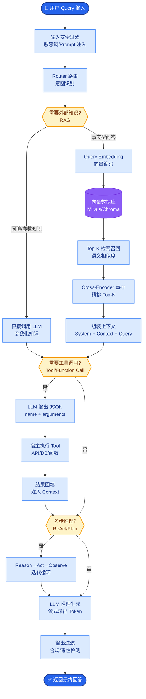

# ReAct 框架

### 1. 概念解释
ReAct（Reasoning + Acting）是一种推理与行动交替进行的范式。它要求模型显式输出思考过程、执行动作并观察结果，形成闭环。其核心在于将“推理链”与“行动交互”结合。

### 2. 核心工作流与循环机制

```text
      ┌─────────────┐
      │   User      │
      │   Query     │
      └──────┬──────┘
             ▼
      ┌─────────────┐
      │   Thought 1 │  (分析意图，决定工具)
      └──────┬──────┘
             ▼
      ┌─────────────┐
      │   Action 1  │  (调用 Tool A)
      └──────┬──────┘
             ▼
      ┌─────────────┐
      │Observation 1│  (获取工具返回结果)
      └──────┬──────┘
             ▼
      ┌─────────────┐
      │   Thought 2 │  (基于 Observation 1 分析)
      └──────┬──────┘
             ▼
      ┌─────────────┐
      │   Action 2  │  (调用 Tool B 或 Finish)
      └──────┬──────┘
             ▼
        (循环直到完成)
```

> **实战案例**：在 ReAct 循环中，若某一步 Tool 返回了错误代码（如 404），模型容易陷入“尝试同样的 Action -> 观察到同样的错误”的死循环。需在 Prompt 中加入：“若遇到错误，必须分析原因并尝试不同的 Action”。

### 3. Prompt 设计关键点
- **显式前缀**：强制使用 `Thought:`、`Action:`、`Observation:` 等前缀便于解析。
- **工具清单**：清晰列出工具名称、描述、参数 Schema（JSON Schema）。
- **Few-shot**：提供 1-3 个完整轨迹示例，提高格式遵从率。

**代码示例**：
```python
import re

def parse_react_output(llm_output):
    # 使用正则提取关键步骤
    thought_match = re.search(r"Thought:(.*?)Action:", llm_output, re.DOTALL)
    action_match = re.search(r"Action:(.*?)", llm_output, re.DOTALL)
    
    thought = thought_match.group(1).strip() if thought_match else None
    action_input = action_match.group(1).strip() if action_match else None
    
    if thought and action_input:
        return {"thought": thought, "action": action_input}
    return None # 格式错误，触发重试
```

### 4. 与 CoT 的区别
| 维度 | CoT (Chain of Thought) | ReAct |
| :--- | :--- | :--- |
| **交互性** | 内部推理，无外部交互 | 外部交互，调用 Tool/环境 |
| **数据源** | 仅依赖模型预训练知识 | 依赖实时反馈和外部数据 |
| **适用任务** | 数学推理、逻辑谜题 | 任务规划、API 调用、问答 |
| **纠错能力** | 弱（一旦生成无法自我修正） | 强（可根据 Observation 修正） |

#### ## 常见考点
1. **终止条件**：在 ReAct 循环中，如何定义“任务完成”以防止无限循环？
2. **解析容错**：当模型输出的 Action 格式不符合 JSON 规范时，如何进行容错处理？
3. **上下文管理**：随着循环步数增加，上下文溢出时如何保留关键的 Observation 信息？


## 核心流程图



## 记忆要点

- ReAct核心：推理与行动交替，显式输出Thought、Action、Observation。
- 工作流：思考决定工具 -> 执行获取结果 -> 基于反馈再思考的循环。
- Prompt关键：强制前缀格式、清晰工具清单、Few-shot示例提高遵从率。
- 对比CoT：ReAct有外部交互与纠错能力，CoT仅内部推理无反馈。
- 防死循环：Prompt中需加入”遇错必换策略”指令，避免重复无效动作。

## 结构化回答

**30 秒电梯演讲：** ReAct 就是让大模型”边想边干”——先输出一段思考，决定调什么工具，拿到结果再思考下一步。它和纯 CoT 的区别是：CoT 只在脑子里推理，ReAct 每一步都能调工具拿真实反馈，所以幻觉更少、能纠错。

**展开框架：**
1. **三段循环** — Thought（分析意图决定工具）→ Action（调用工具）→ Observation（看返回结果），循环直到 Finish。
2. **Prompt 关键** — 强制用 `Thought:/Action:/Observation:` 前缀方便解析，工具清单要写清 Schema，配 1-3 个 Few-shot 示例提高遵从率。
3. **对比 CoT** — CoT 是内部推理无反馈、一旦错就一路错；ReAct 有外部交互，能根据 Observation 自我修正。
4. **防死循环** — Prompt 里必须写”遇错必换策略”，否则模型会反复尝试同样的 Action 拿到同样的 404。

**收尾：** ReAct 是最基础的 Agent 范式，后面所有框架都是它的变体。您想深入聊 Prompt 格式、解析容错还是上下文管理？

## 视频脚本

> 预计时长：4 分钟 | 由浅入深

| 时间 | 画面/字幕 | 口播台词 | 讲解要点 |
|------|----------|----------|----------|
| 0:00 | 标题卡：ReAct 框架 | “让大模型边想边干的 ReAct，是所有 Agent 框架的祖宗。” | 开场钩子 |
| 0:20 | Thought-Action-Observation 循环动画 | “核心就三步：Thought 想下一步、Action 调工具、Observation 看结果，循环直到完成。” | 核心循环 |
| 0:55 | Prompt 模板代码截图 | “Prompt 要强制前缀 Thought/Action/Observation，工具清单写清 Schema，再加几个 Few-shot 示例。” | Prompt 设计 |
| 1:35 | ReAct vs CoT 对比表 | “和 CoT 的区别：CoT 只在脑子里想，错了没法改；ReAct 每步拿真实反馈，能自我修正。” | 对比辨析 |
| 2:15 | 死循环案例：反复调同一个 API 拿 404 | “最大的坑是死循环。模型可能反复调同一个报错的 API，Prompt 里必须写'遇错必换策略'。” | 防坑指南 |
| 2:50 | 总结卡 | “一句话：ReAct = 推理 + 行动 + 观察。下期讲 Plan-and-Execute 怎么补 ReAct 的短视。” | 收尾 |

