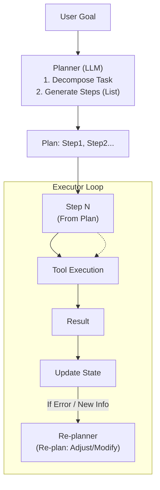

# Plan-and-Execute 框架

### 1. 概念解释
Plan-and-Execute 分为两个阶段：
1. **Planner（规划）**：先制定全局计划，进行任务分解。
2. **Executor（执行）**：按计划逐步执行，执行过程中根据反馈决定是否重规划。

### 2. 核心流程与架构



### 3. 与 ReAct 的对比
| 维度 | ReAct | Plan-and-Execute |
| :--- | :--- | :--- |
| **规划方式** | 隐式、逐步贪心（走一步看一步） | 显式、先全局后局部（制定全案再动手） |
| **灵活性** | 高，随时可调整方向 | 中，调整需触发重规划，开销大 |
| **Token 效率** | 低，需反复输出思考 | 中，Plan 仅生成一次，但需维护状态 |
| **复杂任务适用性** | 弱，容易在长链中迷失 | 强，适合有明确步骤的任务（如数据分析流程） |
| **错误恢复** | 容易在局部死循环 | 可通过回溯 Plan 跳过错误步骤 |

> **实战案例**：在“撰写市场调研报告”任务中，ReAct 可能写着写着忘了查竞品数据；Plan-and-Execute 会先生成大纲（搜数据 -> 分析 -> 写草稿 -> 润色），确保每个环节都不漏。

**代码示例**：
```python
# 简单的 Plan 结构与执行器
class PlanExecutor:
    def execute_plan(self, plan_steps):
        for i, step in enumerate(plan_steps):
            print(f"Executing Step {i+1}: {step['description']}")
            try:
                result = self.tools.run(step['tool'], step['args'])
                # 将结果存入上下文，供后续步骤或重规划使用
                self.context[step['id']] = result
            except Exception as e:
                print(f"Step failed: {e}")
                # 触发 Re-plan：将错误信息反馈给 Planner 修正后续步骤
                return self.re_plan(error=str(e), failed_step_index=i)
        return "All steps completed"
```

## 核心知识点图


## 记忆要点

- 两阶段：先Planner生成全局计划，后Executor逐步执行并反馈。
- 对比ReAct：ReAct是逐步贪心，Plan-and-Execute是先全局后局部。
- 优势：结构清晰不易漏步骤，适合长流程任务；劣势是调整需重规划。
- 重规划：执行遇错或新信息时，触发Re-planner调整原计划。
- 适用性：适合步骤明确的任务（如写报告），ReAct适合灵活探索。

## 结构化回答

**30 秒电梯演讲：** Plan-and-Execute 就是"先画路线图再施工"——Planner 先把任务拆成全局步骤列表，Executor 再逐步执行，遇到错误还能回炉重规划。它解决的是 ReAct "走一步看一步"容易在长任务里迷失的问题。

**展开框架：**
1. **两阶段拆解** — Planner 用 LLM 生成全局计划（Step1, Step2...），Executor 按计划逐步调用工具，执行结果回写状态。
2. **重规划机制** — 执行某步失败或拿到新信息时，触发 Re-planner 调整后续步骤，这是它和死板流水线的本质区别。
3. **对比 ReAct** — ReAct 是逐步贪心、灵活但易短视；Plan-and-Execute 是先全局后局部、结构清晰但调整成本高。
4. **适用边界** — 适合步骤明确的任务（写报告、数据分析流程），灵活探索类任务还是 ReAct 更合适。

**收尾：** 我在写市场调研报告的任务里用过，Plan-and-Execute 能保证不漏查竞品数据。您想深入聊重规划触发条件、状态管理还是和 ReAct 的混合用法？

## 视频脚本

> 预计时长：4 分钟 | 由浅入深

| 时间 | 画面/字幕 | 口播台词 | 讲解要点 |
|------|----------|----------|----------|
| 0:00 | 标题卡：Plan-and-Execute | "ReAct 走一步看一步容易迷路，Plan-and-Execute 先画路线图再施工。" | 开场钩子 |
| 0:20 | Planner → Plan → Executor 流程图 | "两阶段：Planner 生成全局步骤列表，Executor 逐步执行，结果回写状态。" | 两阶段架构 |
| 0:55 | 重规划触发动画：Step 失败 → Re-planner | "关键机制是重规划。某步失败或拿到新信息，Re-planner 会调整后续步骤。" | 重规划机制 |
| 1:35 | Plan-and-Execute vs ReAct 对比表 | "和 ReAct 比：ReAct 灵活但短视，Plan-and-Execute 结构清晰但调整贵。" | 对比辨析 |
| 2:10 | 写市场调研报告案例 | "写报告任务，Plan-and-Execute 会先列大纲：搜数据、分析、写草稿、润色，每步都不漏。" | 实战案例 |
| 2:50 | 总结卡 | "记住：先全局后局部，遇错能重规划。下期讲 Reflexion 怎么用反思提升成功率。" | 收尾 |

