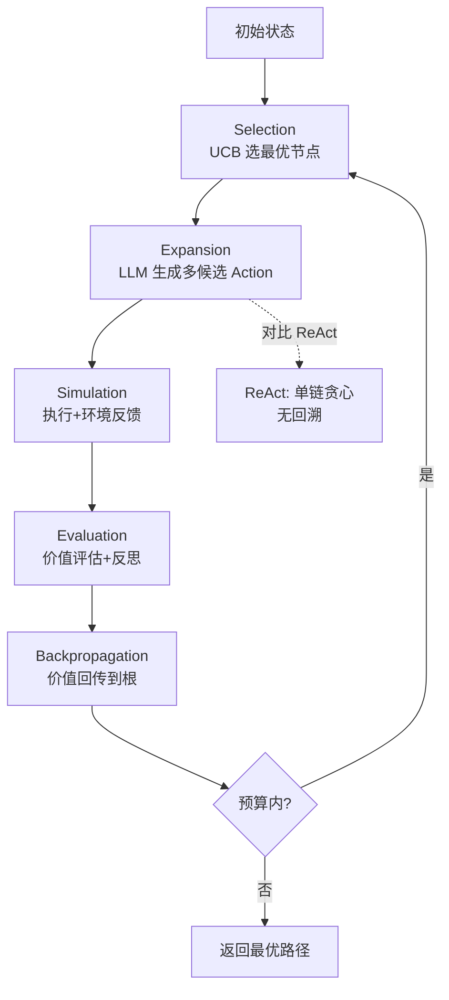

# LATS（Language Agent Tree Search）

### 1. 概念解释
LATS（Language Agent Tree Search）将 Agent 的决策过程建模为树搜索。它结合了蒙特卡洛树搜索（MCTS）的思想，通过探索多条路径并回传评估值，找到最优行动序列。

### 2. 核心思想
- **节点**：代表当前状态或中间思路。
- **边**：代表采取的行动。
- **搜索策略**：Selection（选择）→ Expansion（扩展）→ Simulation（模拟）→ Backpropagation（回传）。

### 3. 架构与流程图
LATS 通过 LLM 生成候选动作，利用环境反馈和评估函数优化路径。

```text
                   LATS 搜索树结构
                       [Root (初始问题)]
                      /      |       \
                     /       |        \
              (Action A) (Action B)  (Action C)  <-- Selection (UCT算法)
                 /          |   \
               /            |    \
          [Node A1]     [Node B1] [Node B2]     <-- Expansion (LLM 生成)
             |             |    |
        (Evaluate)    (Evaluate) (Evaluate)     <-- Evaluation (环境反馈/LLM打分)
             |             |    |
          Backpropagate <-----+----|            <-- Backpropagation (更新价值)
                               \
                              [Leaf] 
```

### 4. 详细机制补充
- **选择**：使用 PUCT (Predictor + UCB applied to Trees) 算法平衡利用与探索，公式为 `PUCT = Q + C * P * sqrt(N_parent) / (1 + N_child)`。
- **扩展**：当节点被选中时，LLM 根据当前状态生成多个可能的后继思路或动作。
- **评估**：这是一个关键步骤。不仅看环境反馈（如代码运行结果），通常还会引入一个独立的 LLM 作为“评估者”，对当前思路的质量打分，或者直接将最终解的答案质量反向传播。
- **回传**：将叶子节点的评估值向上传递，更新路径上所有节点的 `Q` 值（平均价值）和 `N` 值（访问次数）。

### 5. 与单路径 ReAct 的区别
| 维度 | ReAct | LATS |
| :--- | :--- | :--- |
| **搜索策略** | 单路径贪心搜索，线性执行 | 树状搜索，多分支并行探索 |
| **纠错能力** | 无法回溯，依赖 Prompt 纠错 | 可回溯到父节点，尝试不同分支 |
| **计算成本** | 低（单次推理） | 高（需构建和评估多棵树） |
| **适用场景** | 简单问答、单步工具调用 | 复杂推理、数学证明、代码优化 |

### 6. 适用场景
- 决策点多、有多个可能解的任务（如策略游戏、代码修复、复杂推理）。特别适合那些需要“试错”且“回溯成本”在推理层面可接受的任务。

### 7. 实战深化
#### 7.1 实战案例
在编写排序算法时，ReAct 可能会快速选定了“快速排序”但实现有 Bug 且无法察觉。LATS 则会在 Root 节点同时展开“归并排序”、“堆排序”和“快速排序”三个分支，并在评估阶段发现“快速排序”分支的测试用例未通过，从而降低其价值分数，最终选择通过率更高的“归并排序”路径。

#### 7.2 关键代码示例

```python
# Python 伪代码：LATS 核心循环
def lats_search(root_state, max_iterations):
    for _ in range(max_iterations):
        # 1. Selection: 根据 PUCT 选择最有潜力的叶子节点
        leaf_node = select(root_state)
        
        # 2. Expansion: LLM 生成下一个思考/动作
        new_thought = llm.generate(leaf_node.context)
        child_node = leaf_node.add_child(new_thought)
        
        # 3. Evaluation: 运行代码或由 LLM 打分 (0.0 - 1.0)
        reward = evaluate(child_node.state)
        
        # 4. Backpropagation: 向上更新 Q 值
        backpropagate(child_node, reward)
    
    return get_best_path(root_state)
```


## 核心流程图




## 记忆要点

- 核心思想：将决策建模为树搜索，结合MCTS探索多条路径找最优解。
- 四步骤：Selection（选节点）-> Expansion（LLM生成）-> Evaluation（打分）-> Backpropagation（回传价值）。
- 对比ReAct：ReAct是单路径贪心，LATS是多分支探索，支持回溯。
- 成本与效果：计算成本高，但纠错能力强，适合复杂推理或代码优化。
- 评估：不仅看环境反馈，常引入独立LLM作为评估者对思路打分。

## 结构化回答

**30 秒电梯演讲：** LATS 就是把 Agent 的决策过程建模成一棵搜索树——像下围棋一样在脑子里推演多种走法，用评估函数打分，再回传价值找出胜率最高的路径。它和 ReAct 的区别是：ReAct 只走一条路，LATS 能同时探索多条路还能回溯。

**展开框架：**
1. **四步循环** — Selection（用 PUCT 选最有潜力的节点）→ Expansion（LLM 生成多个候选动作）→ Evaluation（环境反馈 + 独立 LLM 打分）→ Backpropagation（回传更新 Q 值）。
2. **多分支探索** — Root 节点同时展开多个分支（如归并/堆/快排），评估阶段发现某分支测试不过就降分，最终选通过率最高的。
3. **对比 ReAct** — ReAct 单路径贪心、无法回溯；LATS 树搜索、可回溯到父节点试别的分支，代价是计算成本高得多。
4. **适用边界** — 决策点多、多解、预算充足的任务（策略游戏、代码修复、复杂推理）；预算紧张别用。

**收尾：** LATS 的精髓是"用算力换正确率"，我在排序算法选型里验证过它能避开 ReAct 的单路径盲点。您想深入聊 PUCT 公式、评估函数设计还是成本控制？

## 视频脚本

> 预计时长：4 分钟 | 由浅入深

| 时间 | 画面/字幕 | 口播台词 | 讲解要点 |
|------|----------|----------|----------|
| 0:00 | 标题卡：LATS 树搜索 | "ReAct 只走一条路，LATS 像下围棋一样推演多种走法再选最优。" | 开场钩子 |
| 0:25 | 搜索树扩展动画：Root 分出三支 | "核心是树搜索。Root 节点同时展开多个分支，比如归并、堆、快排三种排序。" | 树结构 |
| 1:05 | Selection-Expansion-Evaluation-Backprop 四步图 | "四步循环：选节点、LLM 生成、打分、回传价值。评估不仅看环境反馈，还引入独立 LLM 打分。" | 四步循环 |
| 1:50 | LATS vs ReAct 对比表 | "和 ReAct 比：ReAct 单路径贪心没法回溯，LATS 能回溯到父节点试别的分支，代价是成本高。" | 对比辨析 |
| 2:30 | 排序算法选型案例：快排分支测试不过被降分 | "实战：写排序算法，快排分支测试没过被降分，最后选了通过率更高的归并排序。" | 实战案例 |
| 3:10 | 总结卡 | "记住：用算力换正确率，多分支探索能回溯。预算紧张就别用。" | 收尾 |

