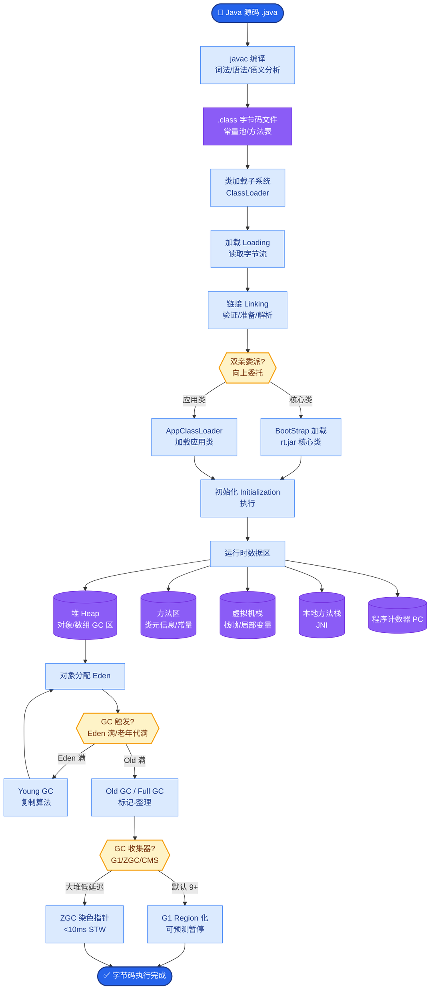

# LangChain Agent 实现

### 1. 概念解释
LangChain 是一个编排框架，其中 Agent 指由 LLM 决定工具调用的循环体，而 **AgentExecutor** 负责驱动这个循环直到任务结束。

### 2. 核心组件
- **Tools**：封装外部能力，包含 `name`（唯一标识）、`description`（LLM 用于决策的文本）和 `args_schema`（输入参数的 Pydantic 定义）。
- **Agent**：推理策略核心，决定如何组合工具与 Prompt（如 ReAct 模式）。它负责解析 LLM 输出为结构化动作。
- **AgentExecutor**：运行时引擎，处理循环、错误捕获、中间步骤记录和最大迭代限制。

### 3. AgentExecutor 工作流 (包含 ASCII 流程图)

```text
   [User Input]
        |
        v
+-----------------------+
|   1. 构造 Prompt       | <--- 拼接 System Message, Tool Descriptions, History
+-----------------------+
        |
        v
+-----------------------+
|   2. 调用 LLM          | <--- LLM 生成文本
+-----------------------+
        |
        v
+-----------------------+
|   3. 解析 Output       | <--- OutputParser (如 ReAct 解析器)
+-----------------------+
        |
        +-----------------------+
        |                       |
[Answer/Finish]        [Action_Call]
        |                       |
        v                       v
  [Return Result]    [Execute Tool]
                               |
                               v
                         [Get Observation]
                               |
                               +---> [回步骤 1: 将 Action+Obs 加入 History]
```

1. 接收用户输入。
2. 调用 LLM 决定下一步（生成回答或工具调用）。
3. 若需调用工具，执行工具并获取 Observation。
4. 将结果回填消息历史，重复步骤 2。
5. 满足停止条件后返回最终答案。

### 4. 自定义 Agent 步骤与关键参数
1. **定义 Tools**：编写清晰的 Description 是 Agent 能否正确调用工具的关键。
2. **选择策略**：选择 Prompt 模板（如 `ZERO_SHOT_REACT_DESCRIPTION`）与输出解析器。
3. **组装**：使用 `initialize_agent` 或手动组合 `Agent` 和 `AgentExecutor`。
4. **关键配置**：
   - `max_iterations`：防止死循环，默认值视策略而定。
   - `handle_parsing_errors`：设置为 `True` 或自定义回调，当 LLM 输出格式错误时，将错误信息回传给 LLM 进行自我修正。
   - `early_stopping_method`：如 `generate`（强制 LLM 生成最终答案）或 `force`（直接返回上次观察）。

### 5. 实战深化
#### 5.1 实战案例
在构建 SQL 查询 Agent 时，经常遇到 LLM 生成的 SQL 语法有小错误（如缺引号）。若未配置 `handle_parsing_errors`，Agent 会直接抛出异常崩溃。配置后，AgentExecutor 会捕获 SQL 报错，将“Syntax error near...”喂回给 LLM，LLM 通常能在第二轮自我修正并返回正确结果。

#### 5.2 关键代码示例

```python
from langchain.agents import initialize_agent, AgentType, Tool
from langchain.utilities import SerpAPIWrapper

# 定义工具：描述极其重要，LLM 依赖此做决策
search = SerpAPIWrapper()
tools = [
    Tool(
        name="Search",
        func=search.run,
        description="Useful for when you need to answer questions about current events."
    )
]

# 初始化 Agent，开启错误自动修正
agent = initialize_agent(
    tools, llm, 
    agent=AgentType.ZERO_SHOT_REACT_DESCRIPTION, 
    verbose=True,
    handle_parsing_errors=True # 关键实战配置
)
agent.run("Who is the current president of the United States?")
```


## 核心流程图



## 记忆要点

- 核心组件：Tools（能力）、Agent（策略）、AgentExecutor（循环引擎）。
- 工作流：构造Prompt -> 调用LLM -> 解析Output -> 执行工具 -> 回填历史循环。
- 工具描述：Description极其重要，LLM依赖它做决策，需包含适用场景。
- 关键配置：max_iterations防死循环，handle_parsing_errors实现自我修正。
- 实战：SQL语法错误时，开启错误解析可将报错回传给LLM自动修正。

## 结构化回答

**30 秒电梯演讲：** LangChain 的 Agent 本质是三个东西的组合——Tools 是能力（工具函数），Agent 是策略（怎么决定调哪个工具），AgentExecutor 是循环引擎（驱动整个"思考-调用-反馈"直到结束）。它把 ReAct 那套循环逻辑标准化成了开箱即用的外壳。

**展开框架：**
1. **三件套** — Tools 封装外部能力（name + description + args_schema），Agent 是推理策略，AgentExecutor 负责循环、错误捕获、步数限制。
2. **工作流五步** — 构造 Prompt → 调 LLM → 解析 Output → 执行工具 → 回填 History，循环到 Finish。
3. **工具描述是命门** — LLM 完全靠 description 做路由和填参，描述不清就会选错工具或参数幻觉。
4. **两个救命配置** — `max_iterations` 防死循环，`handle_parsing_errors=True` 把解析错误回传给 LLM 自我修正。

**收尾：** 我做过 SQL 查询 Agent，没开 handle_parsing_errors 时一个缺引号的 SQL 就能让整个 Agent 崩掉，开了之后报错自动回传第二轮就修好了。您想深入聊工具描述怎么写、错误恢复还是和 LangGraph 的选型？

## 视频脚本

> 预计时长：3 分钟 | 由浅入深

| 时间 | 画面/字幕 | 口播台词 | 讲解要点 |
|------|----------|----------|----------|
| 0:00 | 标题卡：LangChain Agent | "LangChain Agent 就是把 ReAct 循环标准化成了一个开箱即用的外壳。" | 开场钩子 |
| 0:20 | Tools-Agent-Executor 三件套图 | "三件套：Tools 是能力，Agent 是策略，AgentExecutor 是循环引擎，负责驱动到任务结束。" | 三件套 |
| 0:55 | 五步工作流动画 | "工作流：构造 Prompt、调 LLM、解析输出、执行工具、回填历史，循环到 Finish。" | 工作流 |
| 1:30 | 工具描述代码特写 | "工具描述是命门，LLM 完全靠它做路由。描述不清就会选错工具或参数幻觉。" | 工具描述 |
| 2:00 | max_iterations + handle_parsing_errors 配置截图 | "两个救命配置：max_iterations 防死循环，handle_parsing_errors 把报错回传让 LLM 自修。" | 关键配置 |
| 2:30 | 总结卡 | "记住：三件套、五步循环、描述是命门、两个救命配置。下期讲 LangGraph 怎么补 LangChain 的短板。" | 收尾 |

