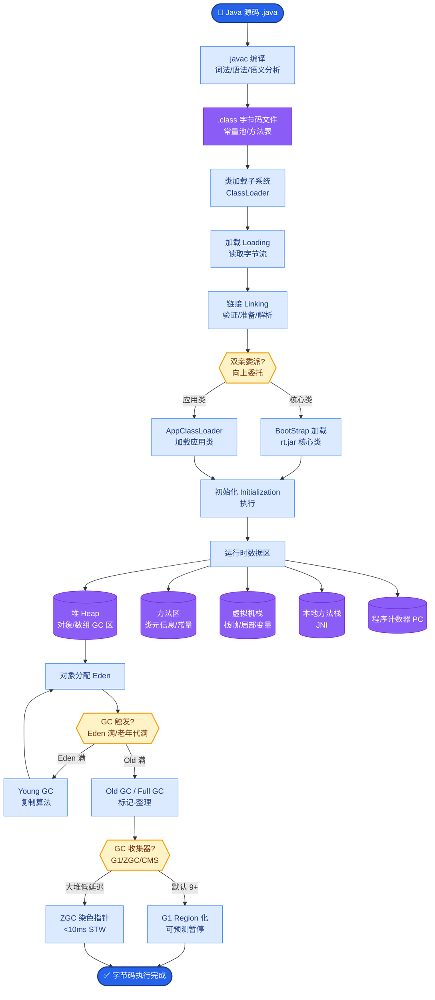

# LangGraph 状态机

### 1. 概念解释
LangGraph 将 Agent 工作流建模为**图（Graph）**结构。节点代表处理逻辑（如模型调用、工具执行），边代表状态流转。相比 LangChain 的固定循环，它更灵活，支持循环、分支和并行。

### 2. 核心要素
- **State**：共享状态，通常用 `TypedDict` 或 `Pydantic` BaseModel 定义，是一个在所有节点间传递的单值对象，各节点通过返回更新部分字段。
- **Node**：纯函数或协程，签名 `(state) -> partial_state_update`。
- **Edge**：连接节点，包含普通边和条件边。

### 3. 架构图与状态流转

```text
          LangGraph 状态流转示意图

+-----------------------------------------------------+
|  Shared State (Annotated Dict)                      |
|  { messages: [], next_action: ... }                 |
+---------------------|-------------------------------+
                      | 传入当前 State
                      v
          +-----------------------+
          | Node A: Agent        |
          | (决定下一步操作)      |
          +-----------------------+
                      |
            +---------+----------+
            | 返回 State Update   |
            v                    v
   (条件边: Conditional Edge)   (普通边: End)
            |
     +------+------+
     |             |
+----+----+   +----+----+
| Tool 1  |   | Human   |   <-- 并行或条件分支节点
+---------+   +---------+
     |             |
     +------+------+
            |
            v (自动合并 State Updates)
          +-----------------------+
          | Node B: Synthesizer   |
          +-----------------------+
```

### 4. 优势细节
- **显式编排**：代码即流程图，容易理解复杂的条件分支和回退逻辑（如重试机制）。
- **人机协同**：特殊的 `interrupt` 机制，允许图暂停在某个节点，等待人工批准后继续执行。
- **时间旅行**：LangGraph 支持保存和回滚状态，便于调试 Agent 的历史行为。
- **流式支持**：可以流式输出节点的执行结果和 Token 生成。

### 5. 与 LangChain Agent 对比
| 维度 | LangChain Agent | LangGraph |
| :--- | :--- | :--- |
| **控制流** | 隐式循环（由 AgentExecutor 黑盒控制） | 显式图结构（完全自定义） |
| **状态管理** | 依赖中间步骤 列表 | 统一的 TypedDict 状态，支持增量更新 |
| **灵活性** | 适合单一任务闭环 | 适合复杂业务流程、多阶段流水线、多 Agent 交互 |

### 6. 实战深化
#### 6.1 实战案例
在构建企业级 RAG 系统时，通常需要“先检索，若无相关文档则转人工客服，若有则生成答案”。LangChain 很难优雅实现“若无则跳出”的逻辑。而在 LangGraph 中，只需定义一个 `check_relevance` 节点，通过条件边判断分数，若分数低则直接路由到 `human_input` 节点，高分则路由到 `generate_answer` 节点，逻辑非常清晰且可维护。

#### 6.2 关键代码示例

```python
from typing import Annotated, TypedDict
from langgraph.graph import StateGraph, END
from langgraph.checkpoint.memory import MemorySaver

# 1. 定义状态
class GraphState(TypedDict):
    messages: Annotated[list, "Messages history"]
    next_action: str

# 2. 定义节点函数
def agent_node(state: GraphState):
    # LLM 决定下一步
    return {"next_action": "tool_a"}

def tool_node(state: GraphState):
    # 执行工具逻辑
    return {"messages": ["Tool result"]}

# 3. 构建图
workflow = StateGraph(GraphState)
workflow.add_node("agent", agent_node)
workflow.add_node("tools", tool_node)

# 4. 设置条件边：根据 next_action 决定路由
def route_decision(state: GraphState):
    return "tools" if state["next_action"] == "tool_a" else END

workflow.set_entry_point("agent")
workflow.add_conditional_edges("agent", route_decision, {"tools": "tools", END: END})
workflow.add_edge("tools", "agent")

# 5. 编译图（支持记忆断点续传）
app = workflow.compile(checkpointer=MemorySaver())
```


## 核心流程图



## 记忆要点

- 核心概念：将工作流建模为图结构，节点是逻辑，边是状态流转。
- 状态管理：使用TypedDict定义共享State，节点间传递部分更新。
- 优势：支持显式编排、循环、分支、人机协同（interrupt）与时间旅行。
- 对比LangChain：LangChain是隐式黑盒循环，LangGraph是显式白盒图。
- 适用场景：复杂业务流程、多阶段流水线，需精确控制条件的任务。

## 结构化回答

**30 秒电梯演讲：** LangGraph 把 Agent 工作流画成一张有向图——节点是处理逻辑，边是状态流转，State 是所有节点共享的"办公桌"。它解决了 LangChain 隐式黑盒循环的问题，让分支、回环、人机协作都变成代码里能直接看见的一等公民。

**展开框架：**
1. **三大要素** — State（TypedDict 定义的全局共享状态）、Node（接收 state 返回部分更新的纯函数）、Edge（普通边 + 条件边）。
2. **条件边是核心** — 根据中间状态动态路由，比如检索分数低就转人工、分数高就生成答案，LangChain 里很难优雅实现这种"若否则跳出"。
3. **人机协同 + 时间旅行** — interrupt 机制让图暂停等人工批准，Checkpointer 支持状态保存和回滚调试。
4. **对比 LangChain** — LangChain 是隐式黑盒循环（AgentExecutor 控制），LangGraph 是显式白盒图（完全自定义），复杂业务流必须选后者。

**收尾：** 我做过企业 RAG，"检索无相关文档就转人工"这个逻辑 LangChain 写得很痛苦，LangGraph 一个条件边就搞定。您想深入聊 State 设计、条件边还是 Checkpoint 兼容性？

## 视频脚本

> 预计时长：4 分钟 | 由浅入深

| 时间 | 画面/字幕 | 口播台词 | 讲解要点 |
|------|----------|----------|----------|
| 0:00 | 标题卡：LangGraph 状态机 | "LangChain 是黑盒循环，LangGraph 把工作流画成一张你能看清的有向图。" | 开场钩子 |
| 0:20 | 有向图：节点 + 边 + 共享 State | "三大要素：State 是共享状态，Node 是处理函数，Edge 是状态流转，分普通边和条件边。" | 三要素 |
| 0:55 | 条件边路由动画：分数低→人工，分数高→生成 | "条件边是核心。检索分数低就转人工，分数高就生成答案，LangChain 里很难优雅写出这种逻辑。" | 条件边 |
| 1:35 | interrupt 暂停 + Checkpoint 回滚截图 | "人机协同用 interrupt 暂停等批准，Checkpointer 支持状态保存和回滚，能时间旅行调试。" | 人机 + 时间旅行 |
| 2:10 | LangChain vs LangGraph 对比表 | "对比：LangChain 隐式黑盒，LangGraph 显式白盒。复杂业务流、多阶段流水线必须选 LangGraph。" | 对比辨析 |
| 2:50 | 企业 RAG 转人工案例 | "实战：企业 RAG 里'检索无相关文档就转人工'，LangGraph 一个条件边搞定，LangChain 写得很痛苦。" | 实战案例 |
| 3:30 | 总结卡 | "记住：图建模、State 共享、条件边、人机协同。下期讲多 Agent 协作框架。" | 收尾 |

