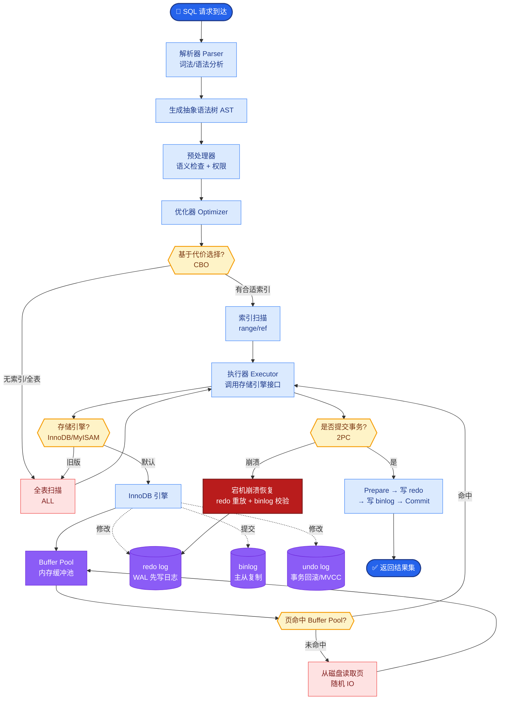

# RAG 基础

### RAG 基础

**1.1 RAG 定义与原理**
RAG（检索增强生成）指：在让大语言模型（LLM）生成答案之前，先从外部知识库（文档、数据库、网页等）中检索与用户问题相关的片段，再把这些片段作为上下文一并输入模型，从而约束模型的输出依据。

**面试 Q1：请用一句话解释 RAG。**
A：RAG 是在生成前先从外部知识库检索相关证据，再把证据作为上下文交给大模型，以减少幻觉并支持实时更新的知识增强范式。

**实战案例**：某电商客服接入 RAG 后，关于“双十一退货政策”的咨询准确率从 60%（纯靠模型记忆）提升至 95%，且无需每天重新训练模型即可更新政策。

**代码示例 (RAG Pipeline)**：
```python
from langchain_community.vectorstores import FAISS
from langchain_openai import OpenAIEmbeddings

retriever = FAISS.from_documents(docs, OpenAIEmbeddings()).as_retriever()
docs = retriever.invoke("如何申请退款？")
context = "\n".join([d.page_content for d in docs])
```

**追问：RAG 和「把文档全文塞进 Prompt」有什么区别？**
答：全文往往超长、噪声大、成本高；RAG 通过检索只取最相关的一小部分，在效果、延迟、费用上更可控，也更适合大规模知识库。

**1.2 为什么需要 RAG**
- **知识截止**：模型只知过去的数据。
- **幻觉**：模型缺乏依据时会编造。
- **实时性**：业务数据（如库存）需要实时更新。

**面试 Q2：为什么企业落地常选 RAG 而不是只靠更大的基座模型？**
A：大模型再强也有知识截止与领域盲区；企业私域数据往往不能用于预训练。RAG 把私域知识以索引形式接入，可审计、可更新，并在同样上下文窗口下聚焦高相关片段，性价比更高。

**实战案例**：在一个医疗问答项目中，直接使用 GPT-4 经常编造不存在的药名，而接入 RAG（检索内部药品库）后，模型被强制“接地气”，编造率大幅降低。

**1.3 RAG vs 微调 vs 长上下文**
| 维度 | RAG | 微调 | 长上下文 |
| :--- | :--- | :--- | :--- |
| **知识更新** | 更新索引即可，快 | 需重新训练，慢 | 仍需把新内容放进上下文 |
| **私域/合规** | 文档可本地化部署 | 数据需用于训练，合规高 | 长上下文可能泄露敏感片段 |
| **成本** | 检索+小上下文生成，省 | 训练/数据标注成本高 | 推理贵、延迟高 |
| **适用** | 事实问答、手册、客服 | 风格、格式、领域口吻 | 单文档极长且需全局推理 |

**面试 Q3：什么时候优先微调而不是 RAG？**
A：当目标主要是行为与格式（如输出 JSON、口吻、工具调用习惯），或训练数据稳定且可标注，而不仅是「塞事实」；事实类仍建议 RAG 或可检索记忆。

**实战案例**：为了强制模型输出 SQL 代码，团队尝试过 RAG（提供示例）效果一般，但使用几百个 `Text->SQL` 样本微调后，模型语法正确率显著提升。

**1.4 Native RAG 完整流程图**
```text
[离线处理 Pipeline]                   [在线推理 Pipeline]

┌──────────┐      ┌──────────┐       ┌────────────┐
│ 原始文档  │ ───> │  解析/清洗│ ───>  │  向量化    │ ───> ┐
└──────────┘      └──────────┘       └────────────┘      │
                                                              ▼
                                                    ┌─────────────────────┐
                                                    │   向量数据库        │
                                                    └─────────────────────┘
                                                              ▲
┌──────────┐      ┌──────────┐       ┌────────────┐      │
│ 用户问题  │ ───> │ Query改写│ ───>  │  向量化    │ ────┘
└──────────┘      └──────────┘       └────────────┘
                                              │
                                              ▼
                                    ┌─────────────────────┐
                                    │   召回 + 重排序     │
                                    └─────────────────────┘
                                              │


## 核心流程图



## 记忆要点

- RAG 定义：生成前先从外部知识库检索相关证据，将证据作为上下文输入模型以减少幻觉。
- RAG 优势：解决知识截止、幻觉问题；支持实时更新；私域数据可审计且无需重新训练。
- RAG vs 微调：事实类、需更新知识选 RAG；改风格、格式、行为习惯选微调。
- RAG vs 全文：RAG 只取相关片段，在效果、延迟、成本上更可控，适合大规模知识库。
- Native RAG 流程：离线（解析->向量化->入库）；在线（Query改写->向量化->召回）。

## 结构化回答

**30 秒电梯演讲：** RAG 就是给大模型外挂一个"可搜索的资料库"——回答前先查书，把相关片段塞进上下文再生成，减少瞎编。它解决三件事：知识截止（模型只懂过去）、幻觉（没依据就编）、数据隐私（企业私域不能进预训练）。

**展开框架：**
1. **两阶段流程** — 离线建索引（解析→向量化→入库），在线检索生成（Query 改写→向量化→召回→重排→生成）。
2. **比全文塞 Prompt 更优** — 全文超长、噪声大、成本高；RAG 只取相关片段，在效果、延迟、费用上都更可控。
3. **与微调互补** — RAG 管事实（可更新、可审计），微调管风格（格式、口吻、行为习惯），不是二选一。
4. **效果命门** — 检索质量和上下文拼接策略决定上限，召回不准再强的模型也白搭。

**收尾：** 我做过电商客服 RAG，"双十一退货政策"准确率从 60% 提到 95%，还不用每天重训。您想深入聊检索质量优化、和微调的选型还是离线管道设计？

## 视频脚本

> 预计时长：4 分钟 | 由浅入深

| 时间 | 画面/字幕 | 口播台词 | 讲解要点 |
|------|----------|----------|----------|
| 0:00 | 标题卡：RAG 基础 | "大模型老爱瞎编？给它外挂一个资料库，回答前先查书，这就是 RAG。" | 开场钩子 |
| 0:25 | 开卷考试类比图 | "像开卷考试，带着参考资料答题比闭卷准。它解决知识截止、幻觉、数据隐私三大问题。" | 定义与价值 |
| 1:00 | 离线 + 在线双管道流程图 | "两阶段：离线建索引（解析、向量化、入库），在线检索生成（Query 改写、召回、重排、生成）。" | 完整流程 |
| 1:45 | RAG vs 全文 vs 微调对比表 | "比全文塞 Prompt 省 Token 少噪声；和微调互补——RAG 管事实，微调管风格。" | 选型辨析 |
| 2:20 | 电商客服退货政策案例 | "实战：电商客服接 RAG 后退货政策准确率从 60% 到 95%，还不用每天重训。" | 实战案例 |
| 3:00 | 检索质量是命门示意图 | "记住一个命门：检索质量和上下文拼接决定上限，召回不准再强的模型也白搭。" | 关键提醒 |
| 3:40 | 总结卡 | "一句话：先查书再答题。下期讲文档解析怎么把脏数据洗干净。" | 收尾 |

