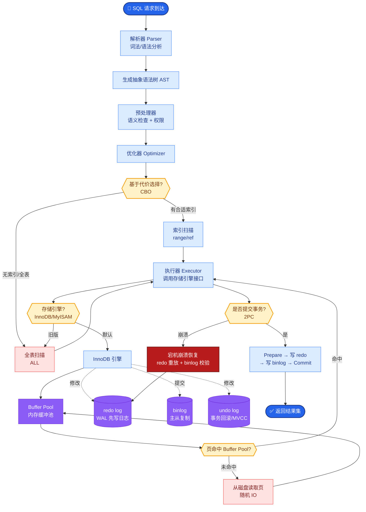

# 文档分块策略（Chunking）

### 文档分块策略

**3.1 分块方式**
- **固定长度**：简单但易切断语义。
- **递归分割**：按分隔符优先级切分，尽量在段落、句子边界断开。
- **语义分块**：根据 embedding 相似度变化切分，更贴合话题。
- **结构化分块**：按 Markdown 标题或 HTML Section 切分。

**面试 Q8：分块太大或太小分别会怎样？**
A：太小 → 语义不完整、检索片段缺主语；太大 → 混入无关内容、噪声干扰、费用上升。

**实战案例**：Chunk 设置为 128 tokens 时，检索结果经常是“主语缺失”的短语（如“...是必要的”），模型无法理解指代；调整为 512 tokens 后，召回内容包含完整上下文，回答质量显著提升。

**代码示例 (语义分块模拟)**：
```python
import numpy as np
from sklearn.cluster import KMeans

# 假设 embeddings 是按句子切分后的向量列表
embeddings = [model.encode(s) for s in sentences]
# 简单的基于相似度变化的切分点检测
similarities = [np.dot(e1, e2) for e1, e2 in zip(embeddings, embeddings[1:])]
split_indices = [i+1 for i, s in enumerate(similarities) if s < 0.7] # 阈值切分
```

**3.6 参数选择**
- **chunk_size**：通常几百到一两千 token，需覆盖完整命题。
- **chunk_overlap**：通常 10%–20%，避免切断关键句。

**3.7 父子文档分块**
策略：子块（小，用于检索）+ 父块（大，用于生成）。检索命中子块后回溯父块，兼顾精度与上下文完整性。

**实战案例**：在一个法律文档问答系统中，通过检索子块（具体条款）定位到父块（整个章节），使得 LLM 在生成法律依据时能引用相关的“前提条件”部分，而不仅仅是孤立的条款。

### 架构示意：父子文档检索流程
```text

[索引阶段]
原文档
   │
   ├──> 1. 父文档分块 (大块: 1000-2000 tokens)
   │       │
   │       └──> 存储父文档 (不用于检索，仅用于生成)
   │
   └──> 2. 子文档分块 (小块: 200-400 tokens, 指向父ID)
           │
           └──> 向量化并索引 ──> 向量数据库

[检索阶段]
Query
   │
   ├──> 向量化检索
   │       │
   │       └──> 命中: 子块 A, 子块 B ──> 获取对应的 Parent_ID
   │
   ▼
根据 Parent_ID 获取完整父文档
   │
   └──> 将父文档内容作为 Context 喂给 LLM
```

### 常见考点
1. **滑动窗口 vs 递归**：滑动窗口切分与递归字符切分在保持上下文连贯性上的区别是什么？
2. **语义分块边界**：如何通过计算相邻句子的 embedding 相似度变化（梯度）来确定最佳切分点？
3. **表格分块**：对于 HTML/Markdown 表格，如何设计分块策略以避免将同一行数据拆分到不同 chunk？
4. **索引优化**：分块数量如何影响向量数据库的检索性能和召回率？

### 代码示例：LangChain TextSplitter
```python
from langchain_text_splitters import (
    RecursiveCharacterTextSplitter,
    MarkdownHeaderTextSplitter
)

# 递归分割（推荐）
recursive_splitter = RecursiveCharacterTextSplitter(
    chunk_size=60, chunk_overlap=10, separators=["\n\n", "\n", " ", ""]
)

# Markdown 标题分割
md_splitter = MarkdownHeaderTextSplitter(headers_to_split_on=[("#", "Header 1")])
```


## 核心流程图



## 记忆要点

- 分块影响：太小语义不完整缺主语；太大混入噪声干扰且费用上升。
- 参数选择：chunk_size 通常几百到两千；overlap 设 10%-20% 避免切断关键句。
- 父子文档：子块（小）用于精准检索，父块（大）用于生成，兼顾精度与上下文。
- 递归分割：按分隔符优先级（段落>句子）切分，比固定长度更贴合语义边界。
- 语义分块：根据 embedding 相似度变化切分，适合话题转换明显的文档。

## 结构化回答

**30 秒电梯演讲：** 分块就是把长文档切成合适大小的"碎片"——太小语义不完整（缺主语），太大混噪声还烧钱。生产默认用 RecursiveCharacterTextSplitter 按段落→句子优先级切，chunk_size 几百到两千，overlap 设 10%-20% 防止切断关键句。

**展开框架：**
1. **大小是双刃剑** — 太小检索片段缺主语模型看不懂；太大混入无关内容、噪声干扰、Token 费用上升。
2. **四种切法** — 固定长度（简单易断语义）、递归分割（按分隔符优先级，生产首选）、语义分块（按 embedding 相似度变化，贵但贴合话题）、结构化分块（按 Markdown 标题）。
3. **父子文档策略** — 子块小用于精准检索，父块大用于生成；命中子块后回溯父块，兼顾精度和上下文完整性。
4. **参数经验值** — chunk_size 几百到两千 token，overlap 10%-20%，具体靠召回率和答案质量微调。

**收尾：** 我做过法律文档问答，用父子分块——检索子块（具体条款）定位到父块（整个章节），LLM 就能引用条款的"前提条件"。您想深入聊父子策略、语义分块还是参数调优？

## 视频脚本

> 预计时长：3 分钟 | 由浅入深

| 时间 | 画面/字幕 | 口播台词 | 讲解要点 |
|------|----------|----------|----------|
| 0:00 | 标题卡：文档分块策略 | "RAG 里分块切不好，检索再准也白搭。太小缺主语，太大混噪声。" | 开场钩子 |
| 0:20 | 切面包类比：每片要有皮有馅 | "像切面包，每片要有皮有馅。太小语义不完整，太大混入无关内容还烧钱。" | 大小权衡 |
| 0:55 | 四种切法对比表 | "四种切法：固定长度、递归分割（生产首选）、语义分块（贵但贴合）、结构化分块（按标题）。" | 分块方式 |
| 1:35 | 父子文档：子块检索父块生成 | "父子文档策略：子块小用于精准检索，父块大用于生成，命中子块回溯父块，兼顾精度和上下文。" | 父子策略 |
| 2:10 | 参数经验值：chunk_size + overlap | "参数经验：chunk_size 几百到两千，overlap 设 10%-20%，靠召回率和答案质量微调。" | 参数选择 |
| 2:40 | 法律文档条款案例 | "实战：法律问答用父子分块，检索条款定位到整个章节，LLM 就能引用前提条件。" | 实战案例 |
| 3:15 | 总结卡 | "记住：递归首选、父子兼顾、参数靠调。下期讲向量化。" | 收尾 |

