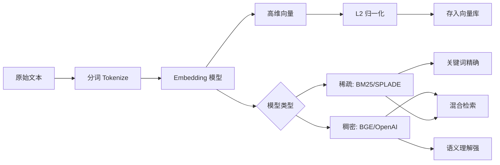

# 向量化（Embedding）

### 向量化

**4.1 什么是 Embedding**
将离散文本映射为固定维度的稠密向量，语义相近的文本在空间距离更近。

**补充原理（Word2Vec -> Transformer）**：
早期 Word2Vec 通过上下文预测词向量，是静态的；现代 Embedding（如 BGE, OpenAI）基于 Transformer 架构（BERT/T5 等），利用 Self-Attention 机制聚合全句上下文信息，生成**上下文感知**的句子级向量。通常对最后一层隐藏状态进行 Mean Pooling 或 CLS Token 聚合得到向量。

**4.2 常用模型**
- **OpenAI**: text-embedding-3-small/large (生态成熟，支持 Matryoshka 学习压缩维度)。
- **BAAI**: BGE 系列 (中文开源常用，引入指令微调，让模型适应检索场景)。
- **Jina**: jina-embeddings (长文本、多语言，支持 8192 上下文)。

**关键参数与细节**：
- **维度**：常见的有 768, 1024, 3072。维度越高理论上信息量越大，但计算和存储成本越高。OpenAI v3 允许截断维度而损失极小精度。
- **归一化**：`normalize_embeddings=True` 将向量模长变为 1，使余弦相似度计算等同于点积，加速检索。

**面试 Q9：同一个 Embedding 用于中英文混合文档要注意什么？**
A：选多语言模型（如 text-embedding-3-large, BGE-M3）或分别建索引；单语模型可能导致跨语言语义空间不一致（即“苹果”的英文向量与中文向量距离很远）。混合检索（BM25）可补关键词。

**实战案例**：在多语言知识库中，用纯中文 BGE 模型索引英文文档，导致英文提问无法召回中文答案。切换到 BGE-M3（多语言模型）后，实现了跨语言的语义对齐。

**代码示例：Sentence-Transformers**
```python
from sentence_transformers import SentenceTransformer

model = SentenceTransformer("BAAI/bge-large-zh-v1.5")
sentences = ["RAG 检索增强生成", "大模型需要外部知识库"]
# normalize_embeddings=True 便于使用内积相似度计算
embeddings = model.encode(sentences, normalize_embeddings=True)
```

## 常见考点
1. **向量的维度怎么选？**
   考察精度与成本的权衡。通常 768/1024 维是平衡点，极大内存受限场景可用 256/512 维，或使用乘积量化（PQ）。
2. **为什么 embedding 结果要归一化？**
   归一化后，余弦相似度等于点积，FAISS 等索引库利用内积优化计算速度。
3. **如何处理超长文本？**
   直接截断可能丢失尾部信息；推荐使用“滑动窗口切片后取平均向量”或使用支持长上下文的模型（如 Jina, BGE-M3）。

## 技术原理

Embedding 的本质是用一个高维稠密向量"指纹"来表示一段文本的语义，让"意思相近"变成可计算的"距离相近"。其原理演进分三个阶段：

- **从静态到上下文感知**：早期 Word2Vec 通过上下文预测生成静态词向量，同一个词在不同语境下向量不变（"苹果"既是水果也是公司却共用一个向量）。现代 Embedding 基于 Transformer（BERT/T5/GTE），用 Self-Attention 聚合全句上下文，生成上下文感知的句子级向量——同一句话在不同上下文里向量不同。通常对最后一层隐藏状态做 Mean Pooling 或取 CLS Token 得到最终向量。
- **归一化的数学意义**：`normalize_embeddings=True` 把向量模长变为 1，使余弦相似度计算等同于点积（内积）。这让 FAISS、Milvus 等向量库能直接用高度优化的内积（IP）索引，比每次算余弦快一个数量级。归一化是"免费"的性能提升。
- **维度的信息-成本权衡**：维度越高理论信息量越大，但存储和计算成本线性增长。768/1024 维是大多数任务的性价比平衡点。OpenAI text-embedding-3 支持 Matryoshka 学习，允许截断维度（如从 3072 截到 256）而精度损失极小，本质是把重要信息集中在向量前几维。

跨语言的关键是"语义空间对齐"：单语模型下"苹果"的中文向量和英文向量距离很远，必须用多语言模型（BGE-M3）在共享语义空间里训练，才能让跨语言检索生效。

## 注意事项

1. **中英文混合必须选多语言模型**：用纯中文 BGE 索引英文文档会导致跨语言检索失效，切到 BGE-M3 或 text-embedding-3-large 才能对齐语义空间。
2. **超长文本别直接截断**：直接截断会丢尾部信息，推荐滑动窗口切片后取平均向量，或用支持长上下文的模型（Jina、BGE-M3 支持 8192 token）。
3. **记得归一化**：`normalize=True` 是免费的性能提升，让余弦相似度退化为点积，FAISS 等库能用内积索引加速。
4. **维度看预算**：内存敏感场景用 256/512 维或乘积量化（PQ）压缩；精度优先用 1024+；768/1024 是平衡点。

## 代码示例

```python
from sentence_transformers import SentenceTransformer
import numpy as np

# 1. 加载多语言模型（中英文混合场景必须选 M3）
model = SentenceTransformer("BAAI/bge-m3")  # 多语言对齐语义空间

# 2. 编码并归一化（normalize=True 是免费加速）
texts = ["RAG 检索增强生成", "Retrieval Augmented Generation", "退款流程"]
embs = model.encode(texts, normalize_embeddings=True)

# 3. 归一化后余弦相似度 = 点积（FAISS/Milvus 用内积索引加速）
sim = np.dot(embs[0], embs[1])  # 中英文语义相似度（跨语言对齐）
print(f"中英相似度: {sim:.3f}")  # 应该较高（同义）
```

```python
# 滑动窗口处理超长文本（防截断丢尾部）
def embed_long_text(text, model, window=500, stride=400):
    tokens = text.split()
    vectors = []
    for i in range(0, len(tokens), stride):
        chunk = " ".join(tokens[i:i+window])
        vectors.append(model.encode(chunk, normalize_embeddings=True))
        if i + window >= len(tokens): break
    return np.mean(vectors, axis=0)  # 平均池化得整体向量
```


## 核心流程图



## 核心知识点图


## 记忆要点

- Embedding 定义：将离散文本映射为稠密向量，语义相近在空间距离更近。
- 模型选型：OpenAI 成熟；BGE 中文强且指令微调；Jina 支持长文本与多语言。
- 归一化作用：normalize=True 后余弦相似度等于点积，可加速 FAISS 等库检索。
- 维度权衡：768/1024 维是平衡点；高维信息量大但成本高，可用 PQ 压缩。
- 混合文档：选多语言模型（如 BGE-M3）或分别建索引，避免跨语言空间不对齐。

## 结构化回答

**30 秒电梯演讲：** Embedding 就是把文字变成数字坐标——语义相近的句子在向量空间里离得近，这样机器就能算出"两句话意思有多像"。它是语义检索的地基，选型看语言（中文选 BGE、多语言选 BGE-M3）、看维度（768/1024 是平衡点）、记得归一化加速。

**展开框架：**
1. **本质** — 把离散文本映射成稠密向量，基于 Transformer 的 Self-Attention 聚合全句上下文，比早期 Word2Vec 的静态向量强得多。
2. **模型选型** — OpenAI 生态成熟、BGE 中文强且有指令微调、Jina 支持长文本和多语言；中英文混合必须选多语言模型或分别建索引。
3. **归一化是免费加速** — `normalize=True` 后余弦相似度等于点积，FAISS 等库能直接用内积优化，检索快一截。
4. **维度权衡** — 768/1024 维是性价比平衡点；高维信息量大但存储计算贵，可用 PQ 乘积量化压缩。

**收尾：** 我踩过坑——用纯中文 BGE 索引英文文档，英文提问完全召回不到中文答案，换 BGE-M3 才对齐。您想深入聊模型选型、维度选择还是长文本处理？

## 视频脚本

> 预计时长：2 分钟 | 由浅入深

| 时间 | 画面/字幕 | 口播台词 | 讲解要点 |
|------|----------|----------|----------|
| 0:00 | 标题卡：向量化 Embedding | "怎么让机器算出两句话意思有多像？把文字变成数字坐标，这就是 Embedding。" | 开场钩子 |
| 0:20 | GPS 坐标类比：相近词距离近 | "像给单词发 GPS 坐标，意思相近的词在地图上离得近，语义检索就靠这个。" | 本质原理 |
| 0:50 | 三大模型对比：OpenAI/BGE/Jina | "选型：OpenAI 成熟、BGE 中文强、Jina 支持长文本多语言。中英混合必须选多语言模型。" | 模型选型 |
| 1:20 | 归一化 + 维度权衡 | "两个性能点：归一化后点积等于余弦相似度能加速；768/1024 维是性价比平衡点。" | 工程要点 |
| 1:45 | 总结卡 | "记住：选对语言、归一化加速、维度看预算。下期讲向量数据库。" | 收尾 |

