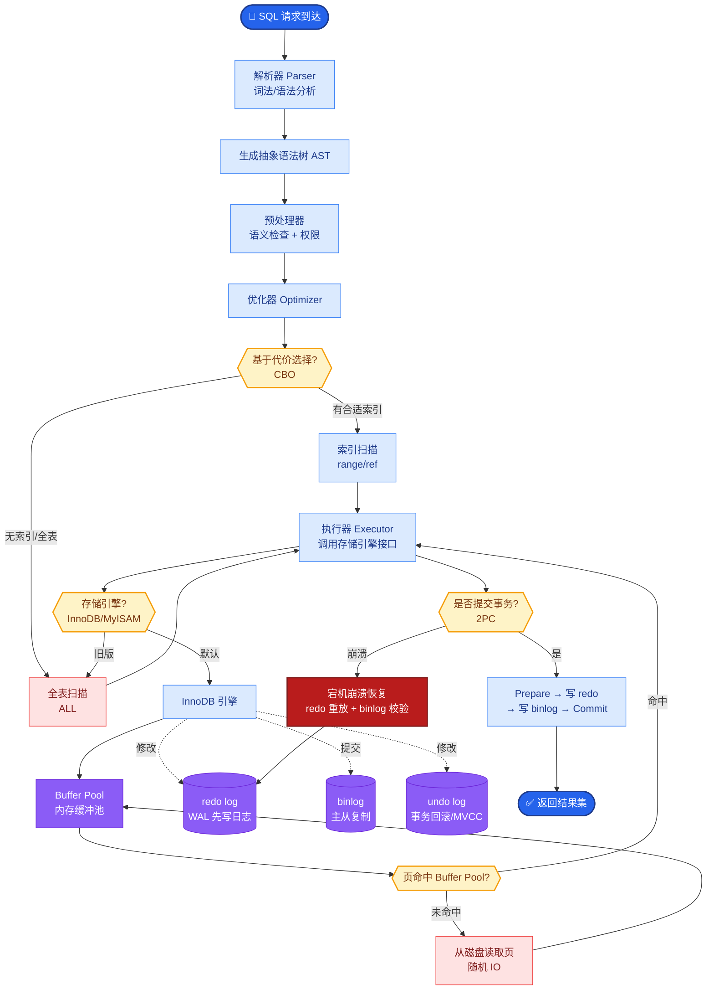

# 向量数据库

### 向量数据库

**5.1 什么是向量数据库**
面向高维向量的存储与近似最近邻（ANN）查询系统，支持元数据过滤。核心解决高维空间下“暴力搜索”性能过低的问题。

**实战案例**：在电商商品推荐中，单机 FASS 难以应对亿级向量实时更新，且无元数据过滤能力（如“只查价格<100的商品”），导致大量无效计算过滤，此时应切换至 Milvus 或 Qdrant 等支持标量过滤的向量库。

**5.2 主流选型**
- **FAISS**: 单机库，极致性能，需自建服务。
- **Milvus**: 云原生、分布式，适合大规模。
- **Pinecone**: 全托管 SaaS，零运维。
- **Qdrant/Weaviate**: 功能丰富，过滤能力强，支持多种距离度量。

**面试 Q10：FAISS 和 Milvus 本质区别？**
A：FAISS 是 ANN 算法库，需自建存储、服务、容灾；Milvus 是向量数据库系统，提供分布式存储、持久化、运维能力与数据管理接口。

**对比表格**：
| 特性 | FAISS | Milvus | Pinecone |
| :--- | :--- | :--- | :--- |
| **定位** | 算法库 | 分布式数据库 | 托管服务 |
| **持久化** | 需手动实现 | 内置 (支持对象存储) | 内置 |
| **元数据过滤** | 不支持 (需二次过滤) | 强支持 (标量索引) | 强支持 |
| **运维成本** | 高 | 中 | 低 |
| **扩展性** | 单机垂直扩展 | 水平扩展 | 自动扩展 |

**5.3 ANN 算法原理**
- **HNSW (Hierarchical Navigable Small World)**: 基于图索引。构建分层的“小世界图”，上层稀疏用于快速逼近，下层稠密用于精确定位。
  - `M`: 每个节点的最大连接数，影响召回率和内存。
  - `efConstruction`: 构建时的搜索宽度，越大索引质量越好但构建越慢。
- **IVF (Inverted File Index)**: 聚类分桶。先通过 K-Means 将向量分成 N 个桶，查询时只搜索最近的几个桶。
  - `nprobe`: 查询时搜索的桶数量，越大召回率越高但越慢。
- **PQ (Product Quantization)**: 乘积量化。将高维向量切分成多个子向量，分别进行聚类编码。用于压缩向量（内存从 float32 变为 uint8），但有损精度。

**架构图（IVF 索引结构）**：
```text
Query Vector
      │
      ▼
┌─────────────┐
│  Coarse     │ (计算 Query 与聚类中心的距离)
│ Quantizer   │
└──────┬──────┘
       │
       ▼
┌───────────────────────┐
│ Inverted File (Index) │
├───┬───┬───┬───┬───┬───┤
│V1 │V2 │V3 │...│Vn │   │ <- Buckets (倒排列表)
└───┴───┴───┴───┴───┴───┘
       ▲
       │ (只搜索最近的 nprobe 个桶)
       │
  精确计算距离 
       │
       ▼
   Top K Results
```

**代码示例：FAISS**
```python
import faiss
import numpy as np

dim = 768
nlist = 100  # 聚类中心数
quantizer = faiss.IndexFlatL2(dim)  # 基础量化器
index = faiss.IndexIVFFlat(quantizer, dim, nlist)  # IVF + Flat 精确存储

# 训练聚类中心（必须先训练）
index.train(vectors) 
index.add(vectors)

# 搜索时指定 nprobe
index.nprobe = 10  
D, I = index.search(query_vec, k=5)
```

**代码示例：带有标量过滤的查询**
```python
# 伪代码：结合过滤后的再排序，解决纯FAISS无法过滤的问题
valid_indices = [i for i, meta in enumerate(metadata) if meta['category'] == 'tech']
# 仅在有效索引的子集中进行搜索（需配合IndexIVF的search_preassigned或内存掩码）
# 实际工程中建议直接迁移至 Milvus/Qdrant
```

## 常见考点
1. **IVF_FLAT 和 IVF_PQ 的区别？**
   IVF_FLAT 在桶内存储原始向量，精度高，内存大；IVF_PQ 在桶内存储量化编码，内存小，精度有损。
2. **向量数据库怎么保证数据一致性？**
   关注分布式架构下 WAL (Write Ahead Log)、副本同步机制，以及是否支持事务。
3. **HNSW 为什么写入慢？**
   因为新节点插入时需要在图的多层结构中寻找最佳位置并进行邻居连接维护，计算量较大。

## 核心流程图



## 记忆要点

- 向量库定义：面向高维向量的 ANN 查询系统，解决暴力搜索性能低的问题。
- FAISS vs Milvus：FAISS 是单机算法库需自建服务；Milvus 是分布式数据库支持持久化。
- ANN 算法：HNSW 图索引精度高；IVF 聚类分桶快；PQ 乘积量化省内存但有损。
- 关键参数：IVF 的 nprobe 决定搜索桶数（影响召回）；HNSW 的 M 影响图连接度。
- 元数据过滤：FAISS 不支持需二次过滤；Milvus/Qdrant 原生支持标量索引过滤。

## 结构化回答

**30 秒电梯演讲：** 向量数据库就是专门存和查"数字坐标"的系统——用 ANN 算法牺牲一点点精度换百倍速度，从亿级向量里秒级找到最相似的。FAISS 是单机算法库要自己搭服务，Milvus 是分布式数据库开箱就有持久化和元数据过滤。

**展开框架：**
1. **ANN 三大算法** — HNSW（图索引，精度高但写慢）、IVF（聚类分桶，查得快）、PQ（乘积量化，省内存但有损），生产常组合用。
2. **选型看运维** — FAISS 是库要自建存储容灾；Milvus/Pinecone/Qdrant 是数据库，内置持久化、水平扩展、元数据过滤。
3. **参数即召回旋钮** — IVF 的 nprobe 决定搜多少桶（越大召回越高越慢）；HNSW 的 M 决定图连接度（越大越准越占内存）。
4. **元数据过滤是生产刚需** — FAISS 不支持要二次过滤，Milvus/Qdrant 原生支持标量索引，能直接"只查价格<100的商品"。

**收尾：** 我做过亿级商品推荐，单机 FAISS 既扛不住实时更新又没元数据过滤，迁到 Milvus 才解决。您想深入聊 ANN 算法原理、选型对比还是参数调优？

## 视频脚本

> 预计时长：3 分钟 | 由浅入深

| 时间 | 画面/字幕 | 口播台词 | 讲解要点 |
|------|----------|----------|----------|
| 0:00 | 标题卡：向量数据库 | "亿级向量怎么秒级找相似？靠 ANN 算法牺牲一点精度换百倍速度。" | 开场钩子 |
| 0:25 | 智能索引卡类比图 | "像图书馆的智能索引卡，不用读完每本书就能找到相关内容。" | 本质类比 |
| 1:00 | HNSW/IVF/PQ 三算法对比 | "三大算法：HNSW 图索引精度高，IVF 聚类分桶快，PQ 乘积量化省内存但有损。" | ANN 算法 |
| 1:40 | FAISS vs Milvus 对比表 | "FAISS 是单机库要自建服务；Milvus 是分布式数据库，内置持久化、水平扩展、元数据过滤。" | 选型对比 |
| 2:15 | nprobe/M 参数旋钮示意 | "参数即召回旋钮：IVF 的 nprobe 搜多少桶，HNSW 的 M 决定连接度，越大越准越慢。" | 关键参数 |
| 2:45 | 总结卡 | "记住：算法三选、选型看运维、参数调召回。下期讲检索策略。" | 收尾 |

### 视频流程图


