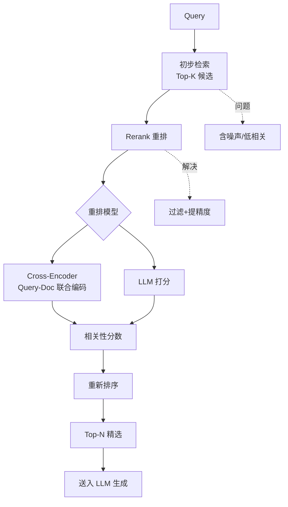

# 重排序（Reranking）

### 重排序

**7.1 为什么需要重排**
向量检索 为追求速度独立编码，交互不足；Cross-Encoder 深度交互精度高但慢，用于精排。

**实战案例**：在法律问答中，初排召回的 Top 10 文档虽然语义相似，但可能包含过期的旧法条。引入 BGE-Reranker 进行精排后，模型能有效识别出“时效性”和“法条适用性”，将最新且相关的法条提升至前 3 位。

**7.2 对比**
- **Bi-Encoder**: 快，可 ANN，精度略低。特征存储为向量，可离线计算。
- **Cross-Encoder**: 慢，只能小批量，精度高。输入为 `[Query, Doc]` 拼接，实时计算交互。

**对比表格**：
| 特性 | Bi-Encoder (双塔) | Cross-Encoder (单塔/交互) |
| :--- | :--- | :--- |
| **计算方式** | Query 和 Doc 独立编码，算余弦相似度 | Q+D 拼接输入 Transformer，全交互注意力 |
| **检索速度** | 极快 (ANN 索引加速) | 慢 (需逐对计算，无法索引) |
| **精度** | 中等 (交互受限) | 高 (深度交互) |
| **适用阶段** | 召回 | 精排 |

**7.4 MMR (Maximal Marginal Relevance)**
在相关性与多样性间权衡，避免返回的 Top-K 全是重复内容。
公式：$MMR = \lambda \cdot Sim(Q, D_i) - (1-\lambda) \cdot \max_{D_j \in S} Sim(D_i, D_j)$
其中 $S$ 是已选结果集。

**面试 Q13：重排放在检索后哪一步？**
A：一般在召回 Top-K (几十到几百，如 100) → Cross-Encoder 精排取 Top-N (3–10) → 再生成，平衡延迟与效果。

**代码示例：MMR 贪心选择**
```python
import numpy as np

def mmr_select(query_vec, doc_vecs, top_k, lambda_mult=0.5):
    # doc_vecs 已归一化
    sim_to_q = doc_vecs @ query_vec
    selected = []
    candidates = set(range(len(doc_vecs)))
    while len(selected) < top_k and candidates:
        best_score = -float('inf')
        best_idx = -1
        for i in candidates:
            # 1. 查询相关性
            rel_score = sim_to_q[i]
            # 2. 去重多样性 (与已选集合的最大相似度)
            div_penalty = 0
            if selected:
                # 计算当前候选 i 与所有已选 j 的最大相似度
                div_penalty = np.max(doc_vecs[selected] @ doc_vecs[i])
            # MMR 分数
            mmr_score = lambda_mult * rel_score - (1 - lambda_mult) * div_penalty
            if mmr_score > best_score:
                best_score = mmr_score
                best_idx = i
        
        selected.append(best_idx)
        candidates.remove(best_idx)
    return selected
```

**代码示例：Cross-Encoder 调用**
```python
from sentence_transformers import CrossEncoder

model = CrossEncoder('BAAI/bge-reranker-base')
# 假设 query 和 docs 已经从 Bi-Encoder 召集出来
pairs = [[query, doc] for doc in top_k_docs]
scores = model.predict(pairs)
# 按 score 重新排序取 Top N
sorted_docs = [doc for _, doc in sorted(zip(scores, top_k_docs), key=lambda x: -x[0])]
```

## 常见考点
1. **Rerank 模型（如 BGE-Reranker）训练数据格式是什么？**
   通常是三元组 或 Pair (Query, Positive_Doc, Negative_Doc)，训练目标是拉开正负样本分数差距。
2. **为什么 Cross-Encoder 不能直接用于海量检索？**
   计算复杂度是 $O(N)$，即查询时需要对每个文档都进行一次前向推理，无法使用向量索引加速，延迟极高。
3. **Cohere Rerank API 的特点？**
   专为多语言优化，对连体句处理效果好，但需要付费 API 调用。


## 核心流程图




## 记忆要点

- 重排目的：向量检索快但交互不足，Cross-Encoder 精度高但慢，用于精排 Top-K。
- Bi vs Cross：Bi-Encoder 独立编码可索引；Cross-Encoder 拼接交互深度计算，无法索引。
- 重排位置：召回 Top 100 -> Cross-Encoder 精排取 Top 10 -> 生成，平衡延迟与效果。
- MMR 算法：在相关性与多样性间权衡，避免返回结果全是重复内容。
- Reranker 训练：通常用 Pair 或三元组数据，目标是拉开正负样本分数差距。

## 结构化回答

**30 秒电梯演讲：** 重排是 RAG 里性价比最高的一招——向量检索（Bi-Encoder）快但交互浅，召回的 Top 100 里常有噪声；用 Cross-Encoder 把 Query 和 Doc 拼一起深度交互精排出 Top 10，精度立涨。它是"先粗筛再精挑"的两段式架构。

**展开框架：**
1. **为什么需要重排** — Bi-Encoder 独立编码可建索引但交互不足；Cross-Encoder 把 Q+D 拼接做全注意力交互，精度高但慢，只能小批量精排。
2. **两段式位置** — 召回 Top 100（快）→ Cross-Encoder 精排取 Top 10（准）→ 生成，在延迟和效果间找平衡。
3. **MMR 管多样性** — 在相关性和多样性间加权，避免返回的 Top-K 全是重复内容，公式是 λ·相关性 - (1-λ)·最大相似度。
4. **常用模型** — BGE-Reranker（开源）、Cohere Rerank（多语言 API），训练用 Pair 或三元组数据拉开正负样本分差。

**收尾：** 我做过法律问答，初排 Top 10 混着过期旧法条，上 BGE-Reranker 精排后最新相关的法条稳进前三。您想深入聊 Cross-Encoder 原理、MMR 算法还是 Reranker 训练？

## 视频脚本

> 预计时长：3 分钟 | 由浅入深

| 时间 | 画面/字幕 | 口播台词 | 讲解要点 |
|------|----------|----------|----------|
| 0:00 | 标题卡：重排序 Reranking | "RAG 里性价比最高的一招：先粗筛再精挑，上 Cross-Encoder 精排 Top 10。" | 开场钩子 |
| 0:25 | 谷歌搜索重排类比 | "像谷歌搜索，先给你一堆可能相关的，再按深度相关性重新排个序。" | 本质类比 |
| 0:55 | Bi-Encoder vs Cross-Encoder 对比 | "Bi-Encoder 独立编码可索引但交互浅；Cross-Encoder 拼 Q+D 做全注意力，精度高但慢，只能精排。" | 双塔 vs 单塔 |
| 1:35 | 召回 100 → 精排 10 流程 | "两段式：召回 Top 100 快，Cross-Encoder 精排取 Top 10 准，再生成，平衡延迟和效果。" | 两段式架构 |
| 2:10 | MMR 多样性公式 | "MMR 在相关性和多样性间权衡，避免 Top-K 全是重复内容。法律问答用它能把最新法条排前面。" | MMR 算法 |
| 2:45 | 总结卡 | "记住：粗筛+精挑、Cross-Encoder 精排、MMR 管多样性。下期讲 RAG 高级模式。" | 收尾 |

