# RAG 高级模式

### RAG 高级模式

**8.1 GraphRAG**
基于知识图谱，抽取实体和关系构建图。适合多跳关系推理（如“A的老板的老板是谁”）。
- **原理**：利用 LLM 抽取三元组（实体-关系-实体），构建社区结构。检索时不仅匹配文本，还在图上进行子图检索。

**实战案例**：在金融风控场景中，需查询“A公司与B公司是否存在潜在关联（通过共同高管）”。普通 RAG 无法处理分散在不同财报中的隐性关系，GraphRAG 通过实体链接直接在图谱中两跳查出关联路径，成功识别风险。

**8.2 Agentic RAG**
由 Agent 决定检索策略，支持多步检索、工具调用，适合复杂动态任务。
- **Router**：根据 Query 意图分发到不同的 RAG Pipeline 或工具。

**8.3 Self-RAG**
模型在生成中自我反思（是否需要检索、是否支持），自动修正路径。
- **机制**：训练时加入特殊的 Reflection Token（如 Retrieve, IsRel, IsSup, IsUse），模型学习在何时生成这些指令。

**8.4 Corrective RAG**
检测到检索质量差时，触发纠正机制（如联网搜索、重写查询）。
- **流程**：评估检索质量 → 若差则触发 Web Search 或 Rewrite → 重新检索。

**8.5 Adaptive RAG**
根据问题类型路由到不同链路（简单问答走向量，复杂任务走 Agent），优化成本。

**对比表格**：
| 模式 | 核心优势 | 适用场景 | 成本 |
| :--- | :--- | :--- | :--- |
| **Naive RAG** | 简单，速度快 | 简单事实问答 | 低 |
| **GraphRAG** | 多跳推理，结构化清晰 | 复杂关系，溯源分析 | 高 (构图成本) |
| **Agentic RAG** | 灵活，支持工具/多步 | 任务规划，动态查询 | 中高 (多步交互) |
| **Self-RAG** | 自主修正，少幻觉 | 对一致性要求高 | 中 (训练成本) |

**GraphRAG 架构图**：
```text
[ Raw Documents ]
       │
       ▼ (LLM Extraction)
[ Triples (实体-关系-实体) ]
       │
       ▼ (Graph Construction)
  ┌────┴────┐
  │ Knowledge│
  │  Graph  │ <--- Nodes (实体), Edges (关系)
  └────┬────┘
       │
  Query (用户问题)
       │
       ▼ (Entity Extraction & Graph Traverse)
[ Subgraph Retrieval ]
       │
       ▼
[ Context Synthesis & Generation ]
```

**面试 Q14：GraphRAG 的成本与挑战？**
A：构图与抽取成本高（需遍历全量文档调用 LLM）、抽取错误会污染图；运维复杂。适合关系密集、愿意投入工程化的场景。

## 常见考点
1. **RAG 与 微调的选择？**
   需更新知识或防幻觉选 RAG；需改变输出格式、风格或注入特定领域逻辑选微调。
2. **Advanced RAG 中的 Routing 如何实现？**
   使用分类模型（如 Logistic Regression 或 LLM本身）将 Query 分类到不同的 Prompt 或数据源。
3. **Modular RAG 指什么？**
   将检索、重排、生成等模块解耦，通过编排器动态组合流程，比线性 Pipeline 更灵活。


## 核心流程图

```mermaid
flowchart TD
    Start([🚀 服务端启动]):::start
    BossGroup[BossGroup<br/>Accept 线程]:::process
    WorkerGroup[WorkerGroup<br/>IO 处理线程]:::process
    Bind[绑定端口<br/>ServerSocketChannel]:::process
    EventLoop[EventLoop<br/>单线程 Selector 轮询]:::process
    Selector[(Selector<br/>多路复用器)]:::store
    IOModelQ{{IO 模型?<br/>select/poll/epoll}}:::decision
    Epoll[epoll 边缘触发<br/>事件驱动 高性能]:::process
    SelectIO[select 水平触发<br/>跨平台]:::process
    AcceptEvent[OP_ACCEPT 事件<br/>新连接到达]:::process
    Register[注册到 Worker<br/>SocketChannel]:::process
    ReadEvent[OP_READ 事件<br/>数据可读]:::process
    Pipeline[Pipeline 处理链<br/>责任链模式]:::process
    Decoder[Decoder 解码器<br/>解决粘包/半包]:::process
    Handler[业务 Handler<br/>处理业务逻辑]:::process
    Encoder[Encoder 编码器<br/>序列化响应]:::process
    ZeroCopyQ{{是否零拷贝?<br/>FileRegion}}:::decision
    ZeroCopy[sendfile/mmap<br/>减少内核态拷贝]:::process
    WriteBack[写回 Channel]:::process
    BackPressureQ{{背压?<br/>写缓冲区高水位}}:::decision
    BackPressure[isWritable=false<br/>自动降级]:::warn
    Final([✅ 响应返回客户端]):::start

    Start --> BossGroup --> Bind --> EventLoop
    EventLoop --> Selector --> IOModelQ
    IOModelQ -->|Linux| Epoll --> AcceptEvent
    IOModelQ -->|通用| SelectIO --> AcceptEvent
    AcceptEvent --> Register --> WorkerGroup
    WorkerGroup --> ReadEvent --> Pipeline
    Pipeline --> Decoder --> Handler --> Encoder
    Encoder --> ZeroCopyQ
    ZeroCopyQ -->|大文件| ZeroCopy --> WriteBack
    ZeroCopyQ -->|否| WriteBack
    WriteBack --> BackPressureQ
    BackPressureQ -->|高水位| BackPressure --> Final
    BackPressureQ -->|正常| Final

    classDef start fill:#2563eb,stroke:#1e3a8a,color:#fff,stroke-width:2px;
    classDef process fill:#dbeafe,stroke:#3b82f6,color:#1e3a8a;
    classDef decision fill:#fef3c7,stroke:#f59e0b,color:#78350f,stroke-width:2px;
    classDef store fill:#8b5cf6,stroke:#6d28d9,color:#fff;
    classDef warn fill:#fee2e2,stroke:#ef4444,color:#7f1d1d;

```



## 记忆要点

- GraphRAG：抽取实体关系构图，适合多跳推理（如 A 的老板的老板），构图成本高。
- Agentic RAG：由 Agent 决定检索策略，支持多步检索与工具调用，适合复杂动态任务。
- Self-RAG：模型自我反思（是否需检索），生成 Reflection Token 自动修正路径。
- Corrective RAG：检测检索质量差时触发纠正（如联网搜索、重写查询）。
- Adaptive RAG：根据问题类型路由，简单问答走向量，复杂任务走 Agent，优化成本。

## 结构化回答

**30 秒电梯演讲：** RAG 高级模式就是把"傻瓜式检索"升级成"聪明式推理"——GraphRAG 用知识图谱做多跳推理，Agentic RAG 让 Agent 决定检索策略，Self-RAG 自我反思要不要检索，Corrective RAG 检索差了自动纠正。越高级越灵活，但工程复杂度和延迟也越高。

**展开框架：**
1. **GraphRAG 攻多跳** — 抽实体关系构图，适合"A 的老板的老板"这类跨文档关系推理；代价是构图要遍历全量文档调 LLM，成本高。
2. **Agentic RAG 动态决策** — 由 Agent 决定检索策略，支持多步检索和工具调用，适合复杂动态任务，但成本中高。
3. **Self-RAG / Corrective RAG 自纠错** — Self-RAG 训练时加 Reflection Token 让模型自己判断要不要检索；Corrective RAG 检测到检索质量差就触发联网搜索或重写。
4. **Adaptive RAG 路由降本** — 简单问答走向量，复杂任务走 Agent，按问题类型路由，性价比最优。

**收尾：** 我做过金融风控，普通 RAG 查不出"A 公司和 B 公司通过共同高管的隐性关联"，GraphRAG 两跳就找出风险路径。您想深入聊 GraphRAG 构图、Agentic 路由还是自纠错机制？

## 视频脚本

> 预计时长：4 分钟 | 由浅入深

| 时间 | 画面/字幕 | 口播台词 | 讲解要点 |
|------|----------|----------|----------|
| 0:00 | 标题卡：RAG 高级模式 | "Naive RAG 不够用？四种高级模式让它会推理、会纠错、会规划。" | 开场钩子 |
| 0:25 | 进化路径：翻字典→查地图→问专家 | "从只会翻字典，进化成会查地图、会问专家、还会自我检查的智能助手。" | 进化类比 |
| 1:00 | GraphRAG 知识图谱构图 | "GraphRAG 抽实体关系构图，适合多跳推理，比如 A 公司和 B 公司通过共同高管的隐性关联。" | GraphRAG |
| 1:45 | Agentic + Self + Corrective 三模式 | "Agentic 让 Agent 决定检索策略，Self-RAG 自我反思要不要检索，Corrective 检索差了自动纠正。" | 自纠错家族 |
| 2:30 | Adaptive RAG 路由降本 | "Adaptive RAG 按问题类型路由：简单问答走向量，复杂任务走 Agent，性价比最优。" | 路由策略 |
| 3:10 | 金融风控两跳查关联案例 | "实战：金融风控查 A 和 B 的隐性关联，GraphRAG 两跳就找出风险路径，普通 RAG 完全不行。" | 实战案例 |
| 3:50 | 总结卡 | "记住：越高级越灵活也越贵，按场景选。下期讲评估。" | 收尾 |

