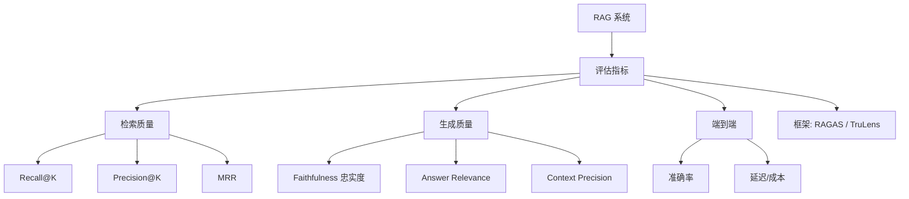
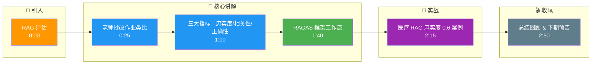

# RAG 评估

### RAG 评估

**9.1 核心指标**
- **忠实度**: 答案是否由上下文推出（不幻觉）。
- **上下文相关性**: 检索到的块是否相关。
- **答案正确性**: 答案是否正确（对比 Ground Truth）。

**实战案例**：某医疗 RAG 系统上线后，发现 LLM 常结合医疗常识而非当前文档“瞎编”。通过引入“忠实度”评估，发现分值仅为 0.6。针对低分样本分析发现，检索回的上下文缺少关键步骤，促使团队优化了 Chunk Size 和 Reranker 模型。

**9.2 RAGAS 框架**
利用 LLM 作为裁判，自动计算上述指标。通过精心设计的 Prompt 让 LLM 生成 0-1 的评分或理由。

**对比表格**：
| 框架 | 评估维度 | 核心特点 | 成本 |
| :--- | :--- | :--- | :--- |
| **RAGAS** | 忠实度, 答案相关性等 | 基于提示词的LLM裁判，无需训练 | 中 (调用LLM) |
| **TruLens (RAG triad)** | 上下文相关性, 忠实度, 答案相关性 | 强调三角测量，可视化反馈强 | 中 |
| **DeepEval** | 综合指标, 幻觉检测 | 类似 Pytest 的单元测试风格 | 中 |
| **RAG Compiler** | 端到端正确性 | 模拟编译器检查逻辑链路 | 高 |

**面试 Q15：为什么说「只看最终答案对错」不够？**
A：可能猜对或上下文不相关仍生成。需同时评检索质量与忠实度，定位瓶颈在检索还是生成。

**代码示例：RAGAS 调用**
```python
from ragas import evaluate
from datasets import Dataset

data = {
    "question": ["公司总部在哪？"],
    "answer": ["上海。"],
    "contexts": [["公司总部位于上海浦东新区……"]],
    "ground_truth": ["上海"],
}

ds = Dataset.from_dict(data)
result = evaluate(ds, metrics=["faithfulness", "answer_relevancy"])
```

**代码示例：计算 MRR (Mean Reciprocal Rank)**
```python
import numpy as np

def compute_mrr(relevant_items_list, ranked_lists):
    """
    :param relevant_items_list: 真实的正样本ID列表的列表 [[doc_id1, doc_id2], ...]
    :param ranked_lists: 模型预测的排序列表 [[doc_id5, doc_id1, ...], ...]
    """
    mrr_sum = 0
    for relevant, ranked in zip(relevant_items_list, ranked_lists):
        for rank, item in enumerate(ranked, start=1):
            if item in relevant:
                mrr_sum += 1.0 / rank
                break
    return mrr_sum / len(relevant_items_list)
```

## 常见考点
1. **如何评估 RAG 的检索效果？**
   使用 Hit Rate（命中率）和 MRR（平均倒数排名）。Hit Rate 关注前 K 个结果是否包含正样本；MRR 关注正样本的排序位置（越靠前分数越高）。
2. **RAGAS 评估的缺点是什么？**
   成本高（需多次调用 LLM 作为 Judge），且 LLM Judge 本身可能有偏好或误差。
3. **什么是 Trulens？**
   另一个评估框架，侧重于构建三角测量和上下文相关性评估，提供可视化反馈。

## 核心流程图



## 记忆要点

- 核心指标：忠实度（不幻觉）、上下文相关性（检索准）、答案正确性（对比 GT）。
- RAGAS 框架：用 LLM 作为裁判，通过 Prompt 自动计算 0-1 评分，无需训练。
- 评估意义：只看答案对错不够，需分评检索与生成，定位瓶颈在召回还是推理。
- 检索指标：Hit Rate（前 K 是否包含正样本）、MRR（正样本排名位置，越前分越高）。
- RAGAS 缺点：成本高（多次调 LLM），且 Judge 本身可能有偏好或误差。

## 结构化回答

**30 秒电梯演讲：** RAG 评估不能只看答案对错——可能猜对或上下文不相关也能蒙对。要用 RAGAS 这种"模型考模型"的框架，分别评忠实度（有没有瞎编）、上下文相关性（检索准不准）、答案正确性（对比标准答案），才能定位瓶颈在检索还是生成。

**展开框架：**
1. **三大核心指标** — 忠实度（答案是否由上下文推出，防幻觉）、上下文相关性（检索块是否相关）、答案正确性（对比 Ground Truth）。
2. **RAGAS 是主流** — 用 LLM 当裁判，通过精心设计的 Prompt 自动算 0-1 评分，无需训练，开箱即用。
3. **检索层指标** — Hit Rate（前 K 是否包含正样本）、MRR（正样本排名位置，越靠前分越高），量化召回质量。
4. **局限要认清** — 成本高（多次调 LLM）、Judge 本身有偏好和误差，必须配人工抽检校准。

**收尾：** 我做过医疗 RAG，忠实度只有 0.6，深挖发现是检索缺关键步骤，优化 Chunk Size 和 Reranker 后才上来。您想深入聊 RAGAS 指标设计、检索评估还是 Judge 校准？

## 视频脚本

> 预计时长：3 分钟 | 由浅入深

| 时间 | 画面/字幕 | 口播台词 | 讲解要点 |
|------|----------|----------|----------|
| 0:00 | 标题卡：RAG 评估 | "RAG 系统好不好，不能只看答案对错——可能猜对也能蒙对。" | 开场钩子 |
| 0:25 | 老师批改作业类比 | "像老师批改作业，不仅看答案对不对，还要看解题步骤有没有抄错、依据对不对。" | 评估本质 |
| 1:00 | 三大指标：忠实度/相关性/正确性 | "三大指标：忠实度防幻觉、上下文相关性看检索准不准、答案正确性对比标准答案。" | 核心指标 |
| 1:40 | RAGAS 框架工作流 | "RAGAS 用 LLM 当裁判，Prompt 自动算 0-1 评分，无需训练。检索层还要看 Hit Rate 和 MRR。" | RAGAS + 检索指标 |
| 2:15 | 医疗 RAG 忠实度 0.6 案例 | "实战：医疗 RAG 忠实度只有 0.6，深挖是检索缺关键步骤，优化 Chunk Size 和 Reranker 后才上来。" | 实战案例 |
| 2:50 | 总结卡 | "记住：分评检索和生成、RAGAS 开箱即用、Judge 要人工校准。下期讲生产优化。" | 收尾 |

### 视频流程图




