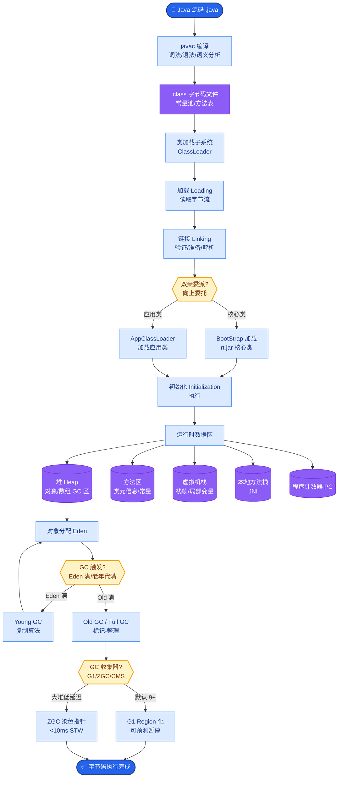

# 工具编排（Tool Orchestration）

### 工具编排

**定义**：决定多个工具的执行顺序与依赖关系。高级的 Agent 能够自主规划并执行复杂的工具链。

**模式**：
1.  **串行**：后一步依赖前一步输出（如：先查 User ID，再查订单）。逻辑简单，但总耗时累加。
2.  **并行**：无依赖查询同时执行（如：查天气 + 查股价），降低延迟。需处理并发异常。
3.  **工具链**：固定或动态的流水线（如 LangChain 的 `Chain`）。
4.  **条件分支**：根据中间结果决定是否调用（如：风险评分 > 0.8 则人工复核）。

**依赖管理**：使用 DAG（有向无环图）管理依赖，拓扑排序执行，检测死循环。

**编排架构图**：
```text
      Start
        │
        ▼
 ┌─────────────┐
 │  Plan/Graph │ (构建 DAG)
 └──────┬──────┘
        │
        ▼
 ┌─────────────┐
 │   Executor  │
 └──────┬──────┘
        │
   ┌────┴────┐
   ▼         ▼
┌─────┐   ┌─────┐
│Task A│   │Task B│ (并行执行，无依赖)
└──┬──┘   └──┬──┘
   │         │
   └────┬────┘
        ▼
   ┌─────────┐
   │Task C   │ (串行，需 A/B 结果)
   └────┬────┘
        │
        ▼
      End
```

**面试金句**：
*   **Q：并行与串行如何取舍？**
*   **A**：读操作且无依赖并行；写操作或有强数据依赖串行。并行需注意后端服务的并发承受能力。

### 代码示例（编排）
```python
import concurrent.futures

def orchestrate(user_email: str):
    # 1. 串行获取 ID
    uid = lookup_user_id(user_email)
    
    # 2. 并行获取后续数据
    with concurrent.futures.ThreadPoolExecutor() as executor:
        fut_orders = executor.submit(fetch_orders, uid)
        fut_points = executor.submit(fetch_points, uid)
        
    return {
        "orders": fut_orders.result(),
        "points": fut_points.result()
    }
```

**实战案例**：
在电商大促期间，我曾遇到因并行调用 5 个下游物流接口导致网关熔断的故障。**教训**：并行编排必须引入“熔断器”和“全局限流”，Agent 编排器需具备对后端负载的感知能力，而非盲目并发。

**串行 vs 并行 编排对比**：

| 维度 | 串行编排 | 并行编排 |
| :--- | :--- | :--- |
| **适用场景** | 强依赖（B依赖A的结果）、写操作主导 | 无依赖查询（聚合数据）、读操作密集 |
| **总耗时** | 累加（Sum(T)） | 取决于最慢任务（Max(T)） |
| **复杂度** | 低，易于调试和重试 | 高，需处理竞态、线程安全、部分失败 |
| **资源消耗** | 平滑，峰值低 | 瞬时峰值高，易压垮数据库 |

## 常见考点
1.  **DAG 循环检测**：在模型自主规划时，如何防止陷入死循环（如一直查同一条数据）？（限制最大步数、状态哈希检测、强制的 Stop 条件）。
2.  **部分失败处理**：并行调用中，一部分成功一部分失败，如何处理？（Fallback 机制、重试策略、向模型报告部分失败并询问下一步）。

## 核心流程图



## 记忆要点

- 串行编排：强依赖或写操作，逻辑简单但耗时累加。
- 并行编排：无依赖读操作，降低延迟，需处理竞态与部分失败。
- 依赖管理：使用DAG（有向无环图）管理依赖，拓扑排序执行，检测死循环。
- 实战教训：并行需引入熔断器和全局限流，防止压垮后端服务。
- 部分失败：并行中部分失败需Fallback或重试，不能影响其他成功分支。

## 结构化回答

**30 秒电梯演讲：** 工具编排就是指挥多个工具"谁先响、谁同时响"——无依赖的读操作并行降延迟，有依赖或写操作串行保安全，用 DAG 管依赖拓扑排序执行。最大的坑是并行会压垮后端，必须配熔断器和全局限流。

**展开框架：**
1. **串行 vs 并行取舍** — 读操作且无依赖就并行（降延迟）；写操作或强数据依赖就串行（保安全）。
2. **DAG 管依赖** — 用有向无环图建模任务依赖，拓扑排序决定执行顺序，同时检测死循环。
3. **并行三大风险** — 竞态条件（写操作要串行）、部分失败（要 Fallback 不影响其他分支）、压垮后端（必须熔断+限流）。
4. **条件分支** — 根据中间结果决定是否调下一步（如风险评分>0.8 则人工复核）。

**收尾：** 我在电商大促并行调 5 个物流接口把网关搞熔断过，教训是并行编排必须配熔断器和全局限流。您想深入聊 DAG 依赖管理、部分失败处理还是并行限流？

## 视频脚本

> 预计时长：3 分钟 | 由浅入深

| 时间 | 画面/字幕 | 口播台词 | 讲解要点 |
|------|----------|----------|----------|
| 0:00 | 标题卡：工具编排 | "多个工具怎么协调？无依赖并行，有依赖串行，用 DAG 管依赖。" | 开场钩子 |
| 0:25 | 交响乐指挥类比 | "像指挥交响乐，决定哪个乐器先响、哪些同时响，还得协调好别打架。" | 本质类比 |
| 0:55 | 串行 vs 并行对比表 | "串行：强依赖或写操作，耗时累加但安全。并行：无依赖读操作，降延迟但要处理竞态和部分失败。" | 两种模式 |
| 1:35 | DAG 拓扑排序动画 | "用 DAG 管依赖，拓扑排序决定执行顺序，同时检测死循环。条件分支按中间结果决定下一步。" | 依赖管理 |
| 2:10 | 电商大促熔断案例 | "实战：电商大促并行调 5 个物流接口把网关搞熔断。教训是并行必须配熔断器和全局限流。" | 实战教训 |
| 2:45 | 总结卡 | "记住：读并行写串行、DAG 管依赖、并行必限流。下期讲安全。" | 收尾 |

### 视频流程图


