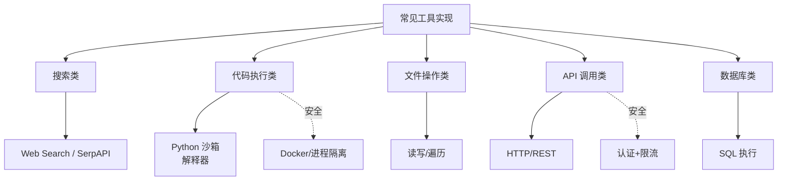

# 常见工具实现

### 常见工具实现

**1. 搜索工具**：封装 Search API（Google/SerpApi），返回摘要与链接，避免大量 HTML 进上下文。注意处理分页和来源可信度。

**2. 数据库工具**：
*   **核心**：永远参数化查询，禁止字符串拼接 SQL。推荐生成 SQL 再执行或使用 Text-to-SQL 中间层。
*   **权限**：只读账号 + 白名单表/列。

**3. 代码执行**：
*   **风险**：极高，可执行任意代码（RCE）。
*   **防护**：必须在沙箱（Docker/WASM/Firecracker microVM）中运行，限制网络（出站规则）、内存与 CPU 时间。

**4. 文件操作**：限制根目录（`chroot` 或虚拟文件系统），路径规范化（`os.path.abspath`），防止任意文件读写。

**5. 计算器**：禁止使用 `eval()`，应使用 AST 解析或安全数学库（如 `numexpr`）。限制运算复杂度防止超时。

**代码示例（安全计算器）**
```python
import ast
import operator

_ALLOWED_OPS = {
    ast.Add: operator.add, ast.Sub: operator.sub,
    ast.Mult: operator.mul, ast.Div: operator.truediv,
}

def safe_eval(expr: str) -> float:
    node = ast.parse(expr, mode='eval').body
    if isinstance(node, ast.Constant): return node.value
    if isinstance(node, ast.BinOp) and type(node.op) in _ALLOWED_OPS:
        return _ALLOWED_OPS[type(node.op)](safe_eval(node.left), safe_eval(node.right))
    raise ValueError("Unsafe operation")
```

**代码示例（安全的 DB 查询）**：
```python
# ✅ 正确：参数化查询
def get_user(user_id: int):
    cursor.execute("SELECT * FROM users WHERE id = %s", (user_id,))
    return cursor.fetchone()

# ❌ 错误：拼接查询（极易被注入）
def get_user_unsafe(user_id: str):
    cursor.execute(f"SELECT * FROM users WHERE id = {user_id}")
```

**实战案例**：
早期实现 Python 解释器工具时，误以为 `eval` 仅影响当前进程。结果被利用 `__import__('os').system('rm -rf /')` 实际上清空了宿主机挂载的共享数据卷。**教训**：任何代码执行工具必须运行在**无持久化存储**且**禁用网络**的微 VM 中，且严格限制进程组。

**工具实现方案对比**：

| 工具类型 | 实现难点 | 核心防御手段 | 性能瓶颈 |
| :--- | :--- | :--- | :--- |
| **搜索工具** | 结果相关性、广告过滤 | 来源可信度白名单 | 第三方 API 延迟、速率限制 |
| **数据库工具** | 语义转 SQL 准确性 | ORM/参数化查询、只读账号 | 复杂 SQL 的查询耗时 |
| **代码执行** | 沙箱逃逸 | MicroVM / WASM、Seccomp | 容器冷启动时间 |
| **文件操作** | 路径穿越 | Chroot、Path规范化、白名单 | 磁盘 I/O |

## 常见考点
1.  **AST 解析局限性**：除了 `eval`，AST 解析还有哪些漏洞？（递归深度导致栈溢出、复杂数字计算精度、`__import__` 等魔术方法的调用）。
2.  **代码沙箱逃逸**：Docker 容器逃逸的基础防御手段有哪些？（非 root 用户运行、禁用 Privileged 模式、Seccomp 配置文件限制系统调用）。


## 核心流程图




## 记忆要点

- 数据库工具：永远参数化查询，禁止字符串拼接SQL，使用只读账号。
- 代码执行：极高RCE风险，必须在沙箱（Docker/WASM）中运行，限制网络。
- 文件操作：限制根目录，路径规范化，防止任意文件读写。
- 计算器：禁止eval()，使用AST解析或安全数学库，限制运算复杂度。
- 实战教训：代码执行工具需无持久化存储且禁用网络，防沙箱逃逸。

## 结构化回答

**30 秒电梯演讲：** 常见工具实现就是给模型配一把"瑞士军刀"，但每把刀刃都要锁好——数据库永远参数化查询、代码执行必须进沙箱、计算器严禁 eval 用 AST 解析、文件操作要限制根目录。安全是底线，一个 eval 就能让攻击者 `rm -rf /` 清空你的数据卷。

**展开框架：**
1. **数据库工具** — 永远参数化查询禁止字符串拼接 SQL、用只读账号、白名单表/列，防 SQL 注入。
2. **代码执行是最高危** — RCE 风险极高，必须在 Docker/WASM/microVM 沙箱运行，禁网络、限内存 CPU、无持久化存储。
3. **计算器禁 eval** — `eval` 等同 RCE 漏洞（`__import__('os').system('rm -rf /')`），必须用 AST 解析或 numexpr 安全库。
4. **文件操作防穿越** — 限制根目录（chroot）、路径规范化（os.path.abspath）、白名单，防 `../../etc/passwd` 任意读写。

**收尾：** 我早期写 Python 解释器工具以为 eval 只影响当前进程，结果被清空了宿主机共享数据卷，血泪教训。您想深入聊沙箱实现、SQL 防注入还是 AST 解析的局限？

## 视频脚本

> 预计时长：3 分钟 | 由浅入深

| 时间 | 画面/字幕 | 口播台词 | 讲解要点 |
|------|----------|----------|----------|
| 0:00 | 标题卡：常见工具实现 | "给模型配瑞士军刀，但每把刀刃都要锁好，安全是底线。" | 开场钩子 |
| 0:25 | 瑞士军刀+锁类比 | "数据库、代码执行、计算器、文件操作，每个都有致命坑。" | 总览 |
| 0:55 | 参数化查询 vs 字符串拼接 | "数据库工具永远参数化查询，禁止字符串拼接 SQL，用只读账号白名单表列。" | 数据库工具 |
| 1:35 | eval → rm -rf / RCE 漏洞 | "计算器严禁 eval，一个 eval 就能让攻击者 rm -rf 清空数据卷。必须用 AST 解析。" | 计算器高危 |
| 2:10 | Docker 沙箱 + 禁网络 | "代码执行是最高危，必须在 Docker/WASM 沙箱运行，禁网络、限内存 CPU、无持久化存储。" | 代码执行 |
| 2:45 | 总结卡 | "记住：SQL 参数化、eval 禁用、沙箱隔离、路径限制。下期讲综合面试题。" | 收尾 |

