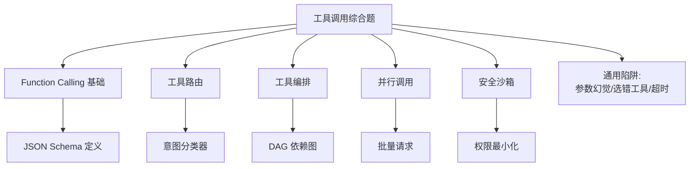

# 综合面试题精选（≥15 题）

### 综合面试题精选

1.  **Q：Function Calling 和纯 JSON 输出区别？**
    **A**：FC 是原生通道，自动绑定对话 ID 和工具定义，解析更稳、支持多轮对话；JSON 依赖 Prompt，易混入闲聊，且需手动处理 Token 概率截断问题。

2.  **Q：`tool_calls` 和 `tool` 消息怎么对应？**
    **A**：`assistant` 消息里的 `tool_calls[i].id` 对应后续 `role=tool` 消息里的 `tool_call_id`，实现多调用结果的匹配。

3.  **Q：MCP 解决什么痛点？**
    **A**：工具集成碎片化、重复建设。MCP 提供标准协议，让工具即插即用，统一了 AI 应用与后端系统的接口。

4.  **Q：工具路由何时必须上？**
    **A**：工具过多导致上下文膨胀、误选率上升或成本增加时（通常 >50 个工具）。或者工具描述非常相似，难以通过语义区分时。

5.  **Q：并行调用要注意什么？**
    **A**：幂等性、后端并发限制、数据竞争、部分失败重试策略（Retry 策略不能影响其他成功的分支）。

6.  **Q：审计日志要记什么？**
    **A**：时间、TraceID、用户、工具名、参数摘要（脱敏）、结果状态、耗时、模型版本、Token 消耗。

7.  **Q：为什么 Calculator 禁止 `eval`？**
    **A**：`eval` 可执行任意 Python 代码（如 `__import__('os').system('rm -rf /')`），等同于远程代码执行（RCE）漏洞，必须使用 AST 解析等安全方式。

8.  **Q：如何处理 Tool 调用超时？**
    **A**：设置严格的超时时间（如 10s），超时后向模型返回明确的错误信息，让模型决定重试或放弃。避免无限阻塞 Agent。

9.  **Q：什么是 “Tool Hallucination”（工具幻觉）？**
    **A**：模型虚构了一个不存在的工具名称，或者编造了工具的参数。应对：Prompt 明确告知“只能使用提供的工具”，并在代码侧做严格的 Schema 校验。

10. **Q：工具返回的数据量过大怎么办？**
    **A**：直接截断或传给 LLM 会导致 Context 溢出。应对：在工具层做 Summarization；或者在工具层增加“分页/翻页”能力，让 Agent 分批次获取。

11. **Q：Function Calling 的参数校验是在 LLM 侧还是代码侧？**
    **A**：**必须双侧**。Prompt 告诉 LLM 格式（减少幻觉），代码侧通过 Pydantic/JSON Schema 进行强校验（兜底），防止非法参数传入后端系统。

12. **Q：如何实现工具的“流式”返回？**
    **A**：如果工具本身耗时较长（如生成图片），可以先返回一个 Job ID，让 Agent 轮询状态或使用 WebSocket 推送结果，而不是保持 HTTP 连接直到结束。

## 技术原理

工具调用系统的设计围绕"协议、路由、编排、安全"四条主线，每条都有明确的工程原理：

- **Function Calling 的协议优势**：FC 是模型原生的结构化输出通道，模型在训练时就学会了按 JSON Schema 输出 `tool_calls`，自动绑定对话 ID 和工具定义。相比纯 JSON 输出（依赖 Prompt 约束、易混入闲聊文本），FC 解析更稳、支持多轮对话的 tool_call_id 匹配。`assistant.tool_calls[i].id` 与后续 `role=tool` 消息的 `tool_call_id` 一一对应，是多调用结果精确回填的关键。
- **工具路由的必要性**：当工具数量超过 50 个，把所有工具定义塞进 System Prompt 会导致上下文膨胀、误选率上升、成本飙升。路由层（语义检索 + 分组）先根据用户意图选出 top-K 相关工具再注入 Prompt，把"全量宣告"降为"按需宣告"。
- **参数双侧校验**：Prompt 侧告知 LLM 参数格式（减幻觉），代码侧用 Pydantic/JSON Schema 强校验（兜底防非法参数）。两层缺一不可——只靠 Prompt 会被模型幻觉击穿，只靠代码校验会让模型反复试错浪费 Token。
- **审计日志的可追溯性**：时间、TraceID、用户、工具名、参数摘要（脱敏）、结果状态、耗时、模型版本、Token 消耗，这些字段构成事后追责和效果分析的唯一依据。

## 注意事项

1. **Calculator 禁止 eval**：`eval` 可执行任意 Python 代码（如 `__import__('os').system('rm -rf /')`），等同 RCE 漏洞，必须用 AST 解析等安全方式。
2. **工具幻觉要防**：模型会虚构不存在的工具名或编造参数，对策是 Prompt 明确"只能使用提供的工具"+ 代码侧 Schema 强校验。
3. **超时要返回明确错误**：设严格超时（如 10s），超时后向模型返回明确错误信息让其决定重试或放弃，避免无限阻塞 Agent。
4. **工具返回大数据要分页**：直接塞给 LLM 会 Context 溢出，应在工具层做 Summarization 或增加分页能力让 Agent 分批获取。

## 对比表

| 维度 | Function Calling | 纯 JSON 输出 | MCP |
|:---|:---|:---|:---|
| **协议层** | 模型原生通道 | Prompt 约束 | 标准化协议层 |
| **解析稳定性** | 高（Schema 绑定） | 低（易混入闲聊） | 高（统一接口） |
| **多轮支持** | 支持（tool_call_id 匹配） | 需手动维护 | 支持 |
| **工具复用** | 每个应用重新集成 | 每个应用重新集成 | 即插即用跨应用 |
| **工具数量上限** | 50+ 需路由 | 受 Prompt 长度限制 | 理论无上限（按需宣告） |

## 代码示例

```python
# 工具调用系统的安全实践：双侧校验 + 审计日志
from pydantic import BaseModel, ValidationError
from datetime import datetime
import uuid

class WeatherArgs(BaseModel):  # 代码侧 Schema 强校验（兜底）
    city: str
    date: str

def call_tool_safely(tool_name: str, raw_args: dict, user: str):
    trace_id = str(uuid.uuid4())
    start = datetime.now()
    try:
        # 1. Pydantic 强校验防非法参数（防工具幻觉）
        args = WeatherArgs(**raw_args)
        # 2. 执行工具（Calculator 禁止 eval，用 AST）
        result = TOOL_REGISTRY[tool_name](args)
        status = "SUCCESS"
    except ValidationError as e:
        result, status = f"参数校验失败: {e}", "REJECTED"
    except Exception as e:
        result, status = str(e), "ERROR"
    # 3. 审计日志（事后追责唯一依据）
    log_audit(trace_id, user, tool_name, raw_args, status,
              duration=(datetime.now()-start).total_seconds())
    return result
```


## 核心流程图



## 记忆要点

- FC vs JSON：FC是原生通道解析更稳支持多轮，JSON依赖Prompt易混入闲聊。
- 消息对应：assistant的tool_calls[i].id对应后续role=tool消息的tool_call_id。
- 工具路由：工具>50个导致上下文膨胀或误选率上升时必须引入。
- 审计日志：记时间、TraceID、用户、工具名、参数摘要、状态、耗时。
- 参数校验：双侧校验，Prompt告知LLM格式，代码侧Pydantic强校验兜底。

## 结构化回答

**30 秒电梯演讲：** 工具调用系统的核心就四件事——FC 是模型和代码交互的标准协议，路由解决工具太多的问题，编排管多工具时序，安全是生命线。记住一句话：参数校验必须双侧（Prompt 告格式 + 代码 Pydantic 兜底），审计日志是事后追责唯一依据。

**展开框架：**
1. **FC vs JSON 输出** — FC 是原生通道自动绑定 ID、解析稳、支持多轮；纯 JSON 依赖 Prompt 易混入闲聊。
2. **消息对应关系** — assistant 的 tool_calls[i].id 对应后续 role=tool 消息的 tool_call_id，多调用结果靠这个匹配。
3. **工具幻觉与超时** — 模型会虚构不存在的工具或编造参数，对策是 Prompt 明确"只能用提供的工具"+ 代码 Schema 强校验；超时返回明确错误让模型决定重试还是放弃。
4. **审计日志必记项** — 时间、TraceID、用户、工具名、参数摘要（脱敏）、结果状态、耗时、模型版本、Token 消耗。

**收尾：** 我被追问最多的是"参数校验在哪侧"——答案是必须双侧，Prompt 减幻觉、Pydantic 兜底防非法参数。您想深入聊 FC 原理、工具幻觉还是审计设计？

## 视频脚本

> 预计时长：4 分钟 | 由浅入深

| 时间 | 画面/字幕 | 口播台词 | 讲解要点 |
|------|----------|----------|----------|
| 0:00 | 标题卡：工具调用综合题 | "工具调用系统的核心：FC 协议、路由、编排、安全，四件事。" | 开场钩子 |
| 0:25 | FC vs JSON 对比 | "FC 是原生通道解析稳支持多轮；纯 JSON 依赖 Prompt 易混入闲聊。" | FC 本质 |
| 1:00 | tool_calls.id 对应关系图 | "消息对应：assistant 的 tool_calls[i].id 对应 role=tool 消息的 tool_call_id，多调用靠这个匹配。" | 消息对应 |
| 1:40 | 工具幻觉 + 超时处理 | "工具幻觉：模型虚构工具名或编造参数，Prompt 明确'只能用提供的工具'+代码 Schema 校验。超时返回错误让模型决策。" | 幻觉与超时 |
| 2:20 | 双侧校验：Prompt + Pydantic | "参数校验必须双侧：Prompt 告格式减幻觉，代码 Pydantic 强校验兜底防非法参数。" | 校验策略 |
| 3:00 | 审计日志必记项清单 | "审计日志记：时间、TraceID、用户、工具名、参数摘要脱敏、状态、耗时、模型版本、Token。" | 审计设计 |
| 3:45 | 总结卡 | "记住：FC 原生通道、消息靠 ID 对应、校验双侧、审计必记。下期讲记忆系统。" | 收尾 |

