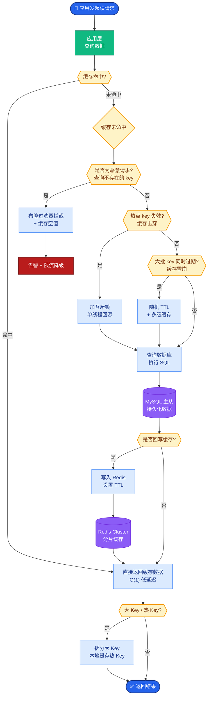

# 长期记忆

长期记忆用于跨会话、跨任务保留信息，典型实现是「向量数据库 + 元数据」。

### 核心原理
1.  **存储**：文本经 Embedding 模型转为向量，与 user_id、timestamp 等元数据一同存入数据库。
2.  **检索**：查询文本转向量 -> 计算 Top-K 相似度 -> 按元数据过滤 -> 注入 Prompt。
3.  **管理**：包括 CRUD 操作、重要性评分（加权保留）与衰减机制（时间遗忘）。

### 局限与应对
*   **局限**：语义相似不代表事实正确；难以精确匹配 ID/订单号；更新一致性难保障。
*   **应对**：混合检索（BM25+向量）、人工/模型校验、主键版本控制、冷热数据分离。

### 架构图：长期记忆 RAG 流程
```text
┌──────────────┐      ┌──────────────────────┐      ┌──────────────┐
│   User Query │ ──>  │  Retrieval Strategy  │ ──>  │ Vector DB    │
└──────────────┘      │  (Filter + Search)   │      │ (ANN Index)  │
                      └──────────────────────┘      └──────┬───────┘
                                                             │
                                                             ▼
┌──────────────┐      ┌──────────────────────┐      ┌──────────────┐
│   Context    │ <─── │  Reranking & Merge   │ <─── │  Top-K Docs  │
│ (Prompt +    │      │  (Score Normalization)│     │ + Metadata   │
│  Memories)   │      └──────────────────────┘      └──────────────┘
└──────┬───────┘
       │
       ▼
┌──────────────┐
│     LLM      │
└──────────────┘
```

### 数据流细节
*   **写入**：数据切分 -> Embedding -> 写入 Vector DB 同时写入 Metadata Store（如 SQL/Redis）。
*   **读取**：Vector Search 获取粗排结果 -> Metadata 过滤（如 `user_id=123` AND `date>2024`） -> 精排。

### 实战案例
*   **工程场景**：电商客服中，用户问“我的订单怎么还没到”，纯向量检索可能召回“物流延迟政策”而非该用户的订单详情。实战中需先提取实体（订单号），先用元数据精确过滤出该订单的日志，再用向量检索相关片段。

### 对比表格：检索方式对比
| 特性 | 向量检索 | 关键词检索 (BM25) | 混合检索 |
| :--- | :--- | :--- | :--- |
| **原理** | 语义相似度 | 词频/逆文档频率 | 综合打分 (RRF/加权) |
| **优势** | 处理同义词、模糊查询 | 匹配专有名词 (ID, 型号) | 兼顾语义与精确度 |
| **劣势** | 无法精确匹配生造词 | 无法理解同义改写 | 系统复杂度高，延迟略增 |
| **适用** | 开放问答、意图理解 | 订单查询、日志搜索 | 复杂业务、知识库 QA |

### 代码逻辑（Python）
```python
from qdrant_client import QdrantClient

def search_memory(client, collection, query_vec, user_id, limit=5):
    hits = client.search(
        collection_name=collection,
        query_vector=query_vec,
        query_filter={
            "must": [
                {"key": "user_id", "match": {"value": user_id}},
                # 实战中常加时间范围过滤，避免召回过时信息
                # {"key": "timestamp", "range": {"gte": "2024-01-01"}} 
            ]
        },
        limit=limit,
        with_payload=True
    )
    return hits
```


## 核心流程图



## 记忆要点

- 核心定义：跨会话、跨任务保留信息，典型实现是「向量数据库 + 元数据」。
- 检索流程：查询转向量 -> 计算 Top-K 相似度 -> 按元数据过滤 -> 注入 Prompt。
- 局限与应对：语义相似不等于事实正确，需混合检索（BM25+向量）补足精确匹配。
- 实战避坑：查订单等精确信息时，先用元数据过滤，再用向量检索片段。
- 管理机制：包含 CRUD、重要性评分与时间衰减（遗忘）机制。

## 结构化回答

**30 秒电梯演讲：** 长期记忆就是给 Agent 配一个"图书馆"——跨会话跨任务保留信息，典型实现是"向量数据库 + 元数据"。核心流程是查询转向量、算 Top-K 相似度、按元数据过滤、注入 Prompt。最大的坑是语义相似不等于事实正确，查订单得先用元数据精确过滤再向量检索。

**展开框架：**
1. **存储与检索** — 文本经 Embedding 转向量，和 user_id、timestamp 等元数据一起入库；检索时查询转向量→Top-K 相似度→元数据过滤→注入 Prompt。
2. **三大局限** — 语义相似不代表事实正确、难精确匹配 ID/订单号、更新一致性难保障；应对靠混合检索（BM25+向量）+ 主键版本控制。
3. **管理机制** — CRUD 操作、重要性评分（加权保留）、时间衰减（遗忘机制），不能只存不删。
4. **实战顺序** — 查订单等精确信息先提取实体用元数据过滤，再用向量检索相关片段，别一上来就纯向量。

**收尾：** 我做过电商客服，用户问"订单怎么没到"，纯向量召回的是"物流延迟政策"而非该用户订单，先元数据过滤才解决。您想深入聊存储设计、混合检索还是遗忘机制？

## 视频脚本

> 预计时长：3 分钟 | 由浅入深

| 时间 | 画面/字幕 | 口播台词 | 讲解要点 |
|------|----------|----------|----------|
| 0:00 | 标题卡：长期记忆 | "Agent 怎么记住跨会话的信息？给它配一个向量数据库图书馆。" | 开场钩子 |
| 0:25 | 图书馆入库打标签类比 | "像图书馆，新书入库打标签，想找相关内容时去搜索引。" | 本质类比 |
| 0:55 | 存储 + 检索流程图 | "存储：文本转向量和元数据一起入库。检索：查询转向量、Top-K、元数据过滤、注入 Prompt。" | 核心流程 |
| 1:35 | 语义相似≠事实正确 | "三大局限：语义相似不代表事实正确、难精确匹配订单号、更新一致性难。应对靠混合检索。" | 局限与应对 |
| 2:10 | 电商订单先元数据过滤案例 | "实战：用户问订单没到，纯向量召回物流政策。必须先提取订单号用元数据过滤，再向量检索片段。" | 实战避坑 |
| 2:45 | 总结卡 | "记住：向量+元数据、混合检索补精确、先过滤再检索。下期讲会话摘要。" | 收尾 |

