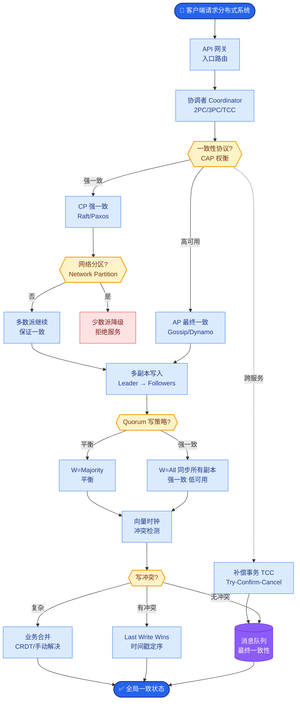

# 会话摘要与压缩

摘要与压缩旨在将长对话转化为更短、信息密度更高的表示，以在 Token 预算内保留任务有效信息。

### 核心策略
1.  **LLM 摘要**：周期性或在写入长记前，调用 LLM 提取约束、未决事项和目标。
2.  **增量 vs 全量**：
    *   **增量**：旧摘要 + 新片段 -> 新摘要。省算力，但误差会累积。
    *   **全量**：定期对完整历史重摘要。一致性好，但成本高。
3.  **滚动摘要**：将对话分成若干块，每块生成摘要，再对摘要列表生成总摘要。这是一种折中方案。

### 权衡
摘要越短越省钱，但易丢失细节；越长越保真，但接近上下文上限。工程上常采用「硬约束进结构化字段 + 软偏好进摘要 + 细节进向量库」的分层策略。

### 架构图：增量摘要流程
```text
Original History:
[M1] [M2] [M3] [M4] [M5] [M6] [M7] [M8] [M9] ...
       │
       ├─> (Trigger: Token Limit Reached or N turns)
       │
       ▼
┌───────────────────────────────────────┐
│  Step 1: Select Window (e.g. M1-M5)   │
└───────────────────┬───────────────────┘
                    │
                    ▼
┌───────────────────────────────────────┐
│  Step 2: LLM Summarization            │
│  Input: Current Summary + M1-M5       │
│  Output: New Summary (Condensed)      │
└───────────────────┬───────────────────┘
                    │
                    ▼
New Context:
[New Summary] [M6] [M7] [M8] [M9] ...
```

### 实现细节
*   **触发条件**：可以是固定轮数（如每 10 轮），也可以是 Token 数量接近阈值时。
*   **结构化摘要**：不仅生成文本，还提取 JSON 结构（如 `{"user_goal": "...", "constraints": [...]}`），便于后续程序化处理。

### 实战案例
*   **踩坑经验**：在增量摘要中，如果用户反驳了之前的设定（例如先说“发邮件给我”，后说“取消邮件”），简单的增量摘要可能会把两句话都摘要进去，导致逻辑冲突。解决方法是在 Prompt 中明确指示“消除矛盾，仅保留最新指令”，或者引入“事件流”而非单纯的摘要。

### 对比表格：摘要策略对比
| 维度 | 实时摘要 | 滚动摘要 | 结构化提取 |
| :--- | :--- | :--- | :--- |
| **处理方式** | 旧摘要+新对话 -> 新摘要 | 分块摘要 -> 二次摘要 | 提取关键字段 (JSON/KV) |
| **信息丢失** | 累积性丢失 | 细节丢失较快 | 仅保留结构化内容 |
| **成本** | 低 | 中 | 低 (仅需小模型) |
| **恢复能力** | 弱 (无法回溯) | 中 (保留中间摘要) | 强 (可精确查询) |

### 代码逻辑（Python）
```python
def summarize_chain(history, current_summary):
    prompt = f"""
    Current Summary: {current_summary}
    New Messages: {format_history(history)}
    
    Please update the summary.
    IMPORTANT: Remove any resolved tasks and update status.
    Return JSON format: {{"intent": str, "pending_tasks": [str]}}
    """
    response = client.chat.completions.create(
        model="gpt-4o-mini",
        messages=[{"role": "user", "content": prompt}],
        response_format={"type": "json_object"}
    )
    return json.loads(response.choices[0].message.content)
```

## 核心流程图



## 记忆要点

- 核心目标：将长对话转化为短且高密度的表示，以节省 Token 并保留有效信息。
- 增量 vs 全量：增量省算力但误差累积，全量一致性好但成本高，滚动摘要是折中。
- 结构化优势：提取 JSON 字段（如 intent、tasks）便于程序化处理，优于纯文本。
- 实战避坑：增量摘要需消除矛盾，仅保留最新指令，避免逻辑冲突。
- 触发条件：固定轮数或 Token 数接近阈值时触发。

## 结构化回答

**30 秒电梯演讲：** 会话摘要就是把长对话"有损压缩"成读书笔记——节省 Token 还能保留核心任务状态。增量摘要省算力但误差会累积，全量摘要一致性好但贵，滚动摘要是折中。最大的坑是用户改主意时（先说要发邮件后说取消），摘要要把两句都记下导致逻辑冲突。

**展开框架：**
1. **三种策略** — 增量（旧摘要+新片段→新摘要，省力但误差累积）、全量（定期重摘要，一致性好但贵）、滚动（分块摘要再二次摘要，折中）。
2. **结构化优于纯文本** — 提取 JSON 字段（intent、pending_tasks、constraints）便于程序化处理，恢复能力也强。
3. **消除矛盾是关键** — Prompt 必须明确"消除矛盾，仅保留最新指令"，否则用户改主意时会出现逻辑冲突。
4. **触发条件** — 固定轮数（如每 10 轮）或 Token 数接近阈值时触发，别等超限了才动。

**收尾：** 我踩过坑——用户先说"发邮件给我"后说"取消"，增量摘要把两句都记下导致 Agent 又发又取消。Prompt 加"仅保留最新指令"才解决。您想深入聊增量 vs 全量、结构化提取还是触发策略？

## 视频脚本

> 预计时长：3 分钟 | 由浅入深

| 时间 | 画面/字幕 | 口播台词 | 讲解要点 |
|------|----------|----------|----------|
| 0:00 | 标题卡：会话摘要与压缩 | "长对话太烧 Token？把它有损压缩成读书笔记，这就是会话摘要。" | 开场钩子 |
| 0:25 | 读书笔记类比 | "像读书笔记，读一章把重点记下来，下次直接看笔记复习，不用重读全书。" | 本质类比 |
| 0:55 | 增量/全量/滚动三策略对比 | "三种策略：增量省力但误差累积，全量一致但贵，滚动分块再二次摘要是折中。" | 三种策略 |
| 1:35 | 结构化 JSON 提取示意 | "结构化优于纯文本：提取 intent、pending_tasks、constraints 字段，便于程序化处理。" | 结构化优势 |
| 2:10 | 发邮件又取消的矛盾案例 | "最大坑：用户先说发邮件后说取消，增量摘要两句都记导致冲突。Prompt 要'仅保留最新指令'。" | 实战避坑 |
| 2:45 | 总结卡 | "记住：有损压缩、结构化提取、消除矛盾。下期讲情景与语义记忆。" | 收尾 |

### 视频流程图


