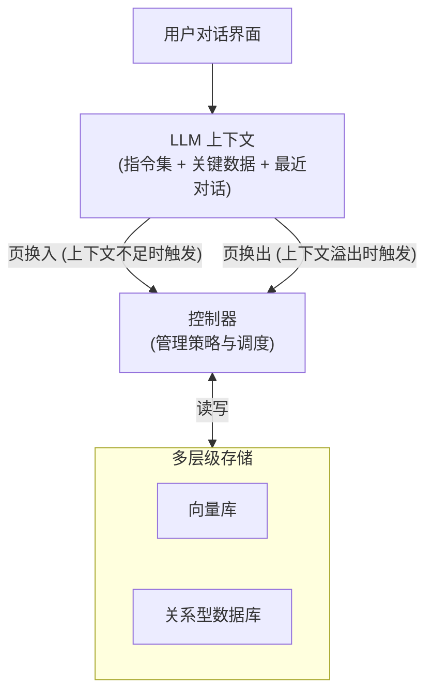

# 高级记忆框架

当对话与工具轨迹变复杂后，业界提出了更接近操作系统的记忆架构（如 MemGPT、Mem0），以解决上下文溢出和记忆组织难题。

### MemGPT / MemOS
*   **核心思想**：将 LLM 上下文视为「有限 RAM」，外部存储（向量数据库、关系型数据库）视为「磁盘」。系统通过**分页/换入换出**机制，主动管理信息进出上下文，而非被动依赖检索。
*   **区别**：传统 RAG 是被动按需检索；MemGPT 是主动内存管理，控制器决定何时外溢、何时加载。

### Mem0 框架
*   **定位**：面向应用的记忆中间件，封装了「抽取-去重-写入-检索」的全流程。
*   **价值**：提供统一的记忆接口，便于在多应用间复用用户画像。

### 高级特性
1.  **反思**：周期性回顾轨迹，生成高层见解（如总结错误原因）。
2.  **记忆图谱**：用实体-关系存储，支持多跳推理，弥补向量库结构化能力的不足。

### 架构原理：OS 级内存管理


### 代码逻辑（反思示意）
```python
def reflect(transcript):
    return llm.complete(
        "基于以下轨迹输出3条高层见解：\n" + transcript
    )
```

### 实战案例
在构建代码助手时，若使用简单 RAG，当对话超过 5 轮后模型常遗忘之前的函数定义。采用 MemGPT 机制后，当 Token 超过阈值，系统自动将“历史代码片段”换出到向量库，仅保留“当前修改上下文”在内存中，从而支持长程代码重构。

### 代码示例（换入换出逻辑）
```python
def manage_memory(context_window, query):
    if context_window.usage > 0.9:
        # 触发换出：根据重要性评分移除低优先级记忆
        evicted = os_layer.swap_out_least_important()
        storage.save(evicted)
    
    # 触发换入：检索相关历史记忆
    relevant_mem = storage.search(query)
    os_layer.swap_in(relevant_mem)
    return context_window.build_prompt()
```

### 对比表格
| 特性 | 传统 RAG | MemGPT (OS 模式) |
| :--- | :--- | :--- |
| **触发方式** | 被动（用户 Query 触发） | 主动（系统状态触发） |
| **上下文管理** | 每次重新检索、拼接 | 动态换页、保留状态 |
| **适用场景** | 问答系统、知识库检索 | 长对话 Agent、复杂任务规划 |

## 常见考点
1.  **MemGPT 与 RAG 的本质区别**：RAG 是"查了再用"，MemGPT 是"缺了自动调"。重点在于"主动性"和"上下文窗口管理"。
2.  **多层存储的选型**：为什么向量库不够？解释结构化数据（如用户偏好设置）和非结构化数据（历史对话）的分离存储策略。
3.  **页换出的判定条件**：如何判断哪部分记忆应该被换出？通常基于 Recency（最近时间）、Importance（重要性评分）、Relevance（与当前查询的相关性）加权计算。
4.  **反思机制的触发时机**：是固定周期触发，还是基于对话轮数或错误率触发？

## 记忆要点

- MemGPT 核心：将上下文视为 RAM，外部存储视为磁盘，通过分页机制主动管理。
- 本质区别：传统 RAG 是被动检索，MemGPT 是主动换入换出，解决上下文溢出。
- 高级特性：反思（周期性回顾生成见解）、记忆图谱（支持多跳推理）。
- Mem0 定位：面向应用的记忆中间件，封装抽取-去重-写入-检索全流程。
- 适用场景：长对话 Agent、复杂任务规划，需动态保留状态。

## 结构化回答

**30 秒电梯演讲：** MemGPT 把操作系统的内存管理思想搬进 LLM——上下文窗口是 RAM，外部存储是磁盘，通过分页机制主动换入换出，突破上下文窗口的物理限制。它和传统 RAG 的本质区别是：RAG 是"查了再用"（被动），MemGPT 是"缺了自动调"（主动）。

**展开框架：**
1. **OS 级内存管理** — 上下文当 RAM，向量库/DB 当磁盘，控制器决定何时外溢（上下文溢出时）、何时加载（查询相关时）。
2. **主动 vs 被动** — 传统 RAG 每次重新检索拼接；MemGPT 动态换页保留状态，适合长对话和复杂任务规划。
3. **反思机制** — 周期性回顾轨迹生成高层见解（总结错误原因），让 Agent 从经验中学习。
4. **Mem0 是中间件** — 封装"抽取-去重-写入-检索"全流程，提供统一记忆接口便于多应用复用用户画像。

**收尾：** 我做过代码助手，简单 RAG 对话超 5 轮就遗忘函数定义，用 MemGPT 机制自动把历史代码片段换出到向量库，只留当前修改上下文，支持了长程重构。您想深入聊分页策略、反思机制还是 Mem0 集成？

## 视频脚本

> 预计时长：3 分钟 | 由浅入深

| 时间 | 画面/字幕 | 口播台词 | 讲解要点 |
|------|----------|----------|----------|
| 0:00 | 标题卡：高级记忆框架 | "上下文窗口不够用？MemGPT 把操作系统的内存管理搬进了 LLM。" | 开场钩子 |
| 0:25 | RAM vs 磁盘类比 | "上下文是 RAM，外部存储是磁盘，通过分页机制主动换入换出，突破窗口限制。" | 核心思想 |
| 0:55 | 主动 vs 被动 RAG 对比 | "和 RAG 的本质区别：RAG 是查了再用被动检索，MemGPT 是缺了自动调主动管理。" | 本质区别 |
| 1:35 | 反思机制 + 记忆图谱 | "高级特性：反思周期性回顾生成见解，记忆图谱支持多跳推理弥补向量库结构化不足。" | 高级特性 |
| 2:10 | 代码助手长程重构案例 | "实战：代码助手用 MemGPT，对话超 5 轮自动把历史代码换出到向量库，只留当前修改上下文。" | 实战案例 |
| 2:45 | 总结卡 | "记住：OS 级管理、主动换页、反思学习。下期讲生产挑战。" | 收尾 |

### 视频流程图


