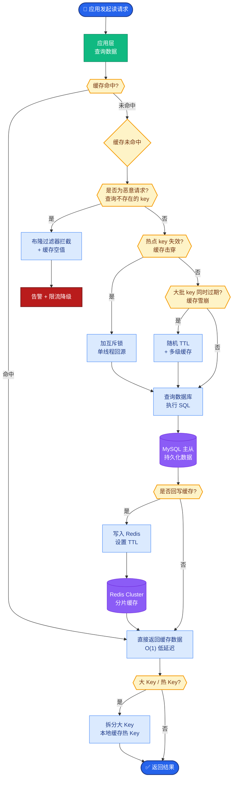

# 记忆在生产中的挑战

从 Demo 到生产，记忆系统面临工程化挑战，主要包括多租户隔离、一致性、隐私合规与性能优化。

### 关键挑战与对策
1.  **多租户隔离**
    *   **风险**：检索时漏加 user_id 导致串数据。
    *   **对策**：元数据强制过滤，集成测试覆盖。
2.  **一致性**
    *   **风险**：摘要与向量库内容冲突，重复记忆。
    *   **对策**：引入主键、版本号、定期对账任务。
3.  **隐私与安全**
    *   **风险**：PII（敏感信息）进向量库；提示注入污染记忆。
    *   **对策**：PII 脱敏/加密；记忆信任分级；支持「被遗忘权」。
4.  **性能与成本**
    *   **对策**：Embedding 缓存、批量写入、冷热数据分层。

### 架构图：记忆系统的安全与隔离流程
```text
用户请求 ──► [ 身份认证层 ] ──► 提取 Tenant_ID/User_ID
                                 │
                                 ▼
                        ┌──────────────────────┐
                        │  记忆检索与过滤      │
                        │ (强制 Metadata Filter)│
                        └──────────┬───────────┘
                                   │
                                   ▼
                        ┌──────────────────────┐
                        │  PII 检测与脱敏      │
                        │ (正则/微模型识别)     │
                        └──────────┬───────────┘
                                   │
                                   ▼
                        ┌──────────────────────┐
                        │  存储层 (向量+KV)    │
                        │  (加密存储 & TTL)     │
                        └──────────────────────┘
```

### 落地检查表
*   隔离：检索是否强制带租户 ID？
*   持久化：向量库是否有备份与迁移方案？
*   合规：是否支持用户一键删除？

### 实战案例
某企业级 AI 客服曾发生数据泄露，原因是在用户升级为 VIP 后，代码逻辑分支未正确传递新的 Group ID，导致该用户检索到了普通用户的对话记录。解决方案是在底层 DAO 层利用切面编程强制校验 Tenant ID。

### 代码示例（强制过滤与PII脱敏）
```python
def search_memories(user_id, query):
    # 1. 强制多租户过滤
    results = vector_store.search(
        query, 
        filter={"user_id": user_id} # 必选参数，防止串数据
    )
    
    # 2. 返回前 PII 脱敏
    clean_results = []
    for res in results:
        clean_res = pii_masker.mask(res.text) 
        clean_results.append(clean_res)
    return clean_results
```

### 对比表格
| 挑战维度 | Demo 级别处理 | 生产级处理 |
| :--- | :--- | :--- |
| **数据隔离** | 仅依赖逻辑分层 | 元数据强制过滤 + DB 行级锁 |
| **隐私合规** | 无处理 | Presidio 脱敏 + AES 存储加密 |
| **一致性** | 仅写向量库 | 双写（KV+向量）+ 事务对账 |
| **更新策略** | 追加写入 | CRUD（Upsert）+ 版本控制 |

## 常见考点
1.  **如何实现"被遗忘权"（Right to be Forgotten）？**：不仅是删除行，还需要处理 Embedding 的"幻影"（Ghost Embeddings）问题，即确保残留的向量片段无法被重组还原。
2.  **向量数据库的一致性瓶颈**：向量库通常支持的是最终一致性（BASE），而用户画像更新需要强一致性，如何平衡？（通常采用元数据存在强一致性 DB，向量存 Elastic/Opine/Search 的异构方案）。
3.  **记忆去重的具体策略**：如何判断两条记忆是重复的？（基于余弦相似度阈值，或是结合实体抽取的精确匹配）。
4.  **冷热数据分层的设计**：热数据（最近 3 轮对话）放 Redis 或 Context，温数据（近期总结）放向量库，冷数据（长期归档）放对象存储，如何设计流转策略？


## 核心流程图



## 记忆要点

- 多租户隔离：检索时强制加 user_id 过滤，底层 DAO 层校验防串数据。
- 一致性：引入主键、版本号，双写（KV+向量）+ 定期对账。
- 隐私合规：PII 脱敏/加密，支持「被遗忘权」（处理幻影向量）。
- 性能优化：Embedding 缓存、批量写入、冷热数据分层。
- 实战避坑：用户升级 VIP 时逻辑分支未传 ID 导致泄露，需强制校验。

## 结构化回答

**30 秒电梯演讲：** 记忆系统从 Demo 到生产要过四关——多租户隔离（检索强制带 user_id 防串数据）、一致性（主键+版本号+双写对账）、隐私合规（PII 脱敏+被遗忘权）、性能优化（缓存+批量+冷热分层）。多租户隔离是红线，漏一个 user_id 就是生产事故。

**展开框架：**
1. **多租户隔离是红线** — 检索时强制加 user_id 过滤，底层 DAO 层用切面编程强制校验，集成测试必须覆盖，漏了就串数据。
2. **一致性靠双写对账** — 引入主键和版本号，KV 和向量库双写，定期对账任务查冲突和重复记忆。
3. **隐私合规三件套** — PII 脱敏/加密（Presidio + AES）、支持被遗忘权（还要处理残留的幻影向量）、记忆信任分级防 Prompt 注入污染。
4. **性能优化** — Embedding 缓存、批量写入、冷热分层（热数据 Redis、温数据向量库、冷数据对象存储）。

**收尾：** 我见过企业客服泄露事故——用户升 VIP 后逻辑分支没传新 Group ID，检索到了别人的对话，底层 DAO 强制校验才根治。您想深入聊多租户隔离、被遗忘权还是冷热分层？

## 视频脚本

> 预计时长：4 分钟 | 由浅入深

| 时间 | 画面/字幕 | 口播台词 | 讲解要点 |
|------|----------|----------|----------|
| 0:00 | 标题卡：记忆生产挑战 | "记忆系统从 Demo 到生产要过四关：隔离、一致性、合规、性能。" | 开场钩子 |
| 0:25 | 盖房子打地基类比 | "像盖房子，不仅要有设计（算法），还要打地基（隔离）、通水电（性能）。" | 本质类比 |
| 0:55 | 多租户强制 user_id 过滤 | "多租户隔离是红线：检索强制加 user_id 过滤，底层 DAO 切面校验，漏了就串数据。" | 隔离红线 |
| 1:35 | 双写对账 + 被遗忘权 | "一致性靠主键版本号双写对账；合规要 PII 脱敏加密，支持被遗忘权还要处理幻影向量。" | 一致性+合规 |
| 2:15 | 冷热分层示意图 | "性能优化：Embedding 缓存、批量写入、冷热分层——热数据 Redis、温数据向量库、冷数据对象存储。" | 性能优化 |
| 2:55 | VIP 升级泄露案例 | "实战：用户升 VIP 后逻辑分支没传 Group ID 检索到别人对话，底层 DAO 强制校验才根治。" | 实战案例 |
| 3:35 | 总结卡 | "记住：隔离是红线、双写对账、PII 脱敏、冷热分层。下期讲多智能体。" | 收尾 |

