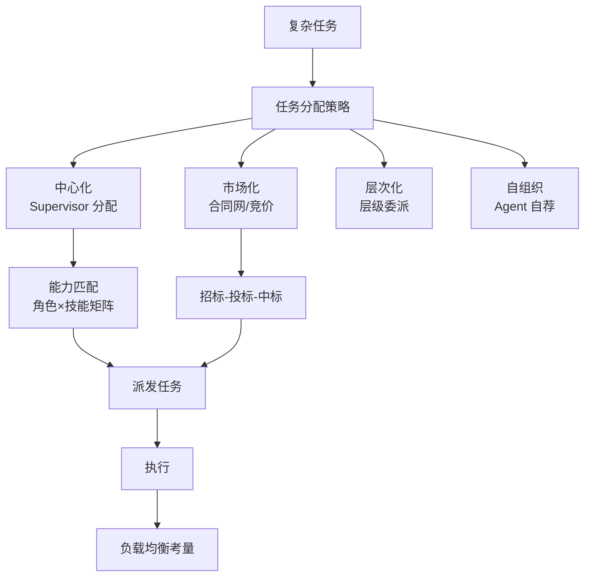

# 任务分配策略

任务分配决定「这个子任务交给谁」。常见策略包括：基于能力、基于负载、动态调整、竞拍机制。

### 1. 原理详解

*   **基于能力的分配**：为 Agent 声明能力标签（如 `python`, `security_review`），调度器计算匹配度打分，将任务分给最擅长的 Agent。
*   **基于负载的分配**：监控队列深度、进行中任务数、最近失败率，优先将任务分给最空闲且健康的执行器，实现负载均衡。
*   **动态任务分配**：运行时根据中间结果改派。例如发现代码需要法律审查，则动态插入法律 Agent。适合探索性任务。
*   **竞拍机制**：任务广播招标，Agent 根据成本、ETA、置信度报价竞标，调度者选标。适合异构资源与多候选执行者的场景。

### 2. 面试问答

**Q：动态任务分配和固定 Pipeline 各适合什么场景？**

**A：**
*   **固定 Pipeline**：适合 SOP 稳定、输入输出契约清晰的场景（如代码审核流水线）。
*   **动态分配**：适合探索性任务（如研究、故障排查），中间可能发现新的子问题。
*   **工程实践**：常混合使用，即主干 Pipeline + 动态插入节点。

**追问应对：** 若问「动态会不会不可控？」——答：需要设置预算上限、最大深度、允许的工具白名单以及人类在环机制。

### 3. 实战案例

在做 **AI 辅助 Bug 修复**系统时，初期使用静态分配（按语言分发给 Python/Java 专家 Agent）。实际踩坑发现，内存泄漏类 Bug 被 Python Agent 接手却无能为力，浪费了 Token 且没解决。后期改为**动态竞拍**：Agent 需先分析报错栈并给出「修复置信度」报价，置信度低则转交给高级调试 Agent，修复率提升 40%。

### 4. 策略对比

| 策略 | 优点 | 缺点 | 适用场景 |
| :--- | :--- | :--- | :--- |
| **基于能力** | 匹配精准，质量高 | 容易出现热点（某个专家过载） | 专业化任务（如代码审计、医疗诊断） |
| **基于负载** | 吞吐量高，资源均衡 | 可能分给「虽然闲但不熟练」的人，导致重试 | 通用任务（如简单分类、数据清洗） |
| **竞拍机制** | 自适应，容错性好 | 通信开销大，逻辑复杂 | 异构环境，任务难度差异大 |

### 5. 代码示例

下面演示 **能力匹配 + 简单负载计数** 的分配器逻辑：

```python
from dataclasses import dataclass, field
from typing import List, Dict, Set

@dataclass
class WorkerAgent:
    name: str
    skills: Set[str]
    load: int = 0

    def can_handle(self, required: Set[str]) -> bool:
        return required.issubset(self.skills)

@dataclass
class Scheduler:
    workers: List[WorkerAgent]

    def assign(self, required_skills: Set[str]) -> WorkerAgent:
        # 1. 筛选具备技能的 Agent
        candidates = [w for w in self.workers if w.can_handle(required_skills)]
        if not candidates:
            raise RuntimeError("No capable worker found")
        
        # 2. 负载优先：相同能力选最闲的
        chosen = sorted(candidates, key=lambda w: w.load)[0]
        chosen.load += 1
        return chosen

# 示例
workers = [
    WorkerAgent("w1", {"python", "test"}),
    WorkerAgent("w2", {"python", "security"}),
]
sched = Scheduler(workers)
print(sched.assign({"python", "test"}).name)  # 输出: w1
```


## 核心流程图




## 记忆要点

- 能力匹配：按技能标签打分，分给最擅长的 Agent，保质量。
- 负载均衡：监控队列深度与任务数，优先分给最空闲的，保吞吐。
- 动态分配：运行时根据中间结果改派或插入节点，适合探索性任务。
- 竞拍机制：Agent 报价竞标，调度者选标，适合异构资源与多候选场景。

## 结构化回答

**30 秒电梯演讲：** 任务分配就是"派单"——像出租车调度，看距离远近（能力匹配）和司机空车情况（负载均衡）。四种策略：能力匹配保质量、负载均衡保吞吐、动态分配适合探索性任务、竞拍机制适合异构资源。实战常混合：主干 Pipeline + 动态插入节点。

**展开框架：**
1. **能力匹配** — 给 Agent 声明技能标签（python、security_review），调度器算匹配度分给最擅长的，保质量但容易出现热点过载。
2. **负载均衡** — 监控队列深度和进行中任务数，优先分给最空闲健康的，保吞吐但可能分给"闲但不熟练"的人。
3. **动态分配** — 运行时根据中间结果改派或插入节点（发现要法律审查就插法律 Agent），适合探索性任务，需配预算上限和工具白名单。
4. **竞拍机制** — Agent 报价竞标（成本、ETA、置信度），调度者选标，适合异构资源和多候选场景。

**收尾：** 我做过 AI Bug 修复，静态分配把内存泄漏 Bug 给了 Python Agent 白费 Token，改动态竞拍按修复置信度报价后修复率升 40%。您想深入聊能力匹配、负载均衡还是竞拍设计？

## 视频脚本

> 预计时长：3 分钟 | 由浅入深

| 时间 | 画面/字幕 | 口播台词 | 讲解要点 |
|------|----------|----------|----------|
| 0:00 | 标题卡：任务分配策略 | "任务交给谁？像出租车派单，看能力和负载，还有动态改派和竞拍。" | 开场钩子 |
| 0:25 | 出租车调度类比 | "像出租车调度派单，看距离远近是能力匹配，看司机空车是负载均衡。" | 本质类比 |
| 0:55 | 能力匹配 vs 负载均衡 | "能力匹配按技能标签分给最擅长的保质量；负载均衡优先分给最空闲的保吞吐。" | 前两种 |
| 1:35 | 动态分配 vs 竞拍机制 | "动态分配运行时根据结果改派适合探索；竞拍机制 Agent 报价竞标适合异构资源。" | 后两种 |
| 2:10 | Bug 修复动态竞拍案例 | "实战：AI Bug 修复静态分配把内存泄漏给 Python Agent 白费 Token，改动态竞拍按置信度报价后修复率升 40%。" | 实战案例 |
| 2:45 | 总结卡 | "记住：能力保质量、负载保吞吐、动态探索、竞拍异构。下期讲冲突解决。" | 收尾 |

