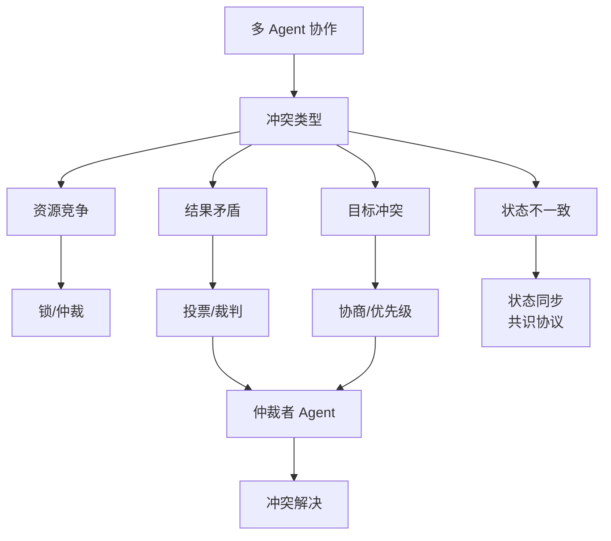

# 冲突解决

多 Agent 系统中，不同 Agent 可能对同一问题给出矛盾结论（例如「能上线」vs「有高危漏洞」）。冲突解决机制用于收敛到可执行决策。

### 1. 原理详解

| 方法 | 做法 | 适用场景 |
| :--- | :--- | :--- |
| **投票** | 多数票或加权票 | 意见相对独立、噪声可被平均的场景 |
| **优先级仲裁** | 设定硬性规则（如：安全 > 产品 > 体验） | 合规性要求高、有强约束的领域 |
| **主席 Agent** | 指定特定角色做最终拍板 | 需要单一责任点的决策 |
| **基于证据的共识** | 必须引用日志、测试结果、CVE 编号等 | 技术决策严谨、审计要求高的场景 |

**注意**：投票在模型相关性高（都想讨好用户）时可能导致集体偏误，需通过多样化提示或引入反方角色来缓解。

### 2. 面试问答

**Q：为什么光有投票不够？**

**A：** 因为 LLM Agent 的「独立意见」往往不独立（源于相似的训练分布或 System Prompt），且在缺少真实世界证据时，投票可能会强化错误。更稳妥的做法是 **证据门槛 + 优先级规则 + 人类在环**。

**追问应对：** 若问「Red Team 怎么用？」——答：专门设立 Agent 负责挑错、攻击假设、构造反例，输出主 Agent 必须回应的质疑清单。

### 3. 实战案例

在 **金融研报生成** 系统中，宏观 Agent 预测「看涨」，风险 Agent 提示「地缘政治风险」。初期简单投票导致结论模棱两可。实战中引入**优先级仲裁器**：设置 `Risk_Control > Alpha_Generation`。一旦风险 Agent 引用具体新闻源并触发阈值，强制覆盖看涨结论，输出「观望」，避免了合规事故。

### 4. 机制对比

| 维度 | 投票机制 | 仲裁/优先级 | 主席制 | 证据共识 |
| :--- | :--- | :--- | :--- | :--- |
| **收敛速度** | 快 | 极快 | 中 | 慢（需检索验证） |
| **鲁棒性** | 低（易受共谋影响） | 高（遵循规则） | 依赖主席能力 | 极高（事实驱动） |
| **灵活性** | 低（非黑即白） | 低（规则死板） | 高（拟人决策） | 中 |
| **计算成本** | 低 | 低 | 中 | 高（需工具调用） |

### 5. 代码示例

以下展示 **基于证据权重** 的冲突解决逻辑：

```python
def resolve_conflict(opinions: list[dict]) -> dict:
    """
    opinions: [{'role': 'safety', 'verdict': 'reject', 'evidence': ['CVE-2023-1234']}, ...]
    """
    # 1. 定义优先级权重，数值越大越强
    PRIORITY = {'security': 10, 'legal': 9, 'product': 5, 'performance': 2}
    
    # 2. 找出权重最高的反对意见（如果有强力的否决票）
    veto_candidate = None
    max_score = -1
    
    for op in opinions:
        score = PRIORITY.get(op['role'], 0)
        if op['verdict'] == 'reject' and score > max_score:
            max_score = score
            veto_candidate = op
            
    # 3. 如果有高权重否决且有证据，采纳否决；否则按默认逻辑（如多数票）
    if veto_candidate and veto_candidate.get('evidence'):
        return {'status': 'rejected', 'reason': f"Vetoed by {veto_candidate['role']}"}
    
    return {'status': 'approved', 'reason': 'No high-priority block'}
```


## 核心流程图




## 记忆要点

- 投票机制：适合意见独立、噪声可平均的场景，防集体偏误需多样化。
- 优先级仲裁：设定硬性规则（如安全 > 产品），适合合规性要求高的领域。
- 主席 Agent：指定特定角色做最终拍板，适合需单一责任点的决策。
- 证据共识：必须引用日志或测试结果，适合技术决策严谨、审计要求高的场景。

## 结构化回答

**30 秒电梯演讲：** 多 Agent 意见冲突时（一个说能上线，一个说有高危漏洞）有四种解决方式——投票（少数服从多数）、优先级仲裁（安全>产品一票否决）、主席 Agent（指定角色拍板）、证据共识（必须引用日志或 CVE）。光投票不够，因为 LLM 的"独立意见"往往不独立。

**展开框架：**
1. **投票机制** — 适合意见独立、噪声可平均的场景；但 LLM 源于相似训练分布"独立意见"不独立，易集体偏误，需多样化提示缓解。
2. **优先级仲裁** — 设硬性规则（安全>产品>体验），关键指标一票否决，适合合规性要求高的领域，收敛极快。
3. **主席 Agent** — 指定特定角色做最终拍板，适合需要单一责任点的决策，灵活性高但依赖主席能力。
4. **证据共识** — 必须引用日志、测试结果、CVE 编号等事实，适合技术决策严谨、审计要求高的场景，鲁棒性极高。

**收尾：** 我做过金融研报，宏观 Agent 看涨、风险 Agent 提示地缘风险，简单投票结论模棱两可，设优先级仲裁器 Risk>Alpha 后风险 Agent 引用新闻触发阈值就强制覆盖。您想深入聊优先级设计、Red Team 还是证据门槛？

## 视频脚本

> 预计时长：2 分钟 | 由浅入深

| 时间 | 画面/字幕 | 口播台词 | 讲解要点 |
|------|----------|----------|----------|
| 0:00 | 标题卡：冲突解决 | "多 Agent 意见打架怎么办？投票、仲裁、主席、证据四种方式。" | 开场钩子 |
| 0:20 | 评审团投票 + 一票否决类比 | "像评审团投票，但若有安全违规，安检员一票否决直接否决。" | 本质类比 |
| 0:50 | 四种机制对比 | "投票少数服从多数；优先级仲裁安全>产品一票否决；主席 Agent 拍板；证据共识必须引用日志或 CVE。" | 四种机制 |
| 1:20 | 为什么光投票不够 | "光投票不够：LLM 的独立意见往往不独立，源于相似训练分布，易集体偏误。要配证据门槛+优先级+人类在环。" | 投票局限 |
| 1:45 | 总结卡 | "记住：投票快但易偏、仲裁快且硬、证据最稳。下期讲状态管理。" | 收尾 |

