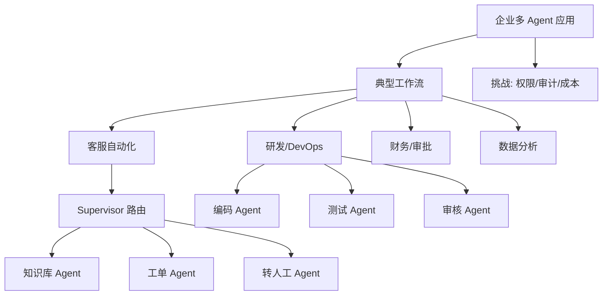
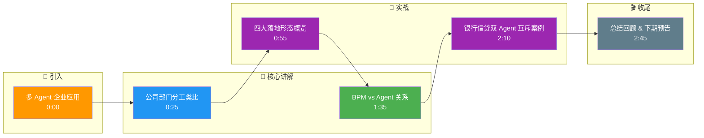

# 多 Agent 在企业中的应用

企业场景强调职责分离、合规、可审计、SLA。以下为四类典型落地形态。

### 1. 典型应用场景

| 场景 | 多 Agent 角色示例 | 价值 |
| :--- | :--- | :--- |
| **代码开发团队** | PM（需求）、架构师（设计）、工程师（实现）、QA（测试） | 模拟评审与质检；支持并行开发 |
| **数据分析团队** | 数据工程师（SQL）、分析师（洞察）、可视化（图表）、合规（脱敏） | 敏感操作隔离（脱敏在前，分析在后） |
| **客服升级系统** | 一线客服、政策专员、技术二线、主管批复 | 分级权限；复杂 Case 可追溯 |
| **文档审核流水线** | 格式检查、事实核查、合规审查、终审 | 固定 Pipeline + 仲裁；易对接人工 |

### 2. 面试问答

**Q：企业里多 Agent 与「传统工作流引擎（BPM）」关系是什么？**

**A：** BPM 管**确定性流程与人工节点**；多 Agent 管**需要语言推理与开放工具调用**的步骤。常见架构：BPM 编排确定性流程，将 LLM Agent 作为一个活动节点嵌入；或由 Agent 产出结构化决策，由 BPM 落账。

**追问应对：** 若问「谁主谁辅？」——答：强合规流程 BPM 为主；强探索任务 Agent 为主，但需加护栏。

### 3. 实战案例

某银行 **信贷审批系统** 中，采用了「双 Agent 互斥」机制。一个 Agent 负责「反洗钱 (AML) 扫描」，另一个负责「信用评分」。系统规定：只有当 **AML Agent 返回 PASS 且信用 Agent 返回评分** 后，流程才进入终审。曾有黑客试图通过 Prompt 注入让信用 Agent 忽略 AML 结果，但因系统设计为 **结构化输出（JSON）** 且后端有严格的 Schema 校验，注入攻击被拦截，保障了业务闭环。

### 4. 模式对比

| 维度 | 单体大模型 | 多 Agent 协作 | 传统 BPM/脚本 |
| :--- | :--- | :--- | :--- |
| **可维护性** | 低（Prompt 越改越乱） | 高（分而治之，职责清晰） | 中（代码硬编码，难改逻辑） |
| **可解释性** | 黑盒 | 中（可输出各 Agent 推理链） | 高（确定的执行路径） |
| **容错性** | 低（一处错全盘错） | 高（单 Agent 失败可重试或降级） | 高（异常捕获明确） |
| **落地难点** | 效果不稳定 | 编排复杂、通讯成本高 | 需处理非结构化数据困难 |

### 5. 代码示例

演示数据脱敏后再分析，体现企业中的**职责链模式**：

```python
def de_identify(table_rows):
    # 真实场景：哈希/泛化/抑制
    return [{"user": "***", "amount": r["amount"]} for r in table_rows]

def analyst_agent(rows):
    return f"洞察：共 {len(rows)} 笔，总额 {sum(r['amount'] for r in rows)}"

def pipeline(raw_rows):
    safe = de_identify(raw_rows)
    return analyst_agent(safe)
```

## 技术原理

多 Agent 在企业落地的核心是"职责分离（Separation of Duties）+ 可审计（Auditability）+ 合规（Compliance）"，这三点对应着不同的工程机制：

- **职责分离的隔离原理**：把一个复杂流程拆成多个角色独立的 Agent（PM、架构、工程师、QA），每个 Agent 只持有完成自己任务所需的最小权限和数据。这隔离了敏感操作（如合规 Agent 先做脱敏，分析师 Agent 只看到脱敏后数据），也防止单点失误污染全链路。本质是用"角色边界"换"安全性和可维护性"。
- **可审计的日志原理**：每个 Agent 的输入、推理链（Thought）、Action、输出都结构化记录（JSON + TraceID），形成可追溯的执行轨迹。这是企业合规审计的基础——出了问题能定位到是哪个 Agent 在哪一步出错。
- **BPM 与 Agent 的混合编排**：BPM（业务流程管理）引擎擅长确定性流程和人工节点（审批、签字），Agent 擅长需要语言推理和开放工具调用的步骤。常见架构是 BPM 编排整体流程，把 LLM Agent 作为一个活动节点嵌入；或 Agent 产出结构化决策由 BPM 落账。强合规流程 BPM 为主，强探索任务 Agent 为主。
- **结构化输出防注入**：Agent 间通信用 JSON + Schema 校验而非自由文本，能挡住 Prompt 注入攻击（黑客无法通过文本诱导 Agent 忽略前置步骤）。

## 注意事项

1. **不可逆操作要互斥**：AML 扫描和信用评分这类关键判断必须"双 Agent 互斥"——都通过才进终审，防止单点被绕过。
2. **职责链顺序不能乱**：脱敏必须在分析之前，否则敏感数据会泄露给分析 Agent；固定 Pipeline 的顺序是合规底线。
3. **Agent 间通信用结构化协议**：别用自由文本传递 Agent 间数据，用 JSON + Schema 校验，既能防 Prompt 注入又能保证可解析。
4. **复杂 Case 要留人工 escalation**：分级处理（一线→专员→二线→主管）时，低置信度或高风险 Case 必须能升级到人工，不能让 Agent 全自动决策。

## 对比表

| 维度 | 单体大模型 | 多 Agent 协作 | 传统 BPM/脚本 |
|:---|:---|:---|:---|
| **可维护性** | 低（Prompt 越改越乱） | 高（职责分离） | 中（硬编码难改） |
| **可解释性** | 黑盒 | 中（各 Agent 推理链） | 高（确定路径） |
| **容错性** | 低（一处错全盘错） | 高（单 Agent 可重试降级） | 高（异常捕获明确） |
| **合规审计** | 难（黑盒） | 易（结构化日志+TraceID） | 易（流程引擎记录） |
| **落地难点** | 效果不稳定 | 编排复杂、通讯成本高 | 非结构化数据难处理 |
| **适用场景** | 简单任务 | 复杂企业流程 | 确定性流水线 |

## 核心流程图



## 记忆要点

- 代码开发团队：PM、架构、工程师、QA 协作，模拟评审与质检，支持并行。
- 数据分析团队：数据工程师、分析师、可视化、合规协作，隔离敏感操作。
- 客服升级系统：一线、专员、二线、主管分级处理，复杂 Case 可追溯。
- 文档审核流水线：格式检查、事实核查、合规审查、终审，易对接人工。

## 结构化回答

**30 秒电梯演讲：** 多 Agent 在企业的核心价值是"职责分离 + 可审计 + 合规"——像公司各部门各司其职，质检部检查完生产部才能入库。四大落地形态：代码团队（PM/架构/工程师/QA）、数据团队（含合规脱敏）、客服分级升级、文档审核流水线。和 BPM 的关系是：BPM 管确定性流程，Agent 管需要推理的步骤。

**展开框架：**
1. **代码开发团队** — PM 需求、架构师设计、工程师实现、QA 测试，模拟评审质检支持并行开发。
2. **数据分析团队** — 数据工程师 SQL、分析师洞察、可视化图表、合规脱敏，敏感操作隔离（脱敏在前分析在后）。
3. **客服升级系统** — 一线、政策专员、技术二线、主管批复分级处理，复杂 Case 可追溯。
4. **文档审核流水线** — 格式检查、事实核查、合规审查、终审，固定 Pipeline + 仲裁，易对接人工。

**收尾：** 我做过银行信贷审批，用"双 Agent 互斥"——AML 扫描和信用评分都通过才进终审，靠结构化 JSON 输出 + Schema 校验挡住了 Prompt 注入攻击。您想深入聊职责分离、BPM 集成还是合规设计？

## 视频脚本

> 预计时长：3 分钟 | 由浅入深

| 时间 | 画面/字幕 | 口播台词 | 讲解要点 |
|------|----------|----------|----------|
| 0:00 | 标题卡：多 Agent 企业应用 | "企业落地的核心是职责分离、可审计、合规，像公司各部门各司其职。" | 开场钩子 |
| 0:25 | 公司部门分工类比 | "像公司里不同部门员工各司其职，质检部检查完生产部才能入库。" | 本质类比 |
| 0:55 | 四大落地形态概览 | "四大形态：代码团队 PM 架构工程师 QA、数据团队含合规脱敏、客服分级升级、文档审核流水线。" | 四大场景 |
| 1:35 | BPM vs Agent 关系 | "BPM 管确定性流程和人工节点，Agent 管需要语言推理的步骤。强合规 BPM 为主，强探索 Agent 为主。" | BPM 集成 |
| 2:10 | 银行信贷双 Agent 互斥案例 | "实战：银行信贷用 AML 和信用双 Agent 互斥，都通过才进终审，结构化 JSON+Schema 校验挡住 Prompt 注入。" | 实战案例 |
| 2:45 | 总结卡 | "记住：职责分离、四大形态、BPM 管流程 Agent 管推理。下期讲生产挑战。" | 收尾 |

### 视频流程图




