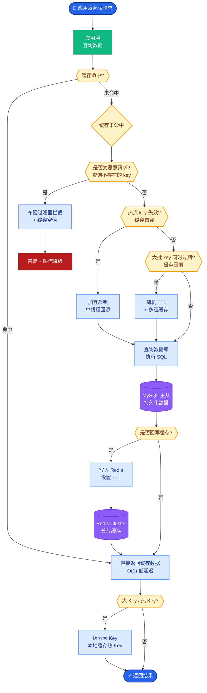

# 生产挑战

多 Agent 在生产环境的难点往往不在 Demo 跑通，而在于成本、延迟、稳定性与可观测性。

### 1. 核心挑战与应对

| 挑战 | 说明 | 常见手段 |
| :--- | :--- | :--- |
| **Token 成本控制** | 多轮讨论、重复上下文、冗余输出 | 摘要、引用 ID、小模型子任务、缓存、提示压缩 |
| **延迟优化** | 串行调用堆叠导致墙钟时间长 | 并行、流式、预取、异步队列、边缘缓存 |
| **死循环防止** | Agent 互相等待或重复同样的计划 | 最大步数、状态哈希去重、无进展检测、强制终止节点 |
| **错误传播与隔离** | 一步错步步错 | 校验门、断路器、沙箱、回滚到检查点 |
| **调试与可观测** | 分布式轨迹难复盘 | TraceId、结构化日志、对话/工具全链路导出、评估集 |

### 防护机制示意图

```text
输入任务
  │
  v
┌─────────────────┐
│  Budget Guard   │ <───(Token/Time/Cost Limit)────┐
└────────┬────────┘                               │
         │                                       │
         v                                       │ (熔断/降级)
┌─────────────────┐                               │
│ Loop Detector   │ <───(Check Action Hash)───────┤
└────────┬────────┘                               │
         │                                       │
         v                                       │
  ┌─────────┐                                   │
  │ Agent A │ ──(Output)──> ┌──────────────┐     │
  └─────────┘                │ Validation   │     │
                             │ Gate (Check) │     │
                             └──────┬───────┘     │
                                    │ Pass        │
                                    v             │
                               ┌─────────┐        │
                               │ Agent B │        │
                               └────┬────┘        │
                                    │             │
                                    └─────────────┘
```

### 面试问答

**Q：如何检测多 Agent 系统的「死循环」？**

**A：** 组合策略：
1.  全局步数上限。
2.  状态哈希去重（若连续重复同一计划或工具入参则停止）。
3.  无进展检测（关键指标多轮不变，如 Bug 数未降）。
4.  预算熔断（Token/费用/时间）。

**Q：错误隔离在多 Agent 里如何实现？**

**A：**
1.  沙箱执行与最小权限工具。
2.  校验 Agent 作为门禁。
3.  检查点机制：通过后持久化，失败从检查点重试。
4.  不把未经校验的自然语言直接当 API 参数。

### 实战案例
在生产环境中曾遇到因 Agent A 输出的 JSON 格式微小差异（如 `true` vs `True`），导致 Agent B 调用 API 失败进而不断重试最终耗尽 Token 预算的案例。引入 Pydantic 进行强类型校验并配合重试策略后，此类无效调用减少了 90%。

### 代码示例
演示 **步数上限 + 重复计划检测** 的简单「刹车」机制：

```python
from typing import Callable, List, Set

def run_with_guard(
    agent_step: Callable[[List[str]], str],
    user_goal: str,
    max_steps: int = 10
):
    history: List[str] = []
    seen_plans: Set[str] = set()
    
    for _ in range(max_steps):
        action = agent_step(history)
        
        # 防止死循环：检查哈希
        action_hash = hash(action)
        if action_hash in seen_plans:
            raise RecursionError("Detected repetitive loop.")
        seen_plans.add(action_hash)
        
        history.append(action)
```

### 对比表格

| 特性 | 单 Agent (大模型) | 多 Agent 协作 |
| :--- | :--- | :--- |
| **调试难度** | 低（单链路） | 高（分布式、交互复杂） |
| **成本控制** | 难（依赖 Prompt 技巧） | 极难（对话叠加、上下文传递） |
| **任务拆解** | 依赖 Prompt 引导 | 专业化 Agent 自动分工 |
| **容错性** | 低（一步错全盘错） | 中（可通过其他 Agent 补救，但需隔离） |


## 核心流程图



## 记忆要点

- Token 成本控制：摘要、引用 ID、小模型子任务、缓存、提示压缩。
- 延迟优化：并行、流式、预取、异步队列、边缘缓存。
- 死循环防止：最大步数、状态哈希去重、无进展检测、强制终止节点。
- 错误隔离：校验门、断路器、沙箱、回滚到检查点，防止一步错步步错。

## 结构化回答

**30 秒电梯演讲：** 多 Agent 上生产的难点不在 Demo 跑通，而在成本、延迟、稳定性、可观测。四大应对：Token 成本靠摘要+小模型+缓存控制，延迟靠并行+流式优化，死循环靠最大步数+状态哈希去重防，错误靠校验门+断路器+沙箱隔离。一句话：给狂奔的马套缰绳、设路障。

**展开框架：**
1. **Token 成本控制** — 摘要压缩、引用 ID 代替全文、简单子任务用小模型、缓存重复结果、提示压缩。
2. **延迟优化** — 无依赖任务并行、流式输出、预取、异步队列、边缘缓存，别让串行调用堆叠。
3. **死循环四道防线** — 全局步数上限、状态哈希去重（重复计划就停）、无进展检测（关键指标多轮不变）、预算熔断。
4. **错误隔离** — 校验 Agent 作门禁、断路器、沙箱执行最小权限、检查点回滚，防止一步错步步错。

**收尾：** 我踩过坑——Agent A 输出 JSON 的 `true` vs `True` 微小差异让 B 调 API 失败不断重试耗尽预算，上 Pydantic 强校验后无效调用减 90%。您想深入聊死循环检测、错误隔离还是成本控制？

## 视频脚本

> 预计时长：4 分钟 | 由浅入深

| 时间 | 画面/字幕 | 口播台词 | 讲解要点 |
|------|----------|----------|----------|
| 0:00 | 标题卡：多 Agent 生产挑战 | "Demo 跑通不等于能上生产，成本、延迟、稳定性、可观测四大难关。" | 开场钩子 |
| 0:25 | 给马套缰绳设路障类比 | "像给狂奔的马套缰绳（步数限制）并设路障（重复检测），防止失控。" | 本质类比 |
| 0:55 | Token 成本 + 延迟优化 | "Token 成本靠摘要、小模型、缓存；延迟靠并行、流式、预取、异步队列。" | 成本+延迟 |
| 1:35 | 死循环四道防线 | "死循环四道防线：全局步数上限、状态哈希去重、无进展检测、预算熔断。" | 死循环防御 |
| 2:10 | 错误隔离机制 | "错误隔离：校验门、断路器、沙箱、检查点回滚，防止一步错步步错。" | 错误隔离 |
| 2:50 | JSON true vs True 耗尽预算案例 | "实战：Agent A 输出 true vs True 让 B 调 API 失败重试耗尽预算，上 Pydantic 强校验后无效调用减 90%。" | 实战案例 |
| 3:30 | 总结卡 | "记住：四难关四应对、死循环四防线、错误必隔离。下期讲 Transformer。" | 收尾 |

