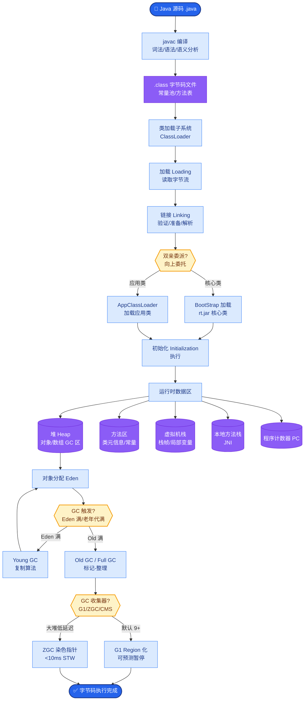

# Transformer 架构

Transformer 是一种完全基于自注意力机制的神经网络结构，用于序列建模。与 RNN/CNN 不同，它通过注意力在任意两个位置之间直接建立依赖关系，并行度高，且更容易捕捉长距离依赖。

### 1. 核心组件

*   **Encoder**：双向注意力，适合理解任务（如 BERT）。
*   **Decoder**：带掩码的单向注意力，适合生成任务（如 GPT）。
*   **Self-Attention**：计算序列内元素两两之间的相关性。

### 2. 关键技术点

1.  **Q, K, V 机制**：
    *   $Q$ (Query)：我要查什么。
    *   $K$ (Key)：我有什么标签。
    *   $V$ (Value)：内容是什么。
    *   公式：$\text{Attention}(Q, K, V) = \text{softmax}(\frac{QK^T}{\sqrt{d_k}})V$。
2.  **Multi-Head Attention**：将维度拆分为多个头，每个头关注不同的子空间特征（如语法、语义）。
3.  **Positional Encoding**：因为 Attention 本身不包含位置信息，必须注入位置编码（如 Sinusoidal 或 RoPE）。
4.  **Pre-Norm vs Post-Norm**：
    *   Pre-Norm（先 Norm 再进入子层）：训练更稳定，现代 LLM 常用。
    *   Post-Norm：经典 Transformer 结构。
5.  **FFN**：两层全连接网络，通常中间层维度扩大 4 倍，负责非线性变换。

### 3. 架构图解

```text
       输入 Embedding + 位置编码
                 │
        ┌────────┴────────┐
        │                 │
   [Multi-Head         [Feed-Forward
    Attention]          Network (FFN)]
        │                 │
        └────────┬────────┘
                 │
           Add & Norm
                 │
             (重复 N 层)
                 │
             输出概率
```

### 4. 面试问答

**Q：Transformer 和 RNN 相比，核心优势是什么？**

**A：** 自注意力在单步内连接任意两位置，**并行计算好**、**长距离依赖路径短**（常数层数内）；RNN 顺序计算且梯度路径长。代价是 $O(n^2)$ 的计算与显存复杂度。

**Q：Decoder 里的 Masked Self-Attention 为什么要 mask？**

**A：** 训练时一次看到整句，若不 mask，位置 $i$ 会看到「未来」token，造成信息泄漏；mask 保证训练（Teacher Forcing）和推理（自回归）一致性。

**Q：为什么大模型多是 Decoder-only？**

**A：** 生成式预训练目标（下一词预测）与架构一致；工程上堆叠简单、扩展性好；Encoder-only（如 BERT）更偏理解，需另做生成适配。

### 常见考点
1.  **残差连接的作用**：解决深层网络梯度消失问题，允许梯度直接流向前层。
2.  **Layer Normalization vs Batch Normalization**：Transformer 使用 LN，因为它不依赖 batch size，且在处理变长序列时更稳定（独立归一化每个样本）。
3.  **位置编码类型**：绝对位置编码与相对位置编码的区别，RoPE（旋转位置编码）的原理及在长文本中的优势。

### 实战案例
在处理超长文本摘要任务时，使用带 Sinusoidal 位置编码的 Transformer 5120 位置截断导致长距离信息丢失；改用支持外推的 ALiBi 或 RoPE 后，模型在 4k-8k 长度上的表现显著提升，且无需重新训练即可支持一定长度的外推。

### 代码示例
PyTorch 实现标准的 Scaled Dot-Product Attention（含 Mask）:

```python
import torch
import torch.nn.functional as F

def scaled_dot_product(q, k, v, mask=None):
    attn_scores = torch.matmul(q, k.transpose(-2, -1)) / (k.size(-1) ** 0.5)
    if mask is not None:
        attn_scores = attn_scores.masked_fill(mask == 0, -1e9)
    attn_probs = F.softmax(attn_scores, dim=-1)
    output = torch.matmul(attn_probs, v)
    return output
```

### 对比表格

| 特性 | Transformer (Attention) | RNN (LSTM/GRU) | CNN (Conv1D) |
| :--- | :--- | :--- | :--- |
| **计算复杂度** | $O(n^2)$ | $O(n)$ | $O(k \cdot n)$ (k 为核宽) |
| **并行能力** | 高（所有位置同时计算） | 低（需等待前一步） | 高 |
| **长距离依赖** | 优秀（一步直达） | 较差（梯度易消失） | 一般（需堆叠多层） |
| **归纳偏置** | 弱（不假设序列局部性） | 强（时间序贯） | 强（局部相关性） |


## 核心流程图



## 记忆要点

- 核心优势：自注意力机制并行计算好，长距离依赖路径短，解决 RNN 梯度问题。
- Q、K、V 机制：Query 查询，Key 标签，Value 内容，通过相似度加权求和。
- Encoder-Decoder：Encoder 双向适合理解（BERT），Decoder 单向带掩码适合生成（GPT）。
- 位置编码：Attention 不包含位置信息，必须注入位置编码（Sinusoidal 或 RoPE）。

## 结构化回答

**30 秒电梯演讲：** Transformer 完全基于自注意力机制——像读书时一目十行，瞬间关注前后文所有关联词。核心是 Q/K/V 三元组（查询、键、值）通过相似度加权求和，并行计算好、长距离依赖路径短，解决了 RNN 的梯度问题。代价是 O(n²) 的计算复杂度。

**展开框架：**
1. **Q/K/V 机制** — Query 是"我要查什么"，Key 是"标签"，Value 是"内容"，公式 softmax(QK^T/√d)V 加权求和。
2. **Encoder vs Decoder** — Encoder 双向注意力适合理解（BERT），Decoder 带掩码单向适合生成（GPT）；大模型多是 Decoder-only 因为生成式预训练目标一致。
3. **Multi-Head + 位置编码** — 多头拆分子空间关注不同特征（语法/语义）；Attention 本身无位置信息，必须注入位置编码（Sinusoidal 或 RoPE）。
4. **对比 RNN** — Transformer 单步连接任意两位置、并行高、长距离依赖常数层；RNN 顺序计算梯度路径长，但复杂度只有 O(n)。

**收尾：** 我做过超长文本摘要，Sinusoidal 位置编码 5120 截断丢长距离信息，换 RoPE 后 4k-8k 长度表现显著提升还能外推。您想深入聊 Q/K/V 细节、位置编码还是 Decoder-only 趋势？

## 视频脚本

> 预计时长：4 分钟 | 由浅入深

| 时间 | 画面/字幕 | 口播台词 | 讲解要点 |
|------|----------|----------|----------|
| 0:00 | 标题卡：Transformer 架构 | "大模型的基石 Transformer，完全基于自注意力，并行好、长距离依赖强。" | 开场钩子 |
| 0:25 | 一目十行类比 | "像读书时一目十行，瞬间关注前后文所有关联词，而不是逐字阅读。" | 本质类比 |
| 0:55 | Q/K/V 三元组公式 | "Q 是查询，K 是标签，V 是内容，公式 softmax QK^T 除根号 d 乘 V，相似度加权求和。" | Q/K/V 机制 |
| 1:35 | Encoder vs Decoder 对比 | "Encoder 双向适合理解如 BERT，Decoder 带掩码单向适合生成如 GPT。大模型多是 Decoder-only。" | 编解码器 |
| 2:10 | Multi-Head + 位置编码 | "多头拆分子空间关注不同特征；Attention 本身无位置信息，必须注入位置编码 Sinusoidal 或 RoPE。" | 多头+位置 |
| 2:50 | RoPE 长文本外推案例 | "实战：超长摘要 Sinusoidal 5120 截断丢信息，换 RoPE 后 4k-8k 长度表现显著提升还能外推。" | 实战案例 |
| 3:30 | 总结卡 | "记住：自注意力、Q/K/V、位置编码必注入。下期讲 LLM 基础。" | 收尾 |

