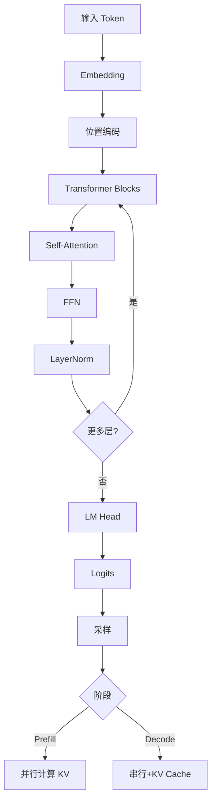

# 大模型推理

大模型推理主要包含 **Prefill**（处理 Prompt）和 **Decode**（生成后续 Token）两个阶段。

### 1. 推理流程详解

*   **Prefill 阶段**：
    *   输入：完整的 Prompt。
    *   特点：**计算密集型**。可以并行计算所有 Token 的 Attention，速度较快。
*   **Decode 阶段**：
    *   输入：每次只输入一个新生成的 Token。
    *   特点：**内存带宽密集型**。需要加载巨大的模型权重，并读取历史所有 Token 的 KV Cache，算力往往吃不饱。

### 2. 推理生命周期与 KV Cache

```text
时间轴 ──────────────────────────────────────▶

Prefill 阶段: | Token 1 | Token 2 | ... | Token N |
             (并行计算 Attention, 建立 KV Cache)

Decode 阶段:  | Gen 1 | Gen 2 | Gen 3 | ... |
             (每次自回归: 
              1. 新 Token 与 历史 KV Cache 做 Attention
              2. 预测下一个词
              3. 新 KV 追加进 Cache)
```

### 3. 关键技术

*   **KV Cache**：
    *   缓存历史 Token 的 Key 和 Value 向量。
    *   作用：避免每一步生成时都重新计算历史 Token 的 Attention。
    *   代价：显存占用随序列长度线性增长。
*   **采样策略**：
    *   **Temperature**：控制随机性，$T>1$ 更随机，$T<1$ 更确定。
    *   **Top-k**：只从概率最高的 k 个 Token 中选。
    *   **Top-p (Nucleus)**：从累积概率达到 p 的最小集合中选。

### 4. 面试问答

**Q：Prefill 和 Decode 哪个更吃算力？哪个更吃带宽？**

**A：**
*   **Prefill**：并行度高，**算力密集**，GPU 利用率高。
*   **Decode**：每次计算量小但需频繁读取权重和 KV Cache，受限于显存带宽，属于**内存密集**型任务。

## 常见考点
1.  **KV Cache 显存计算**：公式 $2 \times \text{layers} \times \text{heads} \times d_{head} \times \text{seq\_len} \times \text{bytes}$。
2.  **Continuous Batching**：如何解决静态 Batching 中由于序列长度不一导致的 Pad 浪费问题（动态插入/剔除）。
3.  **长文本推理瓶颈**：随着序列长度增加，Attention 算力复杂度 $O(N^2)$ 和 KV Cache 显存 $O(N)$ 如何成为瓶颈。

### 实战案例
在部署实时客服机器人时，遇到 Prompt 较长导致首字延迟（TTFT）过高的问题。通过分析 Profile 发现 Prefill 阶段占用了过多 GPU 算力资源，阻塞了其他短请求的 Decode。采用 vLLM 的 PagedAttention 机制并对长 Prompt 任务进行分离调度后，P99 延迟降低了 40%。

### 代码示例
简易的 Top-p (Nucleus) 采样实现:

```python
import torch
import torch.nn.functional as F

def top_p_sampling(logits, temperature=1.0, top_p=0.9):
    # 1. 温度缩放
    probs = F.softmax(logits / temperature, dim=-1)
    # 2. 降序排列
    sorted_probs, sorted_indices = torch.sort(probs, descending=True)
    # 3. 计算累积概率
    cumulative_probs = torch.cumsum(sorted_probs, dim=-1)
    # 4. 移除超过 p 的部分
    sorted_indices_to_remove = cumulative_probs > top_p
    # 保留第一个超过阈值的关键词（避免移除所有）
    sorted_indices_to_remove[..., 1:] = sorted_indices_to_remove[..., :-1].clone()
    sorted_indices_to_remove[..., 0] = 0
    # 5. 采样
    sorted_probs[sorted_indices_to_remove] = 0.0
    next_token = torch.multinomial(sorted_probs, num_samples=1)
    return sorted_indices.gather(-1, next_token)
```

### 对比表格

| 指标/阶段 | Prefill (处理输入) | Decode (生成输出) |
| :--- | :--- | :--- |
| **计算模式** | 矩阵乘法密集 | 向量-矩阵乘法 (轻量级) |
| **内存占用** | 激增（写入 KV Cache） | 缓慢线性增长（追加 KV Cache） |
| **主要瓶颈** | GPU 计算能力 (FLOPS) | 显存带宽 (Memory Bandwidth) |
| **Batch 处理** | 容易 Padding 过多 | 需要 Continuous Batching |
| **优化目标** | 减少首字延迟 (TTFT) | 提高吞吐 (Tokens/s) |


## 核心流程图



## 记忆要点

- Prefill 阶段：处理完整 Prompt，并行计算 Attention，属于计算密集型。
- Decode 阶段：每次生成一个 Token，需读取历史 KV Cache，属于内存带宽密集型。
- KV Cache：缓存历史 Key 和 Value，避免每步重新计算，代价是显存占用随长度线性增长。
- 采样策略：Temperature 控制随机性，Top-k/Top-p 限制候选词范围。

## 结构化回答

**30 秒电梯演讲：** 大模型推理分两段：Prefill 一次性并行处理整个 Prompt，属于算力密集；Decode 一个字一个字往外蹦，每次都要读历史 KV Cache，瓶颈在显存带宽。KV Cache 的存在是为了避免重复算历史 Attention，代价是显存随长度线性涨。

**展开框架：**
1. **两阶段差异** — Prefill 算力密集、GPU 利用率高；Decode 内存带宽密集、算力常吃不饱。
2. **KV Cache** — 缓存历史 Key/Value，省掉重复计算，但显存随序列长度线性增长，长文本场景是主要瓶颈。
3. **采样控制** — Temperature 调随机性，Top-k/Top-p 限制候选范围，决定生成多样性。

**收尾：** 这两阶段的特性决定了优化方向不同——Prefill 抓首字延迟，Decode 抓吞吐，我可以接着讲 Continuous Batching 怎么配合。

## 视频脚本

> 预计时长：3 分钟 | 由浅入深

| 时间 | 画面/字幕 | 口播台词 | 讲解要点 |
|------|----------|----------|----------|
| 0:00 | 标题卡：大模型推理 | "推理就两步：先把 Prompt 读完，再一个字一个字往外写。" | 两阶段总览 |
| 0:30 | Prefill 并行计算动画 | "Prefill 是一次性并行算完所有 Token 的 Attention，吃的是算力。" | Prefill 算力密集 |
| 1:15 | Decode 串行 + 读 KV Cache 动画 | "Decode 每步只算一个新 Token，但要反复读权重和 KV Cache，卡在带宽上。" | Decode 带宽密集 |
| 2:00 | KV Cache 显存随长度增长曲线 | "KV Cache 省了重复计算，但显存跟序列长度成正比，长文本最先扛不住。" | KV Cache 代价 |
| 2:40 | Top-p 采样示意图 | "采样这块，Temperature 管随机，Top-p 圈定候选池。" | 采样策略 |

